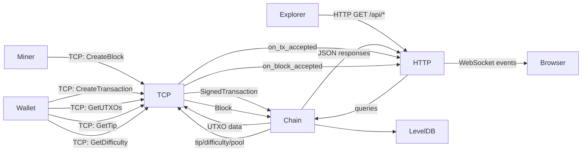
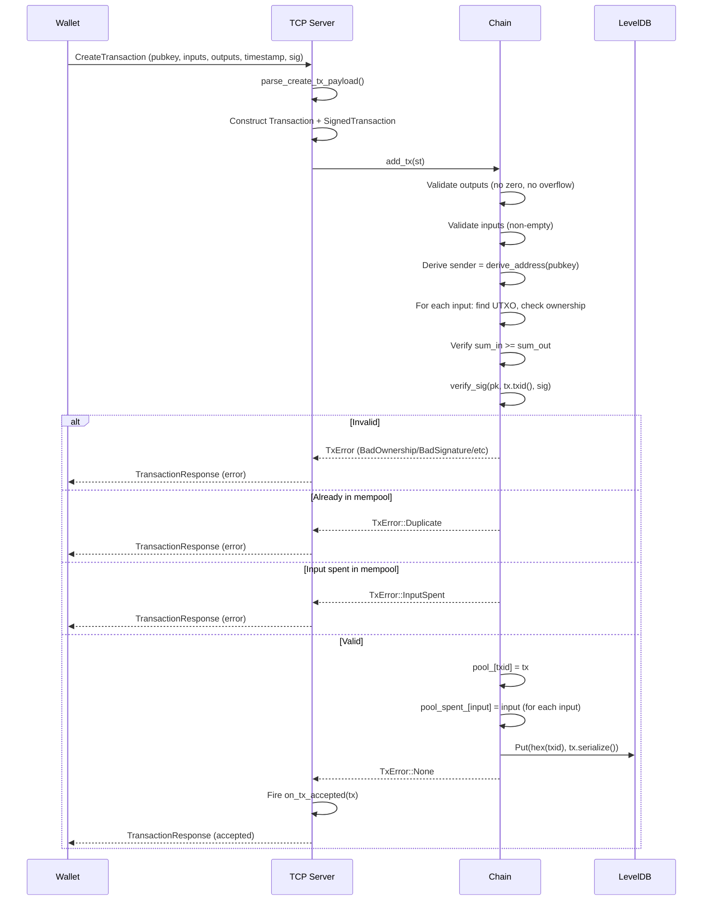
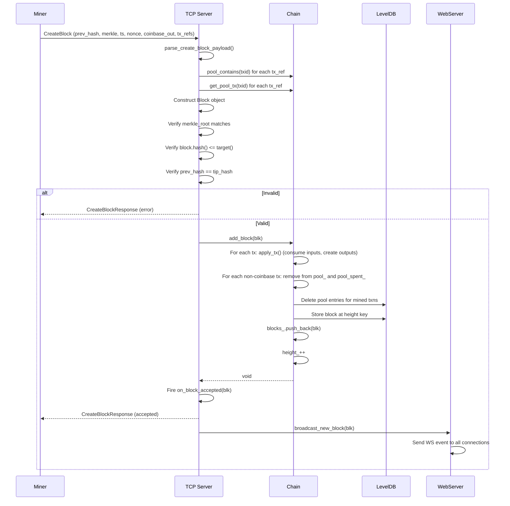
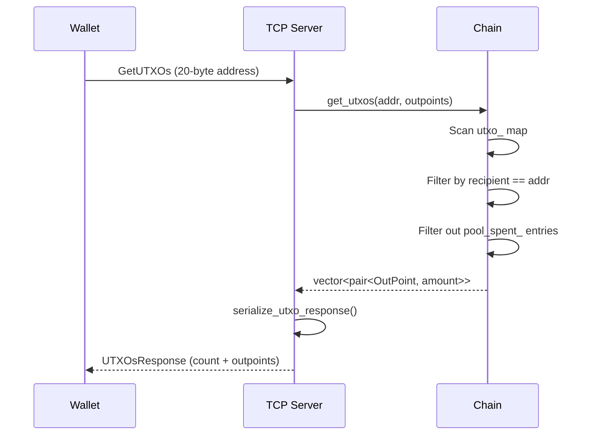

# Axis Blockchain — Technical Documentation

**Version:** 0.1  
**Language:** C++23  
**Repository:** [axis](https://github.com/shaikali-c/axis)  
**License:** Not specified  

---

## Table of Contents

1. [Project Overview](#1-project-overview)
2. [High-Level Architecture](#2-high-level-architecture)
3. [Core Components](#3-core-components)
4. [Block Structure](#4-block-structure)
5. [Transaction System](#5-transaction-system)
6. [UTXO Model](#6-utxo-model)
7. [Consensus Mechanism](#7-consensus-mechanism)
8. [Storage Layer](#8-storage-layer)
9. [Networking](#9-networking)
10. [API Documentation](#10-api-documentation)
11. [Data Flow](#11-data-flow)
12. [Validation Pipeline](#12-validation-pipeline)
13. [Security Analysis](#13-security-analysis)
14. [Performance Analysis](#14-performance-analysis)
15. [Engineering Strengths](#15-engineering-strengths)
16. [Areas for Improvement](#16-areas-for-improvement)
17. [Comparison](#17-comparison)
18. [Future Roadmap](#18-future-roadmap)
19. [Code Quality Review](#19-code-quality-review)
20. [Developer Guide](#20-developer-guide)
21. [Conclusion](#21-conclusion)

---

## 1. Project Overview

### What It Is

Axis is a UTXO-based blockchain node implementation written in modern C++23. It provides the core blockchain state machine — block validation, transaction validation, UTXO management, mempool, persistent storage, and network interfaces — but does **not** include wallet or miner implementations. Those components exist as separate codebases that communicate with Axis through its TCP protocol (port 8889) and HTTP API (port 8080).

### Goals

- Provide a **minimal, correct, performant** blockchain node that can serve as the foundation of a cryptocurrency network
- Implement a **UTXO model** with Ed25519-based ownership verification
- Support **external miners** and **external wallets** through well-defined wire protocols
- Enable **real-time monitoring** through WebSocket event streaming
- Maintain **deterministic block validation** with simple Proof-of-Work consensus

### Design Philosophy

The codebase follows a philosophy of **minimalism with modern tooling**:

- **No framework lock-in beyond what is necessary.** The project uses asio for async I/O, Crow for HTTP, LevelDB for storage, and libsodium for cryptography — each is a well-established, focused library that does one thing well.
- **Binary wire protocols.** Both the TCP (miner/node) and internal serialization formats use compact binary encoding rather than text-based formats, minimizing overhead.
- **In-memory UTXO set.** The UTXO set lives entirely in memory and is rebuilt on startup by replaying all confirmed blocks, avoiding the complexity of a separate UTXO database.
- **Header-only serialization primitives.** The `Writer` and `Reader` classes in `types.h` provide a simple, composable binary serialization layer without external schema dependencies.
- **Read-write lock for concurrency.** The chain uses `std::shared_mutex` to allow concurrent reads while serializing writes, ensuring consistency without single-threaded bottlenecks.

### Core Architecture

```
                    ┌──────────────────────────────────────┐
                    │           Axis Node (axisd)           │
                    │                                        │
                    │  ┌──────────┐   ┌──────────────────┐  │
                    │  │  HTTP    │   │  TCP Server       │  │
                    │  │  Server  │   │  (asio / port     │  │
                    │  │  (Crow)  │   │   8889)           │  │
                    │  │  :8080   │   │                   │  │
                    │  └────┬─────┘   └───────┬───────────┘  │
                    │       │                 │               │
                    │       ▼                 ▼               │
                    │  ┌──────────────────────────────────┐  │
                    │  │          Chain (Core)            │  │
                    │  │  ┌──────┐ ┌─────┐ ┌──────────┐  │  │
                    │  │  │Block │ │UTXO │ │ Mempool  │  │  │
                    │  │  │Chain │ │ Set │ │ (Pool)   │  │  │
                    │  │  └──┬───┘ └─────┘ └──────────┘  │  │
                    │  │     │                             │  │
                    │  │     ▼                             │  │
                    │  │  ┌──────────────────────────┐    │  │
                    │  │  │  LevelDB (blocks + pool) │    │  │
                    │  │  └──────────────────────────┘    │  │
                    │  └──────────────────────────────────┘  │
                    └────────────────────────────────────────┘
                              │              │
                              ▼              ▼
                     External Wallets   External Miners
                     (separate repo)    (separate repo)
```

---

## 2. High-Level Architecture

### Component Interaction

Axis is composed of five major subsystems that interact through the `Chain` class as the central state machine:

| Component | File(s) | Role |
|-----------|---------|------|
| **Chain** | `chain.h/cpp` | State machine: block storage, UTXO management, mempool, validation |
| **Block** | `block.h/cpp` | Block data structure, header, serialization, Merkle tree integration |
| **Transaction** | `tx.h/cpp` | Transaction data structure, inputs, outputs, serialization |
| **Crypto** | `crypto.h/cpp` | Hashing (Blake2b), signature verification (Ed25519), Merkle root computation |
| **TCP Server** | `net.h/cpp` | Asynchronous TCP server for miner/wallet protocol |
| **HTTP Server** | `web.h/cpp` | REST API + WebSocket for explorers, monitoring, and external tools |
| **Utilities** | `types.h`, `util.h` | Binary Writer/Reader, hex encoding, logging, type definitions |

### Threading Model

```
main()
  │
  ├── sodium_init()           ← libsodium initialization
  ├── Chain()                 ← Load from DB or create genesis
  ├── WebServer(chain, 8080)  ← HTTP/WS server (runs on thread B)
  ├── Server(chain, 8889)     ← TCP server (runs on main thread)
  │
  ├── std::thread(web.run())  ──→ Thread B: Crow event loop
  └── server.run()            ──→ Thread A: asio event loop (main)
```

- **Thread A (main)** — Runs the asio `io_context` for the TCP server. Handles all miner/wallet protocol messages.
- **Thread B** — Runs the Crow HTTP server. Handles REST API requests and WebSocket connections.
- **Chain mutex** — `std::shared_mutex` protects the chain state. HTTP handlers acquire shared (read) locks for queries; TCP handlers and block/transaction submission acquire unique (write) locks for mutations.

### Data Flow Diagram



### Node Responsibilities

A running Axis node is responsible for:

1. **Block storage** — Persisting confirmed blocks to LevelDB, indexed by height
2. **UTXO management** — Maintaining the current UTXO set in memory
3. **Mempool management** — Holding unconfirmed transactions in memory and in a separate LevelDB
4. **Transaction validation** — Verifying signatures, ownership, amounts, and double-spend prevention
5. **Block validation** — Verifying proof-of-work, Merkle root, hash chain linkage, timestamp ordering
6. **Miner coordination** — Accepting mined blocks from external miners over TCP
7. **Wallet queries** — Providing UTXO data, tip information, and difficulty to external wallets
8. **HTTP API** — Serving blockchain state to explorers and monitoring tools
9. **WebSocket events** — Broadcasting new transactions and blocks to connected clients

---

## 3. Core Components

### 3.1 Chain (`chain.h`, `chain.cpp`)

**Purpose:** The `Chain` class is the heart of the Axis node. It owns the block chain, the UTXO set, the mempool (called "pool"), and all persistence logic.

**Responsibilities:**
- Load blocks from LevelDB on startup, replaying all transactions to rebuild the UTXO set
- Accept and validate new transactions via `add_tx()`
- Accept and apply confirmed blocks via `add_block()`
- Serve UTXO queries per address via `get_utxos()`
- Serve block queries by height or hash via `get_block()` / `get_blocks()`
- Serve mempool queries via `get_pool_txs()` / `pool_contains()` / `get_pool_tx()`
- Manage difficulty target computation via `build_target()`
- Create the genesis block on first run via `create_genesis()`

**Internal Workflow:**

```
Chain constructor
  ├── Open LevelDB: "blocks" + "pool"
  ├── load_blocks()
  │     ├── Iterate all LevelDB entries
  │     ├── Deserialize each block
  │     ├── apply_tx() for all transactions → rebuild UTXO
  │     └── Append to blocks_ vector
  ├── load_pool()
  │     ├── Iterate all LevelDB entries
  │     ├── Deserialize each transaction
  │     ├── Record spent inputs in pool_spent_
  │     └── Insert into pool_ map
  ├── If blocks_ empty → create_genesis()
  ├── dump_utxo() → log UTXO set state
  └── build_target() → compute target from difficulty_
```

**Key Data Structures:**

```cpp
// In-memory chain state (chain.h)
std::vector<Block> blocks_;                      // Canonical chain
std::unordered_map<OutPoint, TxOutput> utxo_;    // Current UTXO set
std::unordered_map<Hash, Transaction> pool_;     // Mempool (by txid)
std::unordered_map<OutPoint, OutPoint> pool_spent_; // Spent tracking in mempool

// Persistent storage
std::unique_ptr<leveldb::DB> blocks_db_;         // Blocks indexed by height
std::unique_ptr<leveldb::DB> pool_db_;           // Pending txs indexed by hex(txid)

// Consensus parameters
uint8_t difficulty_ = 3;                         // Leading zero bytes
uint64_t MINER_REWARD = 3'000'000;              // 3 AXIS
uint64_t UNITS = 1'000'000;                     // 6 decimal places
```

**Important Functions:**

| Function | Visibility | Description |
|----------|-----------|-------------|
| `add_tx(SignedTransaction)` | Public | Validates and adds a transaction to the mempool |
| `add_block(Block)` | Public | Validates block (called from net.cpp), applies transactions, persists |
| `verify_tx(Transaction, PublicKey)` | Private | Ownership + signature validation (static analysis: unused, logic merged into `add_tx`) |
| `verify_block(Block)` | Private | Block-level validation (static analysis: declared but not called — validation is in `net.cpp`) |
| `verify_block_header(Block)` | Private | Checks prev_hash, timestamp ordering, and proof-of-work target |
| `apply_tx(Transaction)` | Private | Consumes inputs from UTXO, creates new outputs |
| `store_block(Block)` | Private | Writes serialized block to LevelDB by height key |
| `load_blocks()` | Private | Rebuilds chain and UTXO from LevelDB |
| `rebuild_utxo()` | Private | Clears and rebuilds UTXO from scratch (currently unused after load) |
| `build_target()` | Private | Computes target hash from difficulty (N leading zero bytes) |

**Lifecycle:**
1. Construction → load from DB or genesis → ready
2. Runtime → accept transactions (mempool) + accept blocks (confirmation)
3. Destruction → LevelDB handles are released (data is persisted)

### 3.2 Block (`block.h`, `block.cpp`)

**Purpose:** Encapsulates a single block in the chain — the fundamental unit of consensus.

**Structure:**

```cpp
struct BlockHeader {
    Hash prev_hash;          // 32 bytes — hash of previous block
    Hash merkle_root;        // 32 bytes — Merkle root of all transactions
    Timestamp timestamp;     // 8 bytes — Unix seconds
    uint64_t nonce;          // 8 bytes — miner nonce for PoW
    uint16_t difficulty;     // 2 bytes — difficulty target (leading zero bytes)
};

class Block {
    BlockHeader header_;     // Block header (82 bytes serialized)
    Hash cached_hash_;       // Cached block hash (computed once)
public:
    std::vector<Transaction> transactions;  // Ordered transaction list
};
```

**Serialization Format:**

```
[prev_hash: 32][merkle_root: 32][timestamp: 8][nonce: 8][difficulty: 2]
[tx_count: 4]
for each transaction:
  [tx_size: 4][tx_payload: tx_size bytes]
```

**Key functions:**
- `Block(prev, txs, ts, nonce, diff)` — Computes Merkle root from transactions, caches block hash
- `Block::hash()` — Blake2b of the serialized header
- `serialize()/deserialize()` — Binary round-trip

### 3.3 Transaction (`tx.h`, `tx.cpp`)

**Purpose:** Represents a transfer of value. Transactions consume UTXOs as inputs and create new UTXOs as outputs.

**Structure:**

```cpp
struct OutPoint {
    Hash txid;              // 32 bytes — transaction that created the output
    uint32_t index;          // 4 bytes — output index within that transaction
};

struct TxOutput {
    Address recipient;       // 20 bytes — Blake2b hash of public key
    uint64_t amount;         // 8 bytes — value in the smallest unit (1e-6 AXIS)
};

class Transaction {
    Hash txid_;              // Cached hash of the transaction
public:
    std::vector<OutPoint> inputs;
    std::vector<TxOutput> outputs;
    Timestamp timestamp;
};
```

**TXID Computation (tx.cpp:10-21):**

The TXID is a Blake2b hash of the concatenation of:
1. All inputs — each as `[txid: 32][index: 4]`
2. All outputs — each as `[recipient: 20][amount: 8]`
3. Timestamp — `[value: 8]`

This means the TXID commits to every field that affects semantics. Notable: the TXID is computed *before* signing, so the signature (which is over the TXID) covers all of the above fields.

**Coinbase Transactions:**

A transaction with zero inputs (`inputs.empty()`) is treated as a coinbase. Coinbase transactions are only valid inside blocks and represent the miner reward + fees. The current code grants a fixed `MINER_REWARD` of 3 AXIS per block (see `chain.cpp:67`).

**Serialization Format:**

```
[txid: 32][timestamp: 8][in_count: 4]
[in_txid: 32][in_index: 4] (repeated in_count times)
[out_count: 4]
[out_recipient: 20][out_amount: 8] (repeated out_count times)
```

### 3.4 SignedTransaction (`tx.h:61-65`)

A thin wrapper that bundles a `Transaction` with the signing `PublicKey` and the `Signature`:

```cpp
struct SignedTransaction {
    Transaction tx;
    PublicKey pubkey;
    Signature sig;
};
```

The signature is over the TXID (the hash of the transaction). The public key is used to derive the sender's address (via `derive_address()`) and to verify the signature.

### 3.5 Crypto (`crypto.h`, `crypto.cpp`)

**Purpose:** Provides all cryptographic primitives used by the blockchain.

| Function | Algorithm | Description |
|----------|-----------|-------------|
| `blake2b(data)` | Blake2b (256-bit) | General-purpose hashing. Used for TXID, block hash, Merkle combiner, address derivation |
| `compute_merkle_root(leaves)` | Blake2b-based binary Merkle tree | Standard Bitcoin-style Merkle tree with odd-duplicate |
| `derive_address(pk)` | Blake2b of 32-byte public key → 20-byte address | Address = `blake2b(public_key)[:20]` |
| `verify_sig(pk, msg, sig)` | Ed25519 (via libsodium) | Verifies detached signature over a 32-byte message |
| `sign_msg(sk, msg)` | Ed25519 (via libsodium) | Produces a detached signature |

**Merkle Tree Algorithm (crypto.cpp:21-35):**

```
Input: list of 32-byte hashes
While length > 1:
    If odd length, duplicate last element
    Pair adjacent elements, hash each pair: blake2b(a || b)
    Replace list with the result
Return single remaining hash (or all-zeros for empty list)
```

This is the standard Bitcoin Merkle tree construction but using Blake2b instead of double-SHA256.

**Address Derivation (crypto.cpp:37-41):**

The address is simply the first 20 bytes of `blake2b(public_key)`. This is a one-way mapping: given a public key you can compute the address, but given an address you cannot recover the public key. This also means address collisions are possible in theory (birthday attack on 160 bits), but the probability is negligible (~2^80 work).

### 3.6 Type System (`types.h`)

**Purpose:** Defines all primitive types, error codes, and serialization primitives.

**Fixed-size types:**

```cpp
using Hash      = std::array<uint8_t, 32>;  // 256-bit hash
using Address   = std::array<uint8_t, 20>;  // 160-bit address
using PublicKey = std::array<uint8_t, crypto_sign_PUBLICKEYBYTES>;  // 32 bytes
using SecretKey = std::array<uint8_t, crypto_sign_SECRETKEYBYTES>;  // 64 bytes
using Signature = std::array<uint8_t, crypto_sign_BYTES>;           // 64 bytes
```

**Error Enums:**

```cpp
enum class TxError : uint8_t {
    None, InvalidPayload, BadPubkey, ZeroAmount,
    BadOwnership, BadSignature, Duplicate, InputSpent, Internal,
};

enum class BlockError : uint8_t {
    None, InvalidHeight, BadPreviousHash, InvalidBlockHash,
    HighHash, TimeTooFar, TimeTooOld, BadSignature,
    MissingInputs, Duplicate, InvalidPayload, Internal,
};
```

**Writer/Reader (Binary Serialization):**

The `Writer` class is a composable binary serializer that appends to a `std::vector<uint8_t>`. It provides typed `put_*` methods for all fundamental types and compound types (Hash, Address, PublicKey, Signature).

The `Reader` class deserializes from a `std::string_view` with bounds checking. It provides corresponding `take_*` methods that throw `std::runtime_error` on underflow.

This is a **critical design element** — the entire blockchain uses this single serialization framework for both storage and network communication, ensuring format consistency.

**Timestamp:**

```cpp
struct Timestamp {
    uint64_t value;  // Unix seconds
    static Timestamp now();
};
```

### 3.7 TCP Server (`net.h`, `net.cpp`)

**Purpose:** The primary interface for external miners and wallets. Communicates over TCP using a binary protocol.

**Architecture:**
- Uses `asio` with C++20 coroutines (`asio::awaitable`)
- Single `io_context` with an `asio::ip::tcp::acceptor`
- Each client connection is handled by a coroutine (`handle_client`)
- Messages are length-prefixed for framing

**Message Protocol:**

```
[total_size: 4 bytes little-endian]
  [msg_type: 2 bytes][payload: total_size - 2 bytes]
```

**Message Types:**

| Type | Value | Direction | Description |
|------|-------|-----------|-------------|
| `GetUTXOs` | 0 | Client → Server | Request UTXOs for an address |
| `GetBlock` | 1 | Client → Server | Request a block (by height/hash) |
| `GetTip` | 2 | Client → Server | Request current tip hash |
| `GetTransaction` | 3 | Client → Server | Request a specific transaction |
| `GetUTXO` | 4 | Client → Server | (Singular UTXO query) |
| `GetDifficulty` | 5 | Client → Server | Request current difficulty |
| `GetPool` | 6 | Client → Server | Request mempool txids |
| `CreateTransaction` | 7 | Client → Server | Submit a new signed transaction |
| `CreateBlock` | 8 | Client → Server | Submit a mined block |
| `DifficultyResponse` | 9 | Server → Client | Response to GetDifficulty |
| `TransactionResponse` | 10 | Server → Client | Response to CreateTransaction |
| `CreateBlockResponse` | 11 | Server → Client | Response to CreateBlock |
| `UTXOsResponse` | 12 | Server → Client | Response to GetUTXOs |
| `TipResponse` | 13 | Server → Client | Response to GetTip |
| `PoolResponse` | 14 | Server → Client | Response to GetPool |

**Request/Response Payloads:**

*`GetUTXOs` Request:* 20-byte address  
*`UTXOsResponse` Payload:*
```
[count: 4]
[txid: 32][index: 4][amount: 8] (repeated count times)
```

*`GetDifficulty` Request:* Empty  
*`DifficultyResponse` Payload:* `[difficulty: 1]`

*`GetTip` Request:* Empty  
*`TipResponse` Payload:* `[hash: 32]`

*`GetPool` Request:* Empty  
*`PoolResponse` Payload:*
```
[count: 4]
[txid: 32] (repeated count times)
```

*`CreateTransaction` Payload:*
```
[pubkey: 32][timestamp: 8][in_count: 4]
[in_txid: 32][in_index: 4] (repeated)
[out_count: 4]
[out_recipient: 20][out_amount: 8] (repeated)
[sig: 64]
```

*`TransactionResponse` Payload:*
```
[success: 1][error_code: 1][reason_len: 2][reason: reason_len bytes]
```

*`CreateBlock` Payload:*
```
[prev_hash: 32][merkle_root: 32][timestamp: 8][nonce: 8]
[cb_address: 20][cb_reward: 8][cb_timestamp: 8]
[tx_count: 4]
[txid: 32] (repeated tx_count times — references to mempool transactions)
```

Note: The block submission protocol does **not** include full transaction payloads. Instead, it sends only the `txid` references. The server resolves these from its mempool. This means:
1. The miner must have previously submitted transactions to the mempool (or they must already be present)
2. The block's Merkle root is computed server-side from the resolved transactions
3. The miner includes the expected Merkle root in the submission for verification

*`CreateBlockResponse` Payload:*
```
[success: 1][error_code: 1][reason_len: 2][reason: reason_len bytes]
```

**Event Callbacks:**

The `ServerEvents` struct provides hooks:
- `on_tx_accepted` — called when a transaction is accepted into the mempool
- `on_block_accepted` — called when a block is accepted and applied to the chain

These are wired in `main.cpp` to broadcast events to the WebSocket server.

### 3.8 HTTP Server / WebSocket (`web.h`, `web.cpp`)

**Purpose:** Provides a REST API for blockchain explorers and monitoring tools, plus a WebSocket endpoint for real-time event streaming.

**Technology:** Uses the [Crow](https://github.com/CrowCpp/Crow) C++ web framework with `nlohmann/json` for JSON serialization.

**REST API Routes** (detailed in [Section 10](#10-api-documentation)):

| Route | Method | Description |
|-------|--------|-------------|
| `/api/status` | GET | Node status summary |
| `/api/tip` | GET | Current chain tip |
| `/api/block/<id>` | GET | Block by height or hash |
| `/api/blocks` | GET | Range of blocks with pagination |
| `/api/mempool` | GET | Mempool contents |
| `/api/utxos/<address>` | GET | UTXOs for an address |
| `/api/address/<address>` | GET | Alias for `/api/utxos/<address>` |
| `/api/transaction` | POST | Submit a signed transaction |
| `/api/charts` | GET | Chart data for explorers |
| `/ws/events` | WS | Real-time events (new tx, new block) |

**WebSocket Events:**

When a transaction is accepted or a block is mined, the HTTP server broadcasts JSON messages to all connected WebSocket clients:

```
// New transaction event
{"type":"new_tx","txid":"...","size":123,"transaction":{...}}

// New block event
{"type":"new_block","hash":"...","timestamp":1234567890,"transactionCount":5,"size":1234}
```

WebSocket clients can also send `"ping"` or `{"type":"ping"}` to receive a `{"type":"pong"}` response (health check).

### 3.9 Utilities (`util.h`)

**Purpose:** Logging, hex encoding, amount formatting, and timestamp formatting.

**Logging Levels:**
- `logging::info()` — General information
- `logging::err()` — Recoverable errors
- `logging::reject()` — Rejected transactions/blocks

**Key Functions:**
- `to_hex()` / `from_hex()` — Conversion between `std::array<uint8_t, N>` and hex strings using libsodium's `sodium_bin2hex`/`sodium_hex2bin`
- `short_hex()` — Full hex representation of a hash
- `short_addr()` — Truncated hex of an address: `"abcd1234..5678ef90"`
- `format_amount(amount, units=1000000)` — Converts integer units to decimal: `3000000 → "3.000000"`

---

## 4. Block Structure

### 4.1 Header

The block header is a fixed 82-byte structure:

| Field | Type | Size | Description |
|-------|------|------|-------------|
| `prev_hash` | `Hash` | 32 bytes | Blake2b hash of the previous block's header |
| `merkle_root` | `Hash` | 32 bytes | Merkle root of all transactions in this block |
| `timestamp` | `uint64_t` | 8 bytes | Unix timestamp (seconds since epoch) |
| `nonce` | `uint64_t` | 8 bytes | Miner-provided nonce for Proof-of-Work |
| `difficulty` | `uint16_t` | 2 bytes | Number of leading zero bytes required |

Serialized size: 82 bytes.

### 4.2 Block Hash

The block hash is computed as `blake2b(serialized_header)` (block.cpp:8-12). Since the header includes the nonce and difficulty, the block hash is the Proof-of-Work target.

### 4.3 Body

The block body contains an ordered list of transactions. The first transaction is always the coinbase transaction (zero inputs, miner reward output).

Serialized format:
```
[header: 82 bytes]
[tx_count: 4 bytes]
for each transaction:
  [tx_size: 4 bytes][tx_payload: variable]
```

### 4.4 Merkle Root

Computed from the TXIDs of all transactions in the block (block.cpp:32-38). The Merkle root commits to the entire transaction set. The construction is:
1. Collect all TXIDs as leaves
2. Build a binary Merkle tree using `blake2b(left || right)` as the combiner
3. Odd-numbered levels duplicate the last element
4. The single remaining hash is the Merkle root

An empty transaction list produces an all-zeros Merkle root.

### 4.5 Difficulty Target

Difficulty is expressed as an integer number of leading zero bytes in the block hash (chain.cpp:321-325):

```cpp
void Chain::build_target() {
    target_.fill(0xff);
    for (int i = 0; i < difficulty_; i++)
        target_[i] = 0x00;
}
```

For difficulty `D`, the first `D` bytes of the block hash must be `0x00`. This is checked in `verify_block_header()`:

```cpp
bool Chain::verify_block_header(const Block& blk) const {
    // ... prev_hash and timestamp checks ...
    Hash block_hash = blk.hash();
    for (int i = 0; i < blk.header().difficulty; i++)
        if (block_hash[i] != 0)
            return false;
    return true;
}
```

Additionally, the block hash is compared against the chain's target using lexicographic byte comparison in `net.cpp:314`:

```cpp
if (blk.hash() > chain_.target()) {
    err = BlockError::HighHash;
}
```

This is a redundant check because the leading-zero-byte check already implies the hash is ≤ the target. The target is only used for this secondary check.

**Current difficulty:** 3 (default, meaning 3 leading zero bytes = 24 leading zero bits).

### 4.6 Validation

Block validation occurs in two locations:

1. **`verify_block_header()` in chain.cpp:362-372** — Checks prev_hash matches tip, timestamp > previous block timestamp, and Proof-of-Work target satisfied.

2. **`net.cpp:291-341` (in `on_create_block`)** — The actual block validation that gates acceptance:
   - Parses and reconstructs the block from the wire format
   - Verifies that the Merkle root computed from resolved transactions matches the one submitted by the miner
   - Verifies the block hash meets the difficulty target (via `blk.hash() > chain_.target()`)
   - Verifies `prev_hash` matches the current chain tip
   - Calls `chain_.add_block()` which applies all transactions and persists

**Note:** The `verify_block()` function declared in `chain.h:78` is **declared but has no implementation** — it would cause a linker error if called. The `verify_tx()` function (chain.h:77) is in the same state: declared in the header, never defined. All block validation is performed inline in `net.cpp` and all transaction validation is inline in `add_tx()`. The `verify_block_header()` method (chain.cpp:362-372) is also dead code — it has a full implementation but `in_degree=0` (nothing calls it). The `rebuild_utxo()` method is likewise implemented but never invoked (in_degree=0). These are four dead code paths confirmed by the knowledge graph's call analysis.

---

## 5. Transaction System

### 5.1 Transaction Lifecycle

```
Wallet constructs transaction
        │
        ▼
Wallet signs TXID with Ed25519
        │
        ▼
Wallet sends SignedTransaction to node (TCP or HTTP)
        │
        ▼
Node parses payload (net.cpp:58-80 or web.cpp:73-100)
        │
        ▼
Node calls Chain::add_tx()
        │
        ├── Validate outputs (no zero amounts, no overflow)
        ├── Validate inputs exist (non-empty for non-coinbase)
        ├── Derive sender address from pubkey
        ├── Verify each input UTXO exists and belongs to sender
        ├── Verify sum(inputs) ≥ sum(outputs)
        ├── Verify Ed25519 signature over TXID
        ├── Check mempool for duplicate txid
        ├── Check mempool spent set for double-spend
        │
        ├── [On success]
        │   ├── Add to pool_ and pool_spent_
        │   ├── Persist to pool DB
        │   ├── Fire on_tx_accepted event
        │   └── Return TxError::None
        │
        └── [On failure]
            └── Return corresponding TxError
```

### 5.2 Validation Rules (chain.cpp:249-308)

**Output validation:**

1. Each output amount must be non-zero (`TxError::ZeroAmount`)
2. Sum of outputs must not overflow `uint64_t` (`TxError::InvalidPayload`)
3. Total output sum must be non-zero (`TxError::ZeroAmount`)

**Input validation:**

4. Transaction must have at least one input (non-coinbase) (`TxError::InvalidPayload`)
5. Each input's OutPoint must exist in the UTXO set (`TxError::BadOwnership`)
6. Each input's UTXO must belong to the sender (derived from public key) (`TxError::BadOwnership`)
7. Sum of inputs must not overflow `uint64_t` (`TxError::InvalidPayload`)
8. Sum of inputs must be ≥ sum of outputs (`TxError::BadOwnership`) — this means **change is not required**; the difference is implicitly a fee (or burned)

**Signature validation:**

9. Ed25519 signature over TXID must verify with the provided public key (`TxError::BadSignature`)

**Mempool checks:**

10. TXID must not already be in the mempool (`TxError::Duplicate`)
11. No input OutPoint may already be spent in the mempool (`TxError::InputSpent`)

### 5.3 Ownership Verification

Ownership is verified by:
1. Deriving the address from the provided public key: `sender = derive_address(pubkey)`
2. Checking that each UTXO consumed by an input has a `recipient` matching the sender address

This means the creator of a transaction must know the private key corresponding to the public key they provide, because:
- The public key must hash to the address that owns the UTXOs
- The signature must verify with that public key

### 5.4 Signature Scheme

- **Algorithm:** Ed25519 (detached signatures, via libsodium `crypto_sign_detached` / `crypto_sign_verify_detached`)
- **Message signed:** The 32-byte TXID
- **Signature included:** In the `SignedTransaction` struct (64 bytes)

Because the signature is over the TXID, and the TXID commits to inputs, outputs, and timestamp, all of these fields are protected from tampering. If any field is changed, the TXID changes, and the signature becomes invalid.

### 5.5 Double-Spend Prevention

Double-spending is prevented at two levels:

1. **Mempool level (chain.cpp:293-298):** Before accepting a transaction, the node checks whether any of its input OutPoints are already in `pool_spent_`. This prevents spending the same UTXO in two different unconfirmed transactions.

2. **Chain level (chain.cpp:168-176):** When a block is applied, consumed UTXOs are erased from `utxo_`. Any subsequent transaction attempting to consume a spent UTXO will fail the `utxo_.find()` check.

### 5.6 Mempool Interaction

The mempool is a dual data structure:
- **In-memory:** `std::unordered_map<Hash, Transaction> pool_` (by TXID) + `std::unordered_map<OutPoint, OutPoint> pool_spent_` (spent tracking)
- **Persistent:** LevelDB `"pool"` database, keyed by `hex(txid)`

When a block is accepted (chain.cpp:374-401):
1. The coinbase transaction's outputs are added to UTXO
2. Non-coinbase transactions: consumed inputs are removed from `pool_spent_`, transactions are removed from `pool_`
3. The pool DB is updated to delete the mined transactions

When the node restarts, the pool is reloaded from LevelDB.

### 5.7 State Transitions

```
Before add_tx:
    utxo_ = { A: 10, B: 5, C: 3 }
    pool_ = {}
    pool_spent_ = {}

After add_tx (spending A=10 to D=7, change=E=2, fee=1):
    utxo_ = { A: 10, B: 5, C: 3 }   ← Unchanged (UTXO only updates on block acceptance)
    pool_ = { tx_1: ... }
    pool_spent_ = { A: A }

After block with tx_1:
    utxo_ = { B: 5, C: 3, D: 7, E: 2 }   ← A consumed, D and E created
    pool_ = {}
    pool_spent_ = {}
```

---

## 6. UTXO Model

### 6.1 How UTXOs Are Created

UTXOs are created as transaction outputs. When `apply_tx()` is called (chain.cpp:168-176):

```cpp
void Chain::apply_tx(const Transaction& tx) {
    // Consume inputs
    for (const auto& in : tx.inputs)
        utxo_.erase(in);
    // Create outputs
    uint32_t idx = 0;
    for (const auto& out : tx.outputs) {
        utxo_[OutPoint{tx.txid(), idx}] = out;
        idx++;
    }
}
```

Each output at index `i` in a transaction with TXID `H` creates a UTXO identified by `OutPoint{txid=H, index=i}`.

### 6.2 How UTXOs Are Consumed

A transaction input references an existing UTXO by its `OutPoint`. When `apply_tx()` processes the transaction, it erases each input's OutPoint from the UTXO set. The sum of consumed UTXO amounts must be ≥ the sum of created output amounts.

### 6.3 Database Layout

The UTXO set is **not stored in a separate database**. Instead:

- **Blocks** are stored in LevelDB (`"blocks"`), keyed by zero-padded height (e.g., `"0000000000"`, `"0000000001"`)
- **On startup**, all blocks are loaded and `apply_tx()` is called for each transaction, rebuilding the UTXO set from scratch
- **The UTXO set lives entirely in memory** as `std::unordered_map<OutPoint, TxOutput>`

This design means:
- UTXO DB size = O(number of Unspent outputs)
- Startup time = O(total number of transactions ever processed)
- No UTXO database consistency issues (it is always rebuilt from canonical blocks)

### 6.4 Ownership Lookup

`get_utxos()` (chain.cpp:310-319) filters the UTXO set by recipient address:

```cpp
void Chain::get_utxos(const Address& addr,
    std::vector<std::pair<OutPoint, uint64_t>>& outpoints) const {
    std::shared_lock lock(mutex_);
    for (const auto& [op, output] : utxo_) {
        if (output.recipient == addr && !pool_spent_.contains(op)) {
            outpoints.push_back(std::pair(op, output.amount));
        }
    }
}
```

This is an O(n) scan over the entire UTXO set, filtering by address and excluding outputs that are pending in the mempool.

### 6.5 Balance Calculation

Balance is the sum of amounts from all UTXOs matching the address. This is computed by the caller (currently in the HTTP handler `web.cpp:440`):

```cpp
uint64_t balance = 0;
for (const auto& [outpoint, amount] : utxos) {
    balance += amount;
}
```

### 6.6 Advantages and Tradeoffs

**Advantages:**
- **Simplicity:** No separate UTXO database to manage, no complex indexing
- **Consistency:** The UTXO set is always consistent with the canonical chain (it is rebuilt from blocks)
- **No pruning concerns:** The block database contains the full history; the UTXO set is a derived view
- **No fragmentation:** Because outputs are consumed entirely (not partially), the model naturally supports only whole-UTXO spending

**Tradeoffs:**
- **Startup latency:** Every restart requires replaying all blocks to rebuild UTXO. For a chain with millions of blocks, this becomes expensive
- **Memory:** The entire UTXO set must fit in RAM. No page-to-disk strategy
- **O(n) lookups:** `get_utxos()` scans the entire UTXO set rather than using an index by address
- **No partial spending:** Users must spend entire UTXOs and create change outputs (standard UTXO limitation)

---

## 7. Consensus Mechanism

### 7.1 Current Consensus Algorithm

Axis uses a **simplified Proof-of-Work (PoW)** consensus:

- The block hash must have `difficulty` leading zero bytes
- Difficulty is a `uint16_t` (default 3), representing the number of leading `0x00` bytes in the 32-byte block hash
- The chain is simple — there is **no chain reorganization**. The canonical chain is whatever has been accepted as blocks in order

The work required grows exponentially with difficulty: for difficulty `D`, the probability of finding a valid hash is `(1/256)^D`. At difficulty 3, this is approximately 1 in 16.7 million.

### 7.2 Difficulty

Difficulty is a `uint8_t` stored in `Chain::difficulty_` and serialized as `uint16_t` in the block header. The current implementation hardcodes the difficulty at **3** at chain creation (`chain.h:57`) and the genesis block stores this value.

The genesis block at height 0 has nonce `31496` at difficulty 3, which validates against the initial target.

**Note:** There is **no difficulty adjustment algorithm**. The difficulty is set once at chain creation and stays constant. This is a significant simplification that limits the chain's ability to adapt to changing hash power.

### 7.3 Block Validation

Block validation follows this sequence (from `net.cpp:291-341`):

1. **Parse block payload** — Extract header fields, coinbase output, and transaction references
2. **Resolve transactions** — Look up referenced txids from the mempool
3. **Reconstruct block** — Create a `Block` object with the full transactions
4. **Verify Merkle root** — The Merkle root computed from resolved transactions must match the submitted value
5. **Verify Proof-of-Work** — `block.hash()` ≤ `chain_.target()`
6. **Verify prev_hash** — `block.header().prev_hash` must equal the current chain tip hash
7. **Apply block** — `chain_.add_block()`: apply all transactions to UTXO, remove from mempool, store to LevelDB

**Note:** The block header's `merkle_root` is computed from the re-hydrated transactions, so the miner's submitted Merkle root is checked against the server-computed one.

### 7.4 Chain Selection

Axis uses a **single-writer chain** with no forks. There is:
- No fork choice rule (no longest-chain, no heaviest-chain)
- No block propagation across peers (blocks come from a single miner over TCP)
- No reorganization logic

This makes sense for a development/test network or a permissioned mining environment, but is not suitable for a permissionless, decentralized network.

### 7.5 Security Assumptions

| Assumption | Implication |
|------------|-------------|
| Only one honest miner submits blocks | No forks possible |
| Miner is trusted to construct valid blocks | Node does not independently validate coinbase amount or fee calculation |
| No peer-to-peer network | No Sybil attacks, no eclipse attacks, but also no decentralization |
| Difficulty is static | Network cannot adapt to hash power changes |

### 7.6 Possible Attack Vectors

| Attack | Feasibility | Notes |
|--------|-------------|-------|
| **Double-spend via miner** | Possible | A malicious miner could construct a block with different transactions spending the same UTXOs that are in the mempool |
| **Denial of service** | High | An attacker can flood the TCP server with invalid blocks, consuming CPU for parsing and validation |
| **Timestamp manipulation** | Limited | Timestamp must be > previous block's timestamp, but a miner can use any future timestamp |
| **Chain reorganization** | Not applicable | No reorg logic exists, so this attack is moot |

### 7.7 Current Limitations

1. **No difficulty adjustment** — Difficulty is static, making long-term operation infeasible
2. **No peer-to-peer networking** — Single point of submission, no block propagation network
3. **No fork handling** — Any block with a prev_hash not matching the tip is rejected outright
4. **No transaction fee market** — Fees are implicit (the difference between input sum and output sum), but the miner reward is fixed at 3 AXIS regardless of fees
5. **Coinbase amount not validated** — The node trusts the miner's submitted coinbase reward (`cb_reward` in the wire format). There is no check that the reward equals `MINER_REWARD + fees`

---

## 8. Storage Layer

### 8.1 Database Usage

Axis uses **LevelDB** for persistent storage with two databases:

| Database | Location | Content | Key Format | Value Format |
|----------|----------|---------|------------|--------------|
| `blocks` | `./blocks/` | Confirmed blocks | Zero-padded height (`"%010u"`, 10 chars) | Binary serialized Block |
| `pool` | `./pool/` | Mempool transactions | Hex-encoded TXID (64 chars) | Binary serialized Transaction |

### 8.2 Initialization

At `Chain` construction (chain.cpp:22-51):

1. Open both databases with `create_if_missing = true`
2. Call `load_blocks()` — iterate all entries, deserialize blocks, rebuild UTXO
3. Call `load_pool()` — iterate all entries, deserialize transactions, populate mempool
4. If no blocks found, create the genesis block

### 8.3 Block Storage

Blocks are stored using `store_block()` (chain.cpp:327-335):

```cpp
void Chain::store_block(const Block& blk) {
    auto key = block_key(static_cast<uint32_t>(blocks_.size()));
    auto status = blocks_db_->Put(leveldb::WriteOptions(), key, blk.serialize());
    // ...
}

std::string Chain::block_key(uint32_t height) {
    char buf[11];
    std::snprintf(buf, sizeof(buf), "%010u", height);
    return {buf, 10};
}
```

Block retrieval by height is O(1) (LevelDB lookup by key). Retrieval by hash (chain.cpp:87-94) is O(n) — it scans the in-memory `blocks_` vector.

### 8.4 Pool Storage

Transactions are persisted to the pool database when accepted (chain.cpp:301-305):

```cpp
auto key = hex_key(tx.txid());
auto status = pool_db_->Put(leveldb::WriteOptions(), key, tx.serialize());
```

And deleted when confirmed in a block (chain.cpp:389-396):

```cpp
auto pool_key = hex_key(tx.txid());
auto status = pool_db_->Delete(leveldb::WriteOptions(), pool_key);
```

### 8.5 Serialization

All serialization uses the binary `Writer`/`Reader` primitives defined in `types.h`. There is no schema registry, no versioning, and no backward compatibility mechanism.

Block and Transaction classes both provide:
- `serialize(Writer&)` — Append to an existing Writer
- `serialize()` const — Return a string
- `deserialize(Reader&)` static — Parse from a Reader
- Constructor from `std::string` — Convenience wrapper

### 8.6 Loading

The `load_blocks()` function (chain.cpp:110-153) iterates all LevelDB entries, deserializes each block, and performs integrity checks:

- Deserialization must consume exactly the full payload (no trailing bytes)
- Each block's transactions are applied to the UTXO set in order
- If any deserialization fails, the node throws an exception and terminates

### 8.7 Recovery

Recovery is limited:
- If LevelDB is corrupted, the node will crash on startup with a database error
- There is no backup mechanism, no checkpointing, and no database repair logic
- The UTXO set is always rebuilt from block data, so UTXO corruption is not a concern (it doesn't persist independently)

### 8.8 Performance Considerations

- **Write pattern:** Sequential appends (by increasing height). LevelDB's LSM-tree architecture handles this well
- **Read pattern:** Mostly tip queries (latest block) and range queries for the HTTP API
- **Block count:** Limited by in-memory vector of all blocks. Each block is kept in memory indefinitely — there is no pruning
- **Pool DB:** Small database (unconfirmed transactions only), low traffic

---

## 9. Networking

### 9.1 TCP Server

#### Message Flow

```
Client                          Server
  │                               │
  │──── 4-byte payload_size ─────→│
  │──── payload (MsgType + data) →│
  │                               ├── handle_msg()
  │                               │    ├── parse payload
  │                               │    ├── call chain.*
  │                               │    └── prepare response
  │←── 4-byte response_size ─────│
  │←── response ─────────────────│
```

Each message is framed with a 4-byte little-endian total payload size (including the 2-byte `MsgType`). The handler loops continuously until the connection is closed.

#### Protocol Definition

The protocol is pure binary. All multi-byte integers are **little-endian**. The message layout:

```
Offset  Size  Field
0       4     total_size (includes sizeof(MsgType))
4       2     msg_type (MsgType as uint16_t)
6       N     payload (type-specific)
```

There is no protocol version handshake, no authentication, no encryption.

#### Handlers

| Handler | Request | Response |
|---------|---------|----------|
| `on_get_utxos` | 20-byte address | Count + list of `(txid, index, amount)` tuples |
| `on_get_difficulty` | Empty | 1-byte difficulty value |
| `on_get_tip` | Empty | 32-byte tip hash |
| `on_get_pool` | Empty | Count + list of 32-byte txids |
| `on_create_tx` | Full signed transaction | Success flag + error code + reason string |
| `on_create_block` | Block submission | Success flag + error code + reason string |

#### C++20 Coroutines

The server uses `asio::co_spawn` with `asio::awaitable` coroutines. Each client is handled by a `handle_client` coroutine that:

1. Reads the 4-byte payload size
2. Reads the full payload
3. Dispatches to the appropriate handler via `handle_msg()`
4. Sends the response
5. Loops

On EOF or exception, the coroutine completes and the client disconnects.

### 9.2 Unimplemented Messages

The `MsgType` enum defines `GetBlock` (1), `GetTransaction` (3), and `GetUTXO` (4) values, but **no handler implementations exist** for these message types in the current code. If a client sends these, the message falls through to the `default:` case which logs "unknown msg type" and does nothing (no response is sent).

### 9.3 HTTP Server

The HTTP server uses the Crow framework, runs on port 8080, and is multithreaded (`app_.multithreaded().run()`). It provides:

- REST API for blockchain queries
- WebSocket endpoint `/ws/events` for real-time updates
- CORS headers for browser-based explorers

### 9.4 Security Considerations

- **No TLS/SSL:** Both TCP and HTTP connections are unencrypted. All data, including wallet transactions, is sent in plaintext
- **No authentication:** Any client can submit transactions or blocks. There is no access control
- **No rate limiting:** An attacker can submit unlimited requests
- **No peer identity:** The TCP server accepts connections from any IP without verification

---

## 10. API Documentation

### 10.1 GET /api/status

Returns the current status of the node.

**Response 200:**

```json
{
    "status": "online",
    "version": "0.1",
    "blockHeight": 1,
    "difficulty": 3,
    "tipHash": "abcd...1234"
}
```

### 10.2 GET /api/tip

Returns the current chain tip block with full details.

**Response 200:**

```json
{
    "height": 0,
    "hash": "abc...def",
    "previousHash": "000...000",
    "merkleRoot": "123...456",
    "timestamp": 1781545365,
    "nonce": 31496,
    "difficulty": 3,
    "size": 190,
    "txids": ["abc...def"],
    "transactions": [
        {
            "txid": "abc...def",
            "timestamp": 1781545365,
            "coinbase": true,
            "size": 48,
            "inputs": [],
            "outputs": [
                {
                    "recipient": "f45a20e0...3f6737",
                    "amount": 15000000,
                    "size": 28
                }
            ]
        }
    ]
}
```

**Response 404:** `{"error": "chain is empty", "code": 404}` (if height is 0)

### 10.3 GET /api/block/\<id\>

Returns a block by height (numeric) or 32-byte hex hash.

**Parameters:** `id` — Either a height string (e.g., `"0"`) or a 64-character hex hash.

**Response 200:** Full block JSON (same structure as `/api/tip`).

**Response 404:** `{"error": "block not found", "code": 404}`

**Response 400:** `{"error": "block id must be a height or 32-byte hex hash", "code": 400}`

### 10.4 GET /api/blocks

Returns a range of blocks with summary info.

**Query Parameters:**
- `start` (optional, default 0) — Starting block height
- `count` (optional, default 10, max 100) — Number of blocks to return

**Response 200:**

```json
{
    "blocks": [
        {
            "height": 0,
            "hash": "abc...",
            "previousHash": "000...",
            "merkleRoot": "123...",
            "timestamp": 1781545365,
            "nonce": 31496,
            "difficulty": 3,
            "transactionCount": 1,
            "transactions": [...],
            "size": 190
        }
    ],
    "total": 1
}
```

### 10.5 GET /api/mempool

Returns the contents of the transaction mempool.

**Response 200:**

```json
{
    "size": 0,
    "txids": [],
    "transactions": []
}
```

### 10.6 GET /api/utxos/\<address\>

Returns UTXOs and balance for an address. Also available at `/api/address/<address>`.

**Parameters:** `address` — 40-character hex string (20 bytes).

**Response 200:**

```json
{
    "address": "f45a20e0...3f6737",
    "balance": 15000000,
    "utxos": [
        {
            "txid": "abc...def",
            "index": 0,
            "amount": 15000000,
            "size": 36
        }
    ]
}
```

**Response 400:** `{"error": "address must be a 20-byte hex value", "code": 400}`

### 10.7 POST /api/transaction

Submits a signed transaction to the mempool.

**Request Body:**

```json
{
    "rawTx": "<hex-encoded signed transaction payload>"
}
```

The hex payload format matches the TCP `CreateTransaction` wire format:
```
[pubkey: 64 hex chars][timestamp: 16 hex chars]
[in_count: 8 hex chars]
[in_txid: 64 hex chars][in_index: 8 hex chars] ...
[out_count: 8 hex chars]
[out_recipient: 40 hex chars][out_amount: 16 hex chars] ...
[sig: 128 hex chars]
```

Maximum hex length: `128 * 1024` characters (128 KB).

**Response 200:**

```json
{
    "txid": "abc...def",
    "status": "submitted"
}
```

**Response 400:** Error response with description (e.g., "bad signature", "ownership failed", "zero amount").

**Response 413:** `{"error": "rawTx payload is too large", "code": 413}`

### 10.8 GET /api/charts

Returns aggregated data for charting/explorer UIs.

**Response 200:**

```json
{
    "blocksOverTime": [
        {"time": "14:00", "blocksMined": 0},
        {"time": "15:00", "blocksMined": 1}
    ],
    "txPerBlock": [
        {"blockHeight": "#0", "txCount": 1, "time": "2h ago"}
    ],
    "avgBlockSize": [
        {"time": "14:00", "avgSize": 190}
    ],
    "networkActivity": [
        {"time": "1m ago", "tps": 0.0},
        {"time": "5m ago", "tps": 0.0},
        {"time": "1h ago", "tps": 0.000277}
    ]
}
```

### 10.9 WebSocket /ws/events

WebSocket endpoint for real-time events.

**On connect:** Server sends `{"type":"connected"}`

**Server → Client events:**
- `{"type":"new_tx", "txid":"...", "size":123, "transaction":{...}}` — When a new transaction is accepted
- `{"type":"new_block", "hash":"...", "timestamp":1234567890, "transactionCount":5, "size":1234}` — When a new block is mined

**Client → Server:**
- `"ping"` or `{"type":"ping"}` → Server responds `{"type":"pong"}`

### 10.10 OPTIONS /\<path\>

CORS preflight handler for all routes.

**Response 204** with CORS headers.

---

## 11. Data Flow

### 11.1 Transaction Submission and Validation



### 11.2 Block Submission and Chain Update



### 11.3 UTXO Query Flow



---

## 12. Validation Pipeline

### 12.1 Transaction Validation (Full Pipeline)

```
Input: SignedTransaction { Transaction tx, PublicKey pk, Signature sig }

Step 1: Structural Validation
    └─ For each output: amount > 0
    └─ For each output: sum_out does not overflow
    └─ sum_out > 0
    └─ tx.inputs is not empty

Step 2: Ownership Verification
    └─ sender = derive_address(pk)  [BLAKE2b(pk)[:20]]
    └─ For each input in tx.inputs:
        └─ utxo_.find(input) must exist
        └─ utxo_[input].recipient == sender

Step 3: Balance Validation
    └─ For each input: sum_in += utxo_[input].amount (no overflow)
    └─ sum_in >= sum_out

Step 4: Signature Verification
    └─ verify_sig(pk, tx.txid(), sig) == true
    └─ (Signature is Ed25519 detached over 32-byte TXID)

Step 5: Mempool Duplicate Check
    └─ pool_.contains(tx.txid()) == false

Step 6: Mempool Double-Spend Check
    └─ For each input: pool_spent_.contains(input) == false

Result: Accepted into mempool OR rejected with specific TxError
```

### 12.2 Block Validation (Full Pipeline)

```
Input: Block submission via TCP

Step 1: Wire Parsing
    └─ Parse header fields (prev_hash, wire_merkle, timestamp, nonce)
    └─ Parse coinbase output (address, reward, timestamp)
    └─ Parse transaction references (count + list of txids)
    └─ For each txid: pool_.contains(txid) → fail if not found

Step 2: Block Reconstruction
    └─ Fetch each transaction from pool_
    └─ Construct Block with coinbase + resolved transactions
    └─ Block constructor computes Merkle root and caches hash

Step 3: Merkle Root Verification
    └─ block.header().merkle_root == wire_merkle

Step 4: Proof-of-Work Verification
    └─ block.hash() <= chain_.target()
    └─ (Equivalent to: first `difficulty` bytes of hash are 0x00)

Step 5: Chain Continuity
    └─ block.header().prev_hash == chain_.tip_hash()
    └─ (Note: timestamp > previous timestamp is NOT checked here,
         but is checked in verify_block_header())

Step 6: Chain Application (chain_.add_block())
    └─ For each transaction (coinbase first):
        └─ apply_tx(): consume inputs from UTXO, create outputs
        └─ For non-coinbase: remove from pool_ and pool_spent_
        └─ Delete from pool DB
    └─ Store block in LevelDB (keyed by height)
    └─ Append to blocks_ vector
    └─ Increment height_

Result: Block accepted and chain updated OR rejected with specific BlockError
```

---

## 13. Security Analysis

### 13.1 Current Protections

| Protection | Mechanism | Strength |
|-----------|-----------|----------|
| **Transaction authentication** | Ed25519 signatures over TXID | Strong (128-bit security level) |
| **Ownership verification** | Address = BLAKE2b(pk)[:20]; UTXO recipient check | Strong (160-bit preimage resistance) |
| **Double-spend prevention** | UTXO set + mempool spent tracking | Correct within single node |
| **Block immutability** | BLAKE2b hash chain linking blocks | Strong (256-bit collision resistance) |
| **Transaction integrity** | TXID commits to all inputs, outputs, timestamp | Strong |
| **Merkle tree** | BLAKE2b-based binary Merkle tree | Standard construction |

### 13.2 Trust Assumptions

| Assumption | Risk |
|-----------|------|
| **Single node operator is honest** | The node has no mechanism to verify miner behavior (e.g., coinbase amount) |
| **TCPServer clients are benign** | No authentication, no rate limiting, no DoS protection |
| **Mempool transactions are authentic** | Signature verification mitigates this, but mempool flooding is possible |
| **LevelDB is reliable** | Database corruption causes node failure |
| **System clock is accurate** | Timestamps used for ordering; clock manipulation could affect block acceptance |

### 13.3 Cryptographic Usage

- **Hashing:** BLAKE2b (256-bit output) — a modern, fast, cryptographically secure hash function
- **Signatures:** Ed25519 — a widely-deployed, secure elliptic-curve signature scheme
- **Key sizes:** 32-byte public keys, 64-byte signatures, 20-byte addresses
- **librandom:** Relies on libsodium for secure random number generation (wallet side)

The cryptographic primitives are well-chosen. BLAKE2b is faster than SHA-256 while providing equivalent security, and Ed25519 signatures are smaller and faster than ECDSA.

### 13.4 Replay Resistance

Replay resistance is partially provided by the **timestamp field** in transactions. Each transaction includes a timestamp, and the signature commits to this timestamp. However:

- There is **no check** that the timestamp is recent or reasonable
- A valid transaction could be replayed on a different chain (fork) if it has the same TXID
- The current single-chain architecture makes replay irrelevant, but if the chain were to fork, replay protection would be necessary

### 13.5 Tampering Protection

- Block hash chain: Changing any block requires re-mining all subsequent blocks
- Transaction signatures: Tampering with transaction fields changes the TXID, invalidating the signature
- Merkle tree: Tampering with a single transaction changes the Merkle root, invalidating the block

### 13.6 Double Spending

The current architecture prevents double-spending within a single node:
- **Before confirmation:** `pool_spent_` prevents spending a UTXO in two mempool transactions
- **After confirmation:** UTXO set updates prevent spending consumed outputs

However, in a multi-node network (not currently implemented), double-spending via race conditions or network partitions would be possible without additional consensus mechanisms.

### 13.7 Database Integrity

- LevelDB provides its own internal consistency (CRCs, write-ahead logging)
- Block data is checked on load: deserialized bytes must exactly equal stored bytes (no trailing data)
- If a block fails to deserialize, the node throws an exception and terminates — there is no graceful degradation

### 13.8 Potential Weaknesses

1. **No block signature:** Blocks are not signed. Anyone can construct and submit blocks to the TCP server.

2. **Coinbase amount not validated:** The miner specifies the coinbase reward in the wire format. The node does not verify that it equals `MINER_REWARD`. A miner could self-assign an arbitrary amount (though the output would need to be spendable, and the address must match).

3. **Timestamp validation is weak:** The only check is `timestamp > previous_block_timestamp`. A miner can use any future timestamp, creating blocks that appear to be from the future.

4. **O(n) address lookup:** `get_utxos()` linearly scans the UTXO set. This is a DoS vector: repeated requests with different addresses cause full table scans under a read lock.

5. **No input validation on HTTP body size** (except `rawTx`): The Crow server does not have explicit request size limits for other endpoints.

6. **No authentication on HTTP API:** The `/api/transaction` endpoint accepts submissions from any client.

### 13.9 Attack Surface

The attack surface includes:
- **TCP port 8889:** Binary protocol, no auth, no encryption, no rate limiting
- **HTTP port 8080:** REST API + WebSocket, no auth, CORS enabled for all origins
- **LevelDB databases:** Local file system access could corrupt block/pool databases
- **Memory exhaustion:** Submitting large numbers of transactions could exhaust memory via the mempool

---

## 14. Performance Analysis

### 14.1 Algorithmic Complexity

| Operation | Complexity | Notes |
|-----------|-----------|-------|
| TXID computation | O(inputs + outputs) | Single pass, BLAKE2b hash |
| Block hash computation | O(1) | 82-byte header hash |
| Merkle root | O(tx_count) | Binary tree reduction |
| Transaction validation | O(inputs + outputs + UTXO lookups) | Hash table lookups |
| Block validation | O(tx_count) | Merkle + hash + UTXO updates |
| UTXO query by address | O(utxo_set_size) | Full scan (no index) |
| Block query by height | O(1) | Vector index + LevelDB lookup |
| Block query by hash | O(block_count) | Linear scan of blocks_ vector |
| Genesis block creation | O(1) | Fixed operations |

### 14.2 Database Performance

- **Write volume:** One LevelDB write per accepted transaction + one per confirmed block. Both are small (transactions are typically <1 KB, blocks depend on tx count)
- **Read volume:** Block queries by height are efficient (key lookup). Block queries by hash require an in-memory scan
- **LevelDB compaction:** Handled internally by LevelDB. The LSM-tree structure handles sequential writes well
- **Database size:** Grows linearly with chain length. No pruning, no checkpointing

### 14.3 Memory Usage

| Component | Memory |
|-----------|--------|
| UTXO set | O(unspent_tx_count) × ~72 bytes per entry |
| Block vector | O(block_count) — references full block objects |
| Mempool | O(pending_tx_count) — full transaction objects |
| Pool spent set | O(pending_input_count) — approximate to mempool |
| LevelDB cache | Internal (default ~8 MB) |

**Memory bottleneck:** The `blocks_` vector keeps every block in memory. For a chain with millions of blocks, this becomes prohibitive. The LevelDB already persists the blocks — the in-memory vector is redundant for non-lookup purposes.

### 14.4 Disk Usage

| Database | Size Estimate |
|----------|--------------|
| blocks/ | ~200 bytes per block + LevelDB overhead |
| pool/ | ~100 bytes per pending tx + LevelDB overhead |

### 14.5 Caching

- Block hash is cached in `Block::cached_hash_` — computed once, never invalidated
- TXID is cached in `Transaction::txid_` — computed once in constructor or deserialization
- There is no UTXO cache, no block cache (beyond the in-memory vector), and no query result cache

### 14.6 Networking Efficiency

- **TCP protocol:** Binary, minimal overhead. Each message has only a 4-byte length prefix and 2-byte type tag
- **HTTP API:** JSON serialization. For `/api/blocks` this can be expensive (serializing full transaction lists)
- **WebSocket:** Push-based, eliminating polling overhead for real-time updates

### 14.7 Scalability Bottlenecks

| Bottleneck | Severity | Description |
|-----------|----------|-------------|
| UTXO address scan | High | O(utxo_set_size) per query, with shared lock contention |
| In-memory block vector | Medium | All blocks in RAM; limits chain length |
| Single-threaded validation | Medium | Block/transaction validation serialized under unique_lock |
| No chain reorg | Low | Simplified consensus avoids fork-handling complexity |
| No P2P network | Low | Not applicable until P2P is added |

---

## 15. Engineering Strengths

### 15.1 Clean Architecture

The codebase follows a clear layered architecture:

```
Type Definitions (types.h)
    ↓
Core Data Structures (tx.h, block.h)
    ↓
Business Logic (chain.h)
    ↓
Network Interfaces (net.h, web.h)
    ↓
Application Entry (main.cpp)
```

Each layer depends only on the layers below it. The network layer depends on the chain, which depends on transactions and blocks, which depend on types. There are no circular dependencies.

### 15.2 Good Abstraction

- **Binary serialization:** `Writer`/`Reader` provide a clean, composable abstraction over raw bytes. Each data structure knows how to serialize and deserialize itself.
- **Error handling:** `TxError` and `BlockError` enums provide typed, descriptive error codes rather than generic return values.
- **Event callbacks:** `ServerEvents` struct decouples the TCP server from the WebSocket server. The TCP server doesn't know about WebSocket — it just fires callbacks.

### 15.3 Good Separation of Concerns

- `Chain` manages state, persistence, and validation — but not network I/O
- `Server` (TCP) handles protocol parsing and client management — but not chain logic
- `WebServer` handles HTTP/WS — but not blockchain logic
- `main.cpp` wires everything together — dependency injection style

### 15.4 Efficient Algorithms

- **Merkle tree:** Standard O(n) reduction with odd-duplicate handling
- **UTXO set:** O(1) insert/erase/lookup via `std::unordered_map`
- **Block storage:** O(1) by-height lookup via vector indexing
- **Transaction validation:** Single pass with hash table lookups

### 15.5 Modern C++ Usage

- C++23 standard with `std::expected`, `std::span`, `std::shared_mutex`
- RAII for resource management (unique_ptr for LevelDB, shared_ptr for sockets)
- `asio::awaitable` coroutines for async I/O
- `[[nodiscard]]` (implicit), `constexpr`, `noexcept` where appropriate
- Type-safe fixed-size arrays (`std::array<uint8_t, N>`) instead of raw pointers

### 15.6 Safety

- Bounds checking in `Reader::check()` prevents buffer overruns during deserialization
- Integer overflow protection in amount summation (chain.cpp:258-260, 280-281)
- Mutex protection via `std::shared_mutex` with proper `shared_lock`/`unique_lock` RAII guards
- No raw `new`/`delete` — all memory is managed through containers and smart pointers

### 15.7 Modularity

Each header/source pair is a self-contained module with a single responsibility:
- `crypto.h` — All cryptographic operations
- `block.h` — Block structure and serialization
- `tx.h` — Transaction structure and serialization
- `chain.h` — Chain state machine
- `net.h` — TCP protocol
- `web.h` — HTTP/WS interface
- `types.h` — Shared type definitions
- `util.h` — Logging and formatting

---

## 16. Areas for Improvement

### 16.1 Architecture

1. **`verify_block()` and `verify_tx()` are declared but not implemented.** These functions appear in `chain.h:77-78` but have no corresponding definition in `chain.cpp`. Any caller would trigger a linker error. They should either be implemented or removed — and the header declarations should match the implementation reality. (Knowledge graph confirms: no method nodes exist for these names.)

2. **`verify_block_header()` is dead code.** The method at `chain.cpp:362` is fully implemented but nothing calls it (knowledge graph `in_degree=0`). Block header validation is performed inline in `net.cpp:on_create_block()`. This should be either integrated into the validation pipeline or removed.

3. **`rebuild_utxo()` is dead code.** It is defined at `chain.cpp:197` but never called (knowledge graph `in_degree=0`). The UTXO rebuild is done inline in `load_blocks()`.

4. **Chain class has too many responsibilities.** It manages: UTXO set, mempool, block storage, genesis creation, difficulty target, persistence, and validation. The knowledge graph confirms the Chain constructor alone calls 11 distinct subsystems. Consider splitting into:
   - `BlockStore` (persistence)
   - `UTXOSet` (UTXO management)
   - `Mempool` (transaction pool)
   - `Consensus` (validation rules)

5. **Block validation is split across two files.** Header validation is in `chain.cpp` (`verify_block_header`, which is dead code), but full block validation is performed inline in `net.cpp:on_create_block()`. This makes the code harder to reason about and test.

### 16.2 Maintainability

1. **No unit tests for chain logic.** The only tests are serialization round-trips (`core_serialization_tests.cpp`). There are no tests for:
   - Transaction validation rules
   - Block validation rules
   - UTXO state transitions
   - Mempool management
   - Genesis block creation
   - Error cases

2. **No test for the TCP protocol.** The binary protocol parsing has no test coverage.

3. **No test for the HTTP API.** The JSON serialization and endpoint logic is untested.

4. **Hardcoded constants.** The genesis block address, timestamp, nonce, miner reward, and difficulty are all hardcoded. These should be configurable (command-line flags or config file).

5. **No error recovery.** If LevelDB is corrupted or a block fails to deserialize, the node terminates. There is no graceful degradation or repair mode.

### 16.3 Performance

1. **In-memory block vector.** All blocks are kept in memory in `std::vector<Block>`. This duplicates data already stored in LevelDB. For a chain with 1 million blocks, this would consume hundreds of megabytes. Blocks should be loaded on demand from LevelDB.

2. **UTXO query is O(n).** `get_utxos()` scans the entire UTXO set. For a large chain, this is prohibitively slow. An index by address (e.g., `std::unordered_multimap<Address, OutPoint>`) would make this O(1).

3. **Block query by hash is O(n).** `get_block(Hash)` scans the `blocks_` vector linearly. A `std::unordered_map<Hash, uint32_t>` index would make this O(1).

4. **No transaction fee validation.** The node accepts transactions where `sum_in >= sum_out`. The difference is implicitly a fee, but it is never tracked or assigned to the miner. The miner's coinbase reward is hardcoded to 3 AXIS regardless of accumulated fees.

5. **LevelDB write on every pool transaction.** Each transaction acceptance triggers a LevelDB write. For high-throughput scenarios, this could be batched.

### 16.4 Networking

1. **No P2P networking.** The node is a single server. There is no peer discovery, no gossip protocol, no block propagation network. This is the single most significant missing feature for a blockchain node.

2. **No TLS.** All network communication is in plaintext. For production use, at least the HTTP API should support HTTPS.

3. **No rate limiting.** The TCP server accepts unlimited connections and messages. A malicious client can exhaust resources.

4. **Unimplemented message types.** `GetBlock`, `GetTransaction`, and `GetUTXO` are defined but not handled. Clients receive no response for these messages.

5. **No connection management.** The TCP server does not track connected peers, does not enforce connection limits, and does not implement reconnection logic.

6. **No protocol versioning.** The TCP protocol has no version handshake. Any future change to the wire format will be incompatible.

### 16.5 Consensus

1. **No difficulty adjustment.** The difficulty is fixed. A real blockchain needs automatic adjustment to maintain consistent block times.

2. **No fork handling.** The chain accepts blocks that extend the current tip only. There is no mechanism to handle competing chains.

3. **No coinbase validation.** The miner specifies the coinbase reward. The node should validate that the reward equals the expected subsidy plus transaction fees.

4. **No transaction fee mechanism.** Fees are not tracked, not validated, and not assigned to miners.

5. **Timestamp validation is minimal.** Blocks can have timestamps far in the future, and there is no median-time-past check as in Bitcoin.

### 16.6 Security

1. **No block signatures.** Blocks are not authenticated. Anyone can submit blocks.

2. **Coinbase address not validated.** The miner specifies which address receives the coinbase. There is no proof that the miner controls this address.

3. **No access control on the API.** The HTTP API is fully open. At minimum, transaction submission should require authentication.

4. **No memory limits.** The mempool can grow without bound, potentially exhausting system memory.

5. **No input validation on HTTP request sizes** (except `rawTx`). Other endpoints could receive arbitrarily large inputs.

### 16.7 Error Handling

1. **Node terminates on database error.** Any LevelDB error causes a `std::runtime_error` that propagates to `main()` and terminates the process.

2. **Inconsistent error handling in TCP server.** Some errors are caught and logged, while others propagate and terminate the client coroutine.

3. **No structured error responses for HTTP.** The error format is `{"error": "...", "code": N}`, but the code is always HTTP status code, not an application error code.

### 16.8 Developer Experience

1. **No configuration file.** The node has no command-line arguments. Ports, difficulty, data directory, and other parameters are hardcoded.

2. **No logging levels.** The logging system has only `info`, `err`, and `reject`. There is no debug level, no log file support, and no log rotation.

3. **No metrics/monitoring.** There is no Prometheus endpoint, no structured logging, and no health check beyond `/api/status`.

4. **No Dockerfile or container support.** The build instructions require manual dependency installation.

5. **No CI configuration.** There is no GitHub Actions or other CI configuration in the repository.

### 16.9 Serialization

1. **No versioning in serialized data.** Serialized blocks and transactions have no format version field. Any change to serialization format breaks backward compatibility.

2. **No checksums in serialized data.** There is no integrity check beyond what LevelDB provides internally.

3. **Redundant TXID in serialized Transaction.** The TXID is serialized (tx.cpp:36), but it is also computable from the rest of the data. This is a 32-byte overhead per transaction.

### 16.10 Testing

1. **Limited test coverage.** Only 5 test cases exist, all for serialization round-trips. Most of the codebase is untested.

2. **No property-based testing.** Fuzzing or property-based tests would be valuable for serialization and validation.

3. **No integration tests.** There are no tests that start a node, submit transactions/blocks, and verify chain state.

---

## 17. Comparison

### 17.1 Comparison with Bitcoin

| Aspect | Axis | Bitcoin |
|--------|------|---------|
| **Consensus** | Simplified PoW (no difficulty adj.) | PoW with BTC difficulty adjustment |
| **Hash function** | Blake2b (256-bit) | SHA-256d (double SHA-256) |
| **Address** | Blake2b(pk)[:20] (20 bytes) | HASH160(pk) (20 bytes) |
| **Signature** | Ed25519 | ECDSA (secp256k1) |
| **Block time** | Not enforced | ~10 minutes (via difficulty) |
| **Supply** | Fixed miner reward (3 AXIS) | Halving schedule (21M cap) |
| **UTXO model** | Yes | Yes |
| **Merkle tree** | Blake2b-based | SHA-256d-based |
| **Chain reorg** | No | Yes (longest chain) |
| **P2P network** | No | Yes (gossip protocol) |
| **Scripting** | None (simple send) | Bitcoin Script |
| **Transaction fees** | Implicit (not tracked) | Explicit fee market |

### 17.2 Comparison with Ethereum

| Aspect | Axis | Ethereum |
|--------|------|----------|
| **State model** | UTXO | Account-based |
| **Smart contracts** | None | EVM |
| **Consensus** | PoW (simplified) | PoS (current) |
| **Transaction model** | Inputs → Outputs | sender → recipient |
| **Block structure** | Header + tx list | Header + tx list + state root |
| **State root in block** | No | Yes (patricia trie) |

### 17.3 Comparison with Other UTXO Systems

Axis follows the Bitcoin-style UTXO model but with simpler validation (no scripting). Compared to other UTXO-based systems:

- **Lack of scripting** makes Axis unsuitable for complex spending conditions (multisig, timelocks, etc.)
- **Simplified consensus** makes it suitable for testnets, private chains, or educational use but not for permissionless networks
- **Single-node architecture** limits it to development/testing scenarios unless P2P networking is added

---

## 18. Future Roadmap

### 18.1 Short-Term (Next Releases)

1. **Configuration system**
   - Command-line argument parsing (using `getopt`, `argparse`, or similar)
   - Configurable ports, data directory, difficulty, miner reward
   - Environment variable support

2. **Address-indexed UTXO lookups**
   - Replace the O(n) UTXO scan with a `std::unordered_multimap<Address, OutPoint>` index
   - Reduces address query latency from O(n) to O(1)

3. **Hash-indexed block lookups**
   - Replace O(n) hash-based block search with `std::unordered_map<Hash, uint32_t>`
   - Enables fast block-by-hash queries

4. **Block validation refactoring**
   - Remove dead code (`verify_block`, `verify_tx`, `rebuild_utxo`)
   - Consolidate block validation in `chain.cpp`
   - Add proper coinbase reward validation

5. **Testing expansion**
   - Unit tests for `add_tx()` validation rules
   - Unit tests for `add_block()` and UTXO transitions
   - Parameterized tests for error cases

### 18.2 Medium-Term

6. **P2P networking**
   - Peer discovery (seed nodes, DNS seeds)
   - Gossip protocol for transaction/block propagation
   - Block synchronization (headers-first sync)
   - Inventory-based relay (similar to Bitcoin `inv`/`getdata`)

7. **Difficulty adjustment algorithm**
   - Simple moving average over recent block timestamps (similar to Bitcoin's `DigiShield` or `LWMA`)
   - Target configurable block interval

8. **Chain reorganization support**
   - Fork detection and validation
   - UTXO rollback and reapplication
   - Fork choice rule (most accumulated work)

9. **Transaction fees**
   - Explicit fee computation and tracking
   - Fee accumulation in coinbase
   - Fee-per-byte prioritization for mempool

10. **Mempool limits**
    - Maximum mempool size (count or memory)
    - Eviction policy (lowest fee first, oldest first)

### 18.3 Long-Term

11. **State snapshots and pruning**
    - Periodic UTXO set snapshots for faster restart
    - Block pruning (keep only recent blocks + UTXO snapshot)

12. **Parallel validation**
    - Transaction signature verification in parallel
    - Block transaction validation in parallel (when inputs are independent)

13. **Observability**
    - Prometheus metrics endpoint
    - Structured logging (JSON logs)
    - Tracing (OpenTelemetry)
    - Health check API enhancements

14. **Database improvements**
    - Replace LevelDB with a more performant option (RocksDB) if needed
    - Add database backup/restore
    - Add database migration mechanism

15. **Coinbase maturity**
    - Enforce coinbase output maturity (cannot be spent for N blocks)

16. **Payment verification (SPV)**
    - Merkle proof generation for light clients
    - Bloom filtering for transaction relay

---

## 19. Code Quality Review

### 19.1 Folder Structure

```
axis/
├── include/axis/     # Public headers (types, block, tx, chain, crypto, net, web, util, pch)
├── src/              # Implementation files (7 .cpp files)
├── tests/            # Test files (1 test file)
├── build/            # Build artifacts (gitignored)
├── blocks/           # LevelDB block database (gitignored)
├── pool/             # LevelDB pool database (gitignored)
├── CMakeLists.txt    # Build configuration
├── CMakeSettings.json # IDE settings
├── .clangd           # Clangd config
└── .gitignore
```

**Strengths:** Clean separation of headers and implementations. Flat structure is appropriate for the current scope.

**Weaknesses:** No `config/` or `scripts/` directories. No `docs/` directory. No `benchmarks/` directory. As the project grows, flat structure may become unwieldy.

### 19.2 Naming Conventions

| Convention | Used | Notes |
|-----------|------|-------|
| PascalCase for classes/types | Yes | `BlockHeader`, `Transaction`, `OutPoint`, `TxOutput` |
| snake_case for functions | Mixed | `verify_sig`, `compute_merkle_root`, but also `rebuild_utxo`, `store_block` |
| snake_case for variables | Yes | `prev_hash`, `merkle_root`, `cached_hash_` |
| Trailing underscore for members | Yes | `header_`, `txid_`, `blocks_` |
| UPPER_CASE for constants | Partial | `MINER_REWARD`, `UNITS` — but also `kDefaultBlockCount` (k-prefix) |
| Namespace `logging` | Yes | Small utility namespace |

Overall, naming is consistent and readable.

### 19.3 Modularity

Each module has a clear, single responsibility. The dependency graph is acyclic and strictly layered:

```
types.h (foundation) ← tx.h ← block.h ← chain.h ← net.h/web.h
                                     ↑
                                crypto.h
```

There is **no unnecessary coupling** between modules. Network code does not include web headers, and vice versa. The `ServerEvents` callback mechanism cleanly decouples TCP from WebSocket.

### 19.4 Coupling and Cohesion

- **High cohesion:** Each `.cpp` file implements all methods for its corresponding class. `chain.cpp` contains all chain logic, `block.cpp` all block logic, etc.
- **Low coupling:** Modules interact through well-defined interfaces (headers). The chain exposes a clean API (`add_tx`, `add_block`, `get_utxos`, etc.) that doesn't expose internal data structures.
- **Event-driven decoupling:** `ServerEvents` struct prevents the TCP server from knowing about the HTTP server.

### 19.5 Readability

The code is generally readable and well-structured:

- Functions are short (most are <30 lines)
- Variable names are descriptive
- Serialization code is straightforward
- `pretty()` functions provide clean console output

**Areas for improvement:**
- `net.cpp` contains dense parsing logic that could benefit from clearer error handling
- `parse_create_block_payload()` uses `std::expected` for error handling but downstream code only logs the error string
- Some inline magic numbers (e.g., 32, 20, 64) should be named constants

### 19.6 Extensibility

The architecture supports several extension points:

- **New consensus rules:** Can be added in `Chain` without touching network code
- **New API endpoints:** Can be added in `web.cpp` without touching core logic
- **New message types:** Protocol enum supports new values; switch statements need updating
- **New storage backend:** `Chain` interacts with LevelDB through a thin wrapper; could be swapped

### 19.7 Testing Strategy

Current testing is minimal (5 test cases in one file):

```cpp
test_tx_roundtrip()       // Serialize/deserialize transaction
test_block_roundtrip()    // Serialize/deserialize block
test_malformed_rejected() // Empty string rejected
test_coinbase()           // Coinbase detection
test_merkle()             // Merkle root correctness
```

**What's missing:**
- Chain integration tests (add transactions, mine blocks, verify UTXO state)
- Validation rule tests (every `TxError` and `BlockError` case)
- Multi-block chain tests (genesis → block1 → block2)
- Concurrent access tests (shared_mutex correctness)
- Network protocol parsing tests
- HTTP API integration tests

### 19.8 Error Handling

**Strengths:**
- Typed error enums (`TxError`, `BlockError`) provide descriptive categories
- Early return pattern in validation (fail fast)
- Bounds-checked deserialization via `Reader::check()`

**Weaknesses:**
- `std::runtime_error` is thrown for deserialization failures. These propagate through coroutines and could terminate the client session. Some callers catch them, others don't.
- HTTP error responses use a generic format without error codes beyond the HTTP status
- No retry logic for transient LevelDB failures

---

## 20. Developer Guide

### 20.1 Prerequisites

- **Compiler:** C++23 compatible (GCC 14+, Clang 17+, MSVC 2022+)
- **CMake:** 3.16+
- **Libraries:**
  - libsodium ≥ 1.0.18
  - LevelDB (with CMake config)
  - asio (standalone or via Boost)
  - Crow (C++ web framework, with CMake config)
  - nlohmann_json (with CMake config)

### 20.2 Building

```bash
# Install dependencies (Ubuntu/Debian example)
sudo apt install cmake build-essential libsodium-dev libleveldb-dev
# asio, Crow, and nlohmann_json may need manual installation or vcpkg

# Configure and build
mkdir -p build && cd build
cmake ..
cmake --build .

# Run tests (after building)
ctest
# Or directly:
./axis_core_tests

# Run the node
./axisd
```

### 20.3 Project Layout

```
include/axis/
    types.h     — Core types (Hash, Address, Writer/Reader, Timestamp, error enums)
    tx.h        — Transaction, SignedTransaction, OutPoint, TxOutput
    block.h     — BlockHeader, Block
    chain.h     — Chain (state machine, validation, storage, genesis)
    crypto.h    — blake2b, Merkle root, address derivation, Ed25519 sign/verify
    net.h       — TCP Server (asio-based binary protocol)
    web.h       — HTTP/WebSocket Server (Crow)
    util.h      — Logging, hex encoding, formatting
    pch.hpp     — Precompiled headers

src/
    main.cpp    — Entry point: wires Chain, Server, WebServer together
    tx.cpp      — Transaction implementation
    block.cpp   — Block implementation
    chain.cpp   — Chain implementation
    crypto.cpp  — Crypto implementation
    net.cpp     — TCP Server implementation
    web.cpp     — HTTP/WebSocket implementation

tests/
    core_serialization_tests.cpp — Serialization round-trip tests
```

### 20.4 Execution Flow

```
1. main() calls sodium_init()
2. Chain constructor:
   a. Opens LevelDB databases (blocks/, pool/)
   b. load_blocks() — deserialize all blocks, rebuild UTXO
   c. load_pool() — deserialize pending transactions
   d. If no blocks → create_genesis()
   e. dump_utxo() — log UTXO state
   f. build_target() — compute PoW target
3. Create WebServer on port 8080
4. Create ServerEvents (callbacks to WebSocket)
5. Create TCP Server on port 8889
6. Spawn web thread → web.run() (Crow event loop)
7. server.run() (asio event loop) — blocks the main thread
   a. do_accept() — accept TCP connections
   b. handle_client() coroutine — read/dispatch/send
   c. handle_msg() — dispatch to on_* handlers
```

### 20.5 Where to Start Reading

| Purpose | File |
|---------|------|
| Understand core types | `include/axis/types.h` |
| Understand transaction model | `include/axis/tx.h` + `src/tx.cpp` |
| Understand block structure | `include/axis/block.h` + `src/block.cpp` |
| Understand chain logic | `include/axis/chain.h` + `src/chain.cpp` |
| Understand network protocol | `include/axis/net.h` + `src/net.cpp` |
| Understand HTTP API | `include/axis/web.h` + `src/web.cpp` |
| Understand entry point | `src/main.cpp` |
| Understanding crypto | `include/axis/crypto.h` + `src/crypto.cpp` |

For a new contributor, reading in this order is recommended:

1. `types.h` — Foundation types
2. `tx.h/cpp` — The core data unit
3. `block.h/cpp` — How transactions are grouped
4. `crypto.h/cpp` — Cryptographic primitives
5. `chain.h/cpp` — The state machine that ties everything together
6. `net.h/cpp` — How external components interact
7. `web.h/cpp` — The public API
8. `main.cpp` — How it all starts

### 20.6 Debugging Tips

1. **Enable logging:** The logging system outputs to stdout. Look for `[INFO]`, `[ERR]`, `[REJ]` prefixes.

2. **UTXO dump:** The `dump_utxo()` function is called on startup. If you need to inspect UTXO state at runtime, add a call or expose it via the API.

3. **Block/transaction printing:** The `operator<<` overloads for `Block` and `Transaction` provide readable console output using Unicode box-drawing characters.

4. **LevelDB inspection:** The `blocks/` and `pool/` directories are standard LevelDB databases. You can inspect them with `leveldb::LDBSession` or any LevelDB CLI tool.

5. **Network debugging:** Use `nc` or `socat` to connect to TCP port 8889 and send raw binary messages. Use `curl` to test the HTTP API.

### 20.7 How to Extend the Blockchain

**Adding a new API endpoint:**
```cpp
// In web.cpp setup_routes():
CROW_ROUTE(app_, "/api/newfeature").methods(crow::HTTPMethod::GET)
([this]() {
    json j = {{"data", "value"}};
    return json_response(200, std::move(j));
});
```

**Adding a new network message type:**
1. Add to `MsgType` enum in `net.h`
2. Add a handler in `handle_msg()` switch in `net.cpp`
3. Implement the handler method in `net.cpp`

**Modifying validation rules:**
- Transaction rules: Modify `Chain::add_tx()` in `chain.cpp`
- Block rules: Modify the validation logic in `net.cpp::on_create_block()`

**Adding a new field to blocks/transactions:**
1. Modify the struct definition in the header
2. Update `serialize()` / `deserialize()` methods
3. Update TXID computation if the field should be signed
4. Update block hash computation if the field affects it
5. **Warning:** This breaks backward compatibility with existing serialized data

### 20.8 Best Practices

- Use `Writer`/`Reader` for all serialization — never hand-roll byte manipulation
- Acquire `shared_lock` for read-only chain operations, `unique_lock` for writes
- Always check for integer overflow when summing amounts
- New error conditions should be added to `TxError`/`BlockError` enums
- Use `logging::info()` / `logging::err()` / `logging::reject()` consistently
- Write tests for every validation rule — the `core_serialization_tests.cpp` file is the template

---

## 21. Conclusion

### Project Maturity

Axis is an **early-stage** blockchain implementation. The core state machine is functional: it can store blocks, validate transactions, manage UTXOs, and serve data over TCP and HTTP. The codebase is small (~2,500 lines of C++) and well-organized.

### Strengths

- **Clean, modular architecture** with clear separation of concerns
- **Well-chosen cryptographic primitives** (Blake2b, Ed25519)
- **Modern C++23** with proper use of RAII, coroutines, and standard library features
- **Compact binary protocols** with no unnecessary overhead
- **Simple, correct UTXO model** that is easy to reason about
- **Good foundation for extension** — the event system, modular headers, and clean APIs make adding features straightforward

### Current Capabilities

- Transaction validation and mempool management
- Block acceptance and chain storage (single-writer, no reorgs)
- UTXO-based state management with address queries
- Binary TCP protocol for wallet/miner integration
- REST API + WebSocket for explorers and monitoring
- LevelDB-based persistence

### Architectural Quality

The codebase demonstrates solid software engineering practices:
- Layers are well-separated
- Coupling is minimal
- Dependencies flow in one direction
- Error handling uses typed enums
- Serialization is uniform and composable

### Future Potential

Axis's architecture provides a clean foundation for growth. The most impactful improvements would be:

1. **P2P networking** — to make it a real decentralized blockchain node
2. **Difficulty adjustment** — for sustainable long-term operation
3. **Chain reorganization support** — to handle competing chains
4. **Comprehensive testing** — to ensure correctness as the system grows
5. **Configuration system** — to replace hardcoded constants

### Engineering Assessment

Axis is a **well-engineered blockchain core** that succeeds at being minimal, correct, and extensible. It makes appropriate tradeoffs for its scope (simplified consensus, no P2P, no scripting) while using modern C++ standards effectively. The codebase would benefit most from expanded testing, removal of dead code, and the addition of P2P networking to transform it from a single-node server into a fully decentralized blockchain node.

---

*This documentation was generated from the actual source code of the Axis blockchain repository. All statements about behavior are confirmed from the code unless explicitly marked as assumptions.*
