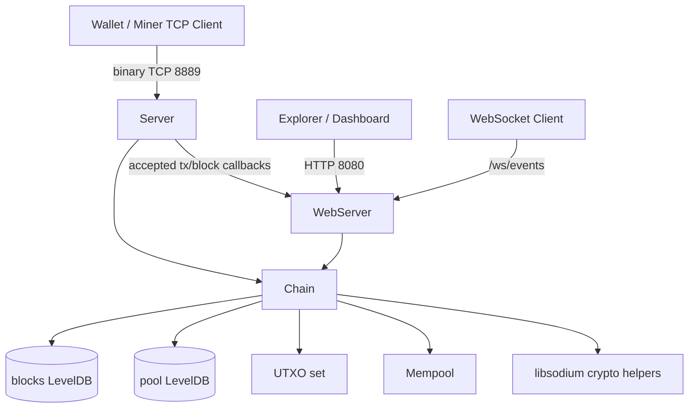

# Axis — Educational C++23 Blockchain Node

Axis is a minimal C++23 blockchain node for learning how blockchain components fit together. It implements a proof-of-work-style linear chain, UTXO-based transactions, Ed25519 signatures, LevelDB persistence, a binary TCP protocol, and an HTTP/WebSocket API.

**This is an educational project, not production cryptocurrency software.**

## What it does

- Maintains a local linear chain of blocks.
- Tracks an in-memory UTXO set reconstructed from persisted blocks.
- Accepts signed transactions into a persisted mempool.
- Validates transaction ownership, signatures, duplicate txids, and local mempool double-spends.
- Accepts externally mined block candidates through the TCP protocol.
- Persists blocks and pending transactions in LevelDB.
- Exposes:
  - binary TCP protocol on port `8889`,
  - HTTP/JSON API on port `8080`,
  - WebSocket event stream on port `8080` at `/ws/events`.

## Current limitations

Axis intentionally omits many production blockchain features:

- no peer-to-peer synchronization,
- no fork choice or chain reorganization,
- no internal miner loop,
- no difficulty retargeting,
- no authenticated or encrypted API layer,
- no wallet/key-management UI,
- no enforced block reward in the current block submission path.

See [`docs/FutureRoadmap.md`](docs/FutureRoadmap.md) for realistic future improvements.

## Quick start

### Dependencies

- CMake ≥ 3.16
- C++23 compiler
- libsodium ≥ 1.0.18
- LevelDB
- standalone Asio
- Crow

### Build & test

```bash
cmake -S . -B build -DBUILD_TESTING=ON
cmake --build build --parallel
ctest --test-dir build --output-on-failure
```

### Run

```bash
rm -rf blocks pool   # optional: start fresh
./build/axisd
```

On first run, Axis creates a genesis block with `15.000000 AXIS` assigned to address:

```text
f45a20e043b01f65638a46831ce79b8fec3f6737
```

## Project structure

```text
include/axis/       Public headers
src/                Implementations
tests/              Regression tests
blocks/             Runtime LevelDB chain database
pool/               Runtime LevelDB mempool database
docs/               Canonical technical documentation
```

## Architecture in one diagram



## Documentation

The generated documentation in [`docs/README.md`](docs/README.md) is the single source of truth for the current implementation.

Key entry points:

| Document | What it covers |
| --- | --- |
| [`docs/Architecture.md`](docs/Architecture.md) | System architecture and module boundaries. |
| [`docs/ProjectStructure.md`](docs/ProjectStructure.md) | File and target layout. |
| [`docs/DataFlow.md`](docs/DataFlow.md) | End-to-end transaction/block/storage flows. |
| [`docs/Blockchain.md`](docs/Blockchain.md) | Chain ownership, genesis, block insertion, lookup. |
| [`docs/Transactions.md`](docs/Transactions.md) | Transaction lifecycle, signing, serialization. |
| [`docs/UTXO.md`](docs/UTXO.md) | UTXO accounting and pending-spend behavior. |
| [`docs/Mempool.md`](docs/Mempool.md) | Pending transaction storage and mining selection. |
| [`docs/Validation.md`](docs/Validation.md) | Current validation rules and gaps. |
| [`docs/Networking.md`](docs/Networking.md) | TCP, HTTP, and WebSocket behavior. |
| [`docs/api/ProtocolPackets.md`](docs/api/ProtocolPackets.md) | Exact TCP packet layouts. |
| [`docs/api/PublicAPI.md`](docs/api/PublicAPI.md) | HTTP/WebSocket and public TCP API reference. |
| [`docs/SourceFiles.md`](docs/SourceFiles.md) | Every source/header/test file. |
| [`docs/FunctionReference.md`](docs/FunctionReference.md) | Function-level reference. |
| [`docs/developer/ExtendingTheProject.md`](docs/developer/ExtendingTheProject.md) | Where and how to add features. |

## License

No license file is currently specified in the source tree.
