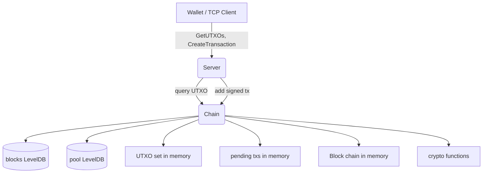

# Axis — Educational C++23 Blockchain Node

Axis is a minimal, clean, C++23 blockchain node that demonstrates how real
blockchain systems work. It implements a proof-of-work chain, UTXO-based
transactions, Ed25519 signatures, LevelDB persistence, and a binary TCP
protocol — all in about 1,000 lines of code.

**This is an educational project, not production cryptocurrency software.**

## What it does

- Maintains a chain of blocks (each containing transactions)
- Tracks Unspent Transaction Outputs (UTXO set)
- Accepts transactions from wallet clients over TCP
- Validates signatures, ownership, and double-spending
- Persists blocks and pending transactions in LevelDB
- Provides a binary wire protocol for wallets

## What it does NOT do (yet)

There is no miner, no peer-to-peer sync, no wallet UI, no REST API. Blocks
are created only during genesis. `verifyBlock()` exists but is not wired to
any network message. This is a foundation for learning and extension.

## Quick start

### Dependencies

- CMake ≥ 3.16
- C++23 compiler (GCC 14+ or Clang 18+)
- [libsodium](https://doc.libsodium.org/) ≥ 1.0.18
- [LevelDB](https://github.com/google/leveldb)
- [standalone Asio](https://think-async.com/Asio/)

On Arch Linux:
```bash
pacman -S cmake ninja libsodium leveldb asio
```

### Build & test

```bash
cmake -S . -B build -DBUILD_TESTING=ON
cmake --build build --parallel
ctest --test-dir build --output-on-failure
```

### Run

```bash
rm -rf blocks pool   # start fresh (optional)
./build/axisd
```

Starts a TCP server on port `9618`. Creates a genesis block with 15,000,000
units sent to address `f45a20e043b01f65638a46831ce79b8fec3f6737` on first run.

## Project structure

```
include/axis/       ── Public headers
  types.h             Core type aliases, Writer/Reader serializers
  util.h              Logger, hex conversion
  crypto.h            Hash, sign, verify, Merkle root
  tx.h                Transaction, OutPoint, TxOutput
  block.h             BlockHeader, Block
  chain.h             Chain (UTXO set, validation, persistence)
  net.h               TCP server, wire protocol

src/                ── Implementation files (one per header)
  main.cpp            Entry point
  chain.cpp           Chain, genesis, UTXO, pool
  block.cpp           Block serialization
  tx.cpp              Transaction serialization
  crypto.cpp          Hashing, signatures, Merkle root
  net.cpp             TCP server, message handling

tests/              ── Regression tests
  core_serialization_tests.cpp

blocks/             ── LevelDB database (chain data, created at runtime)
pool/               ── LevelDB database (mempool data, created at runtime)
```

## Architecture in one diagram



## Documentation

Start with [`docs/README.md`](docs/README.md) — it indexes everything.

| Document | What it covers |
|----------|---------------|
| [Architecture](docs/architecture.md) | High-level design, modules, data flow |
| [Blockchain concepts](docs/blockchain.md) | Blockchain explained from zero |
| [UTXO model](docs/utxo_model.md) | The UTXO accounting model |
| [Transactions](docs/transaction_lifecycle.md) | Transaction creation through validation |
| [Blocks](docs/block_lifecycle.md) | Block structure, genesis, chaining |
| [Serialization](docs/serialization.md) | Binary wire and storage formats |
| [Packet protocol](docs/packet_protocol.md) | TCP message format and types |
| [Database](docs/database.md) | LevelDB key/value schemas |
| [Cryptography](docs/cryptography.md) | Hashing, signing, addresses |
| [Networking](docs/network.md) | Asio coroutines, connection lifecycle |
| [Class reference](docs/class_reference.md) | Every class, method, field |
| [Function reference](docs/function_reference.md) | Every non-trivial function |
| [Developer guide](docs/developer_guide.md) | How to extend the project |
| [Design decisions](docs/design_decisions.md) | Why things are the way they are |
| [FAQ](docs/faq.md) | Common questions |
| [Glossary](docs/glossary.md) | Every technical term defined |

## License

See the repository for license information (not specified in source).
