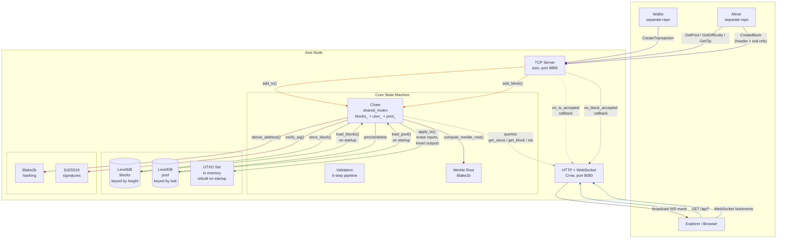

# Axis

Axis is a blockchain node I've been building to understand what actually happens inside a cryptocurrency after the wallet signs a transaction.

There are plenty of tutorials that explain blocks, hashes, and consensus. Very few walk through the engineering problems you run into when you're the one writing the node that has to validate transactions, keep a consistent UTXO set, survive restarts, talk to other programs over the network, and persist everything without corrupting state.

That's what this project is.

The wallet and miner live in separate repositories. Axis is the node they talk to. It validates transactions, manages the mempool, verifies mined blocks, updates the chain, and exposes both a binary TCP protocol and an HTTP API.

Everything else exists to support that job.

## Why I Built It

I wanted something I could actually reason about.

A lot of blockchain projects are so large that it's difficult to answer simple questions like:

* Where is a transaction verified?
* When does a UTXO disappear?
* Who decides whether a block is valid?
* What exactly gets written to disk?
* How does the node recover after restarting?

I wanted to be able to answer every one of those questions by opening a few source files instead of digging through hundreds of thousands of lines of code.

That influenced almost every decision in the project.

I intentionally avoided adding layers just because other projects have them. If something could stay simple without sacrificing correctness, I kept it simple.

## What You'll Find Here

Axis isn't trying to become the next Bitcoin.

It's a blockchain node written from scratch that focuses on the core pipeline.

A transaction arrives.

The node validates ownership and signatures.

If it's valid, it enters the mempool.

A miner later references those transactions when building a block.

The node verifies the block, updates the UTXO set, removes confirmed transactions from the mempool, stores everything in LevelDB, and broadcasts the result.

That's the entire lifecycle.

Nothing is mocked.

Nothing is simulated.

The node actually runs.

## Some Design Decisions

One of the first decisions I made was **not** storing the UTXO set separately.

Instead, the node rebuilds it from confirmed blocks every time it starts.

Yes, startup gets slower as the chain grows.

I'm okay with that.

I'd rather spend a few extra seconds rebuilding state than spend weeks chasing bugs caused by two databases getting out of sync.

I also chose a binary protocol instead of JSON.

The wallet and miner aren't humans.

They're programs.

They don't need readable packets.

They need packets that are compact, predictable, and cheap to parse.

Every message starts with a length, followed by a message type, followed by raw serialized data.

Nothing more.

Serialization follows the same idea.

I didn't want protobuf, FlatBuffers, or another code generation step.

Every type simply knows how to write itself into a byte buffer and reconstruct itself later.

The exact same serialization code is used for disk storage and network communication.

That means there's only one format to maintain.

For storage I ended up with LevelDB.

Not because it's the fastest database on Earth.

Because it solves exactly the problem I have.

I need a lightweight embedded key-value store that writes blocks efficiently without dragging a database server into the project.

LevelDB does that well.

## Project Structure

The project is intentionally small.

Most of the interesting work happens inside a handful of modules.

`chain.cpp` owns the blockchain state.

`tx.cpp` deals with transactions.

`block.cpp` handles blocks and Merkle roots.

`crypto.cpp` wraps hashing and signature verification.

`net.cpp` is the binary TCP server.

`web.cpp` exposes the REST API and WebSocket endpoint.

There isn't much magic.

If you're curious how something works, there's usually only one place to look.

## How It All Fits Together



## What I Enjoyed Building

The networking ended up being one of my favorite parts.

The TCP server uses standalone Asio with coroutines, so the code reads almost like synchronous logic even though everything is asynchronous underneath.

Another part I enjoyed was building the binary serialization layer.

It looks boring until you realize everything depends on it.

Disk storage.

Network packets.

Hashes.

Transactions.

Blocks.

Once serialization became reliable, everything else became much easier to reason about.

I also spent far more time than I expected thinking about validation order.

Small decisions matter.

Should ownership be checked before signatures?

Should duplicate detection happen before expensive cryptography?

What should happen if one output overflows?

The final validation pipeline is the result of answering dozens of little questions like those.

## Current State

Right now the node supports:

* UTXO-based transaction validation
* Proof-of-work block verification
* Persistent block storage with LevelDB
* Mempool management
* Binary TCP protocol for wallets and miners
* HTTP API for explorers
* WebSocket events for real-time updates

The wallet and miner already exist as separate projects, so this repository focuses entirely on the node.

## Things I'd Like To Improve

The biggest weakness right now is address lookups.

Finding every UTXO for an address currently requires scanning the entire UTXO set.

It works.

It's also the obvious place to optimize.

I'd like to maintain a dedicated address index so those lookups become effectively constant time.

I'd also like to move toward a proper peer-to-peer network.

At the moment the node accepts blocks from an external miner, but there's no node-to-node synchronization yet.

That's easily the biggest feature still missing.

## What This Project Taught Me

Before building this I thought blockchain was mostly about cryptography.

It isn't.

Most of the work is bookkeeping.

Making sure every state transition is valid.

Making sure nothing gets applied twice.

Making sure the node can recover after crashing.

Making sure one bug doesn't silently corrupt the chain six hours later.

It also changed the way I write C++.

This project pushed me toward smaller modules, clearer ownership, fewer abstractions, and writing code that's easy to debug instead of code that's merely clever.

## Building

```bash
git clone git@github.com:shaikali-c/axis.git
cd axis

cmake -B build
cmake --build build

./build/axis
