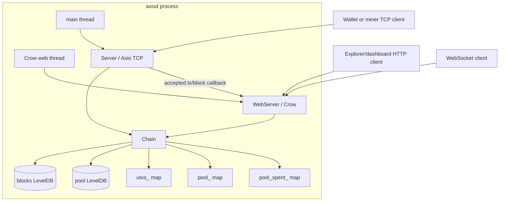
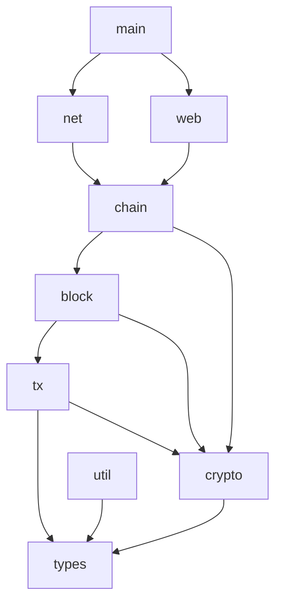

# Architecture

Axis is a compact monolithic blockchain node. The runtime is one process (`axisd`) with three major live objects:

1. `Chain` — owns blockchain state, UTXO state, mempool state, proof-of-work target state, and LevelDB handles.
2. `Server` — owns the asynchronous TCP listener and binary packet handlers.
3. `WebServer` — owns the Crow HTTP/WebSocket app and connected WebSocket clients.

`main()` initializes libsodium, constructs the chain, constructs the web server, wires TCP acceptance events to WebSocket broadcasts, starts Crow on a secondary thread, and runs the TCP `asio::io_context` on the main thread.

## Module Responsibilities

| Module | Files | Owns | Should not own |
| --- | --- | --- | --- |
| Core types | `include/axis/types.h` | Fixed byte types, error enums, primitive binary reader/writer, timestamps. | Blockchain rules, networking, persistence. |
| Utilities | `include/axis/util.h` | Logging helpers, hex conversion, amount/timestamp formatting. | Consensus or validation decisions. |
| Crypto | `include/axis/crypto.h`, `src/crypto.cpp` | Blake2b hashing, Merkle root calculation, address derivation, Ed25519 sign/verify wrappers. | Key storage, wallet policy, chain state. |
| Transactions | `include/axis/tx.h`, `src/tx.cpp` | Transaction object, txid computation, transaction serialization, pretty printing. | Signature verification, UTXO lookups, mempool policy. |
| Blocks | `include/axis/block.h`, `src/block.cpp` | Block header, block object, block hash, Merkle root from contained txids, block serialization. | Chain validity, persistence decisions, mining orchestration. |
| Chain | `include/axis/chain.h`, `src/chain.cpp` | In-memory blocks, UTXO map, mempool map, mempool spent index, LevelDB handles, transaction acceptance, block insertion. | Socket I/O, HTTP routing, JSON formatting. |
| TCP networking | `include/axis/net.h`, `src/net.cpp` | TCP accept loop, packet framing, binary request parsing, response serialization, block/transaction submission routing. | Long-term blockchain state beyond calls to `Chain`. |
| HTTP/WebSocket | `include/axis/web.h`, `src/web.cpp` | REST routes, JSON responses, WebSocket connection set, event broadcast. | Binary TCP protocol, LevelDB ownership, direct UTXO mutation. |
| Entry point | `src/main.cpp` | Process initialization, object lifetime, thread startup/shutdown. | Business logic. |

## Runtime Architecture



## Dependency Direction

The intended dependency direction is mostly inward toward core data structures:



The headers encode this layering: `net.h` and `web.h` include `chain.h`; `chain.h` includes `block.h`; `block.h` includes `tx.h`; `tx.h` and `crypto.h` include `types.h`.

## Ownership Graph

```mermaid
graph TD
    main[main()] --> chain[Chain stack object]
    main --> web[WebServer stack object]
    main --> server[Server stack object]
    chain --> blocksDb[unique_ptr leveldb::DB blocks_db_]
    chain --> poolDb[unique_ptr leveldb::DB pool_db_]
    chain --> blocks[vector<Block> blocks_]
    chain --> utxo[unordered_map<OutPoint, TxOutput> utxo_]
    chain --> pool[unordered_map<Hash, Transaction> pool_]
    chain --> poolSpent[unordered_map<OutPoint, OutPoint> pool_spent_]
    server --> io[asio::io_context ctx_]
    server --> acceptor[tcp::acceptor acceptor_]
    server --> chainRef[Chain& chain_]
    web --> app[crow::SimpleApp app_]
    web --> wsSet[unordered_set websocket connections]
    web --> chainRef2[Chain& chain_]
```

`Chain` is referenced by both servers and outlives them because it is constructed first in `main()` and destroyed after the servers leave scope.

## Critical Design Decisions

- **Single authoritative chain object:** both TCP and HTTP/WebSocket access the same `Chain`, avoiding cross-component synchronization protocols. Internal locking is centralized in `Chain`.
- **LevelDB per data category:** blocks and pool transactions are stored in separate LevelDB directories (`blocks/`, `pool/`).
- **Native binary serialization:** `Writer`/`Reader` copy integer memory representation directly. This keeps code small but makes wire/storage bytes native-endian.
- **Mempool spent index:** `pool_spent_` prevents accepting two pending transactions that spend the same outpoint before either is mined.
- **HTTP as read/control facade:** HTTP exposes chain status, block lookup, mempool lookup, UTXO lookup, and transaction submission, but not block creation.
- **TCP as miner/wallet protocol:** TCP supports UTXO lookup, difficulty query, pool query, transaction submission, and block submission.

## Current Architectural Limitations

- There is no peer-to-peer networking or remote chain synchronization.
- There is no fork choice; blocks are appended only to the current tip.
- Difficulty is hardcoded to `3` leading zero bytes and never retargets.
- Public block validation is split between `Server::on_create_block()` and `Chain::add_block()`; `Chain::add_block()` itself does not verify the block before mutating state.
- `Chain::verify_tx()` and `Chain::verify_block()` are declared but not implemented.
- `Chain::verify_block_header()` is implemented but not used by block submission.
- HTTP JSON is built manually with streams rather than a full JSON serializer.
- WebSocket broadcast sends while holding the WebSocket set mutex.
