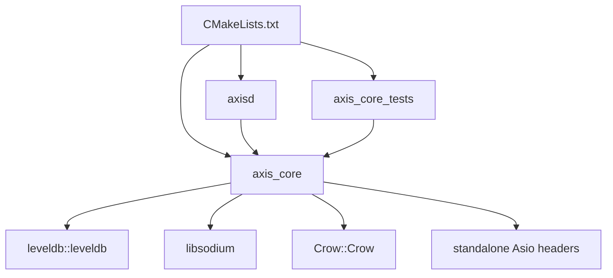

# Build System

Axis is built with CMake 3.16 or newer and requires C++23.

## Global CMake Settings

`CMakeLists.txt` sets:

- `CMAKE_CXX_STANDARD 23`
- `CMAKE_CXX_STANDARD_REQUIRED ON`
- `CMAKE_CXX_EXTENSIONS OFF`
- `CMAKE_EXPORT_COMPILE_COMMANDS ON`

This means the project expects standard C++23 without compiler-specific language extensions and emits `compile_commands.json` for tooling.

## External Dependencies

| Dependency | CMake discovery | Runtime role |
| --- | --- | --- |
| Threads | `find_package(Threads REQUIRED)` | Used indirectly by Crow/Asio and `std::thread` in `main`. |
| LevelDB | `find_package(leveldb CONFIG REQUIRED)` | Persistent block and mempool key/value storage. |
| PkgConfig | `find_package(PkgConfig REQUIRED)` | Finds libsodium and fallback Asio. |
| Crow | `find_package(Crow CONFIG REQUIRED)` | HTTP and WebSocket server. |
| libsodium >= 1.0.18 | `pkg_check_modules(LIBSODIUM REQUIRED libsodium>=1.0.18)` | Blake2b hashing, hex encoding/decoding, Ed25519 signatures. |
| standalone Asio | `find_package(asio CONFIG QUIET)`, fallback `pkg_check_modules(ASIO REQUIRED asio)` | Asynchronous TCP server and coroutines. |

## CMake Targets

### `axis_core`

Type: static/shared library according to CMake default.

Sources:

- `src/chain.cpp`
- `src/block.cpp`
- `src/tx.cpp`
- `src/crypto.cpp`
- `src/net.cpp`
- `src/web.cpp`

Public include directory:

- `include`

Private include directories:

- libsodium include directories
- Asio include directories when found via pkg-config fallback

Linked libraries:

- `leveldb::leveldb`
- libsodium libraries from pkg-config
- `Crow::Crow`

Precompiled header:

- `include/axis/pch.hpp`

### `axisd`

Type: executable.

Source:

- `src/main.cpp`

Links:

- `axis_core`

Uses the same precompiled header.

### `axis_core_tests`

Type: executable, only when `BUILD_TESTING` is enabled.

Source:

- `tests/core_serialization_tests.cpp`

Links:

- `axis_core`

Registered CTest name:

- `axis_core_tests`

## Typical Commands

```bash
cmake -S . -B build -DBUILD_TESTING=ON
cmake --build build --parallel
ctest --test-dir build --output-on-failure
```

## Build-Time Architecture



## Precompiled Header Policy

`include/axis/pch.hpp` intentionally includes stable third-party and standard headers only. Project headers are excluded so normal edits to Axis headers do not invalidate the PCH more than necessary.

## Dependency Notes

- libsodium must be initialized with `sodium_init()` before crypto helpers are used. Both `src/main.cpp` and `tests/core_serialization_tests.cpp` do this.
- LevelDB paths are hardcoded in `Chain::Chain()` as `blocks` and `pool`; CMake does not configure them.
- TCP and HTTP ports are hardcoded in `src/main.cpp` as `8889` and `8080` respectively.
