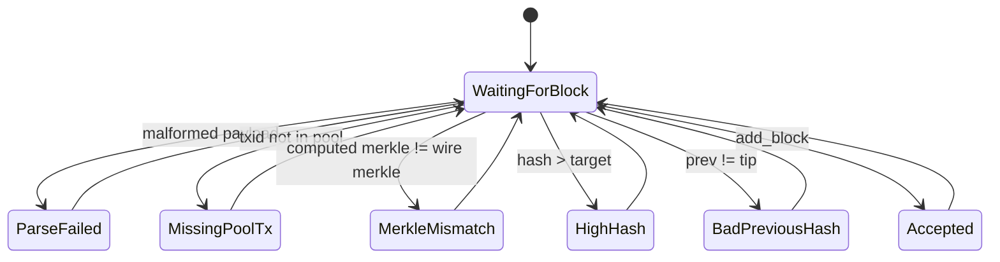

# Consensus

Axis currently implements local block acceptance checks, not distributed consensus. There are no peers, no chain synchronization, no fork handling, and no difficulty retargeting.

## Proof-of-Work Target

`Chain::difficulty_` defaults to `3`. `build_target()` creates a 32-byte target:

- start with all bytes `0xff`,
- set the first `difficulty_` bytes to `0x00`.

For difficulty `3`, target is:

```text
000000ffffffffffffffffffffffffffffffffffffffffffffffffffffffffff
```

`Server::on_create_block()` accepts proof-of-work if:

```text
block.hash() <= chain.target()
```

Because `Hash` is a `std::array<uint8_t, 32>`, comparison is lexicographic byte comparison. With the target above, this is equivalent to requiring the first three bytes to be zero or smaller than the first non-`0xff` position.

`Chain::verify_block_header()` instead checks the first `difficulty_` bytes directly equal zero. That function is not used by current block submission.

## Block Acceptance Rules in Current Runtime

TCP `CreateBlock` path checks:

1. Payload parses successfully.
2. Every non-coinbase txid in the payload exists in `chain.pool_` through `pool_contains()`.
3. Server reconstructs the block from:
   - submitted previous hash,
   - server-created coinbase transaction,
   - mempool transactions referenced by txids,
   - submitted timestamp,
   - submitted nonce.
4. Recomputed block Merkle root equals the wire `merkle_root` field.
5. `blk.hash() <= chain.target()`.
6. `blk.header().prev_hash == chain.tip_hash()`.
7. `chain.add_block(blk)` succeeds.

Rules not currently enforced in `Server::on_create_block()`:

- block timestamp greater than previous block timestamp,
- block timestamp not too far in the future,
- coinbase reward amount equals `MINER_REWARD`,
- exactly one coinbase transaction beyond the constructed first transaction,
- maximum block size or transaction count,
- revalidation of each transaction at block connection time,
- duplicate transaction IDs inside a block,
- transaction fee accounting,
- Merkle tree proof paths.

## Fork Choice

There is no fork choice. A block is accepted only if its previous hash equals the current local tip hash. Competing blocks for the same height are rejected by `BadPreviousHash` after one becomes tip.

## Difficulty Adjustment

There is no difficulty adjustment. `difficulty_` is always initialized to `3` and never changes.

## Consensus State Machine



## Educational vs Production Consensus

Axis demonstrates the shape of local proof-of-work validation, but production blockchain consensus would require:

- peer discovery and block propagation,
- complete block validation in the chain layer,
- fork choice by cumulative work,
- chain reorganization support,
- difficulty retarget rules,
- timestamp windows,
- coinbase maturity/reward rules,
- durable block indexes by hash,
- ban/scoring rules for invalid peers.
