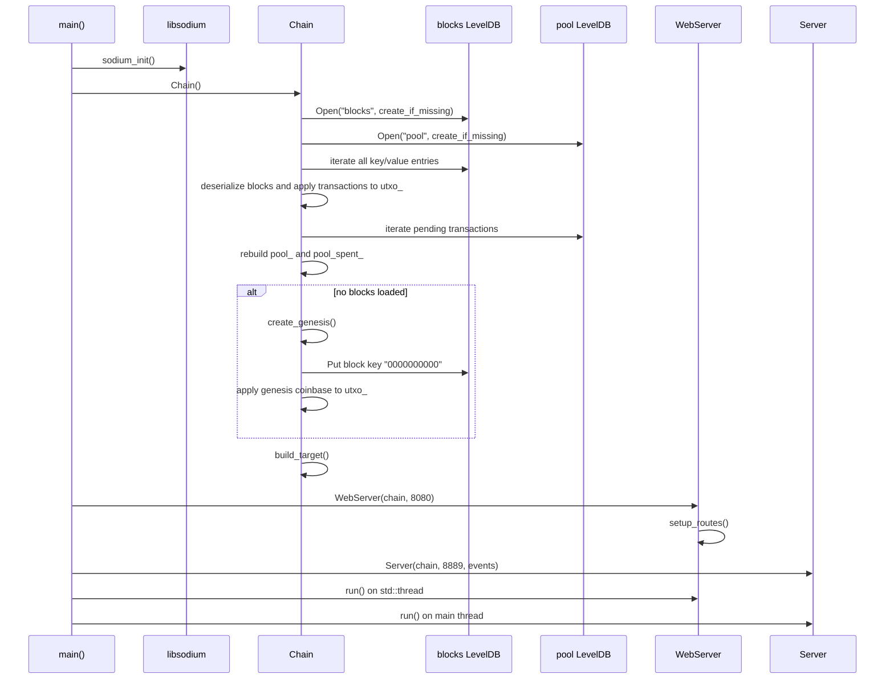
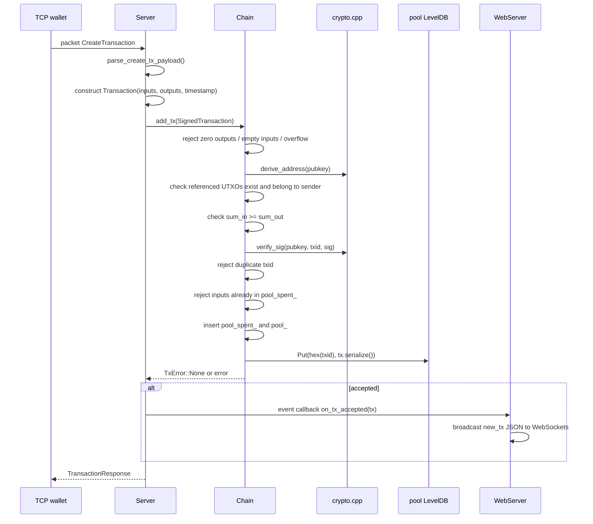
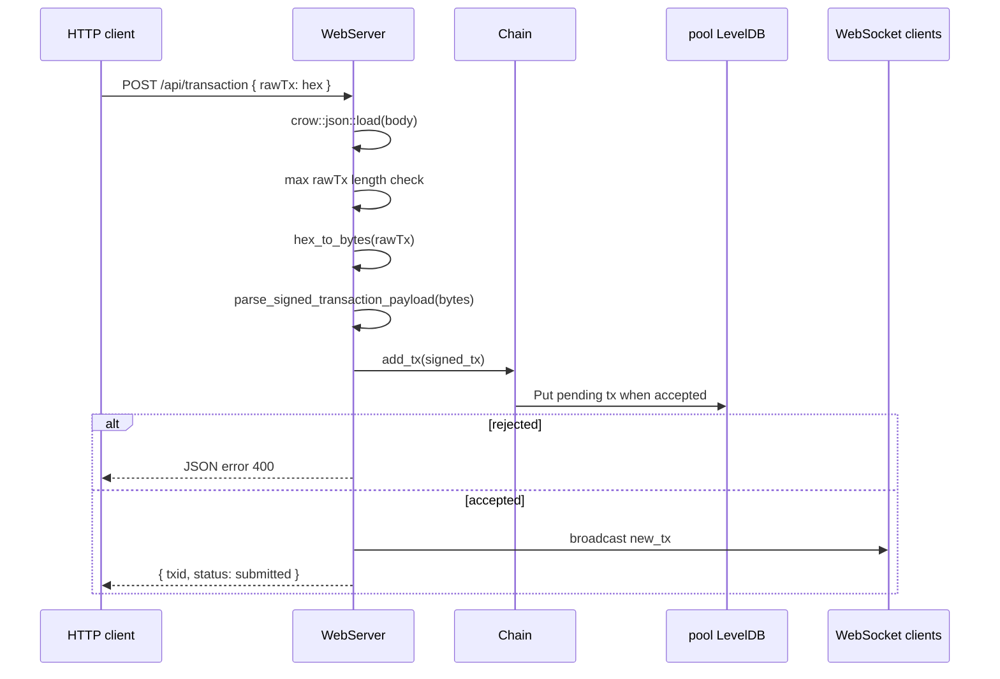
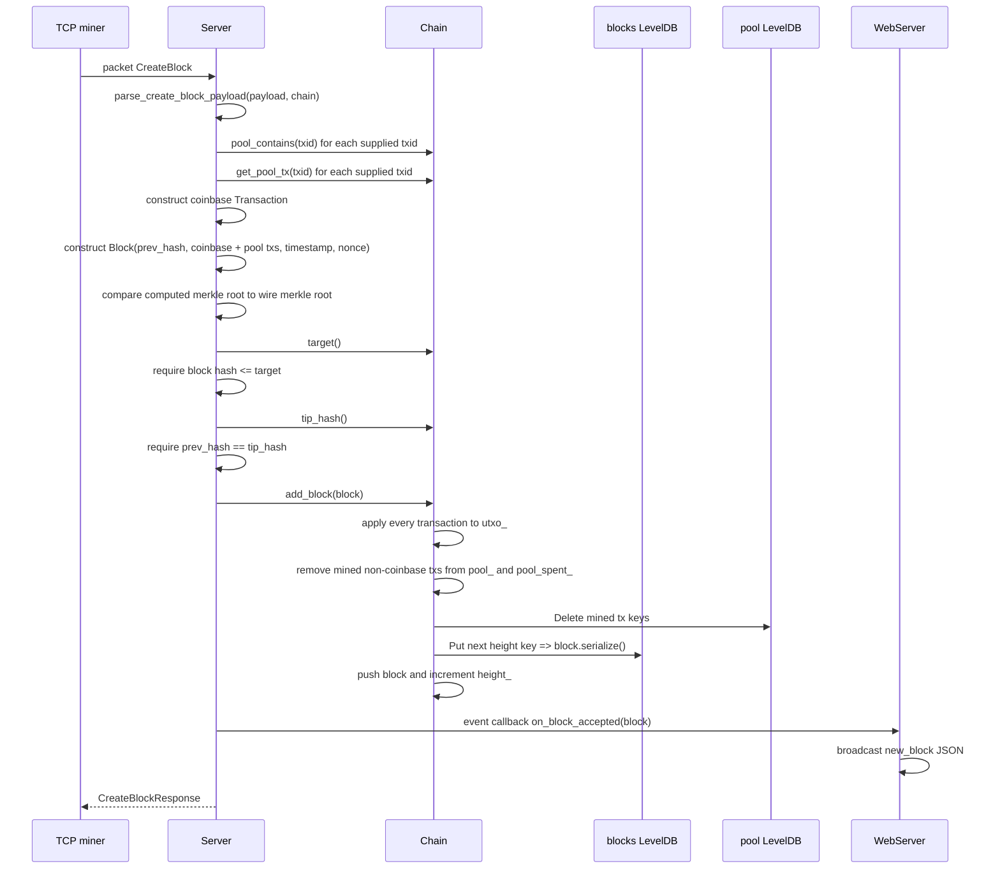
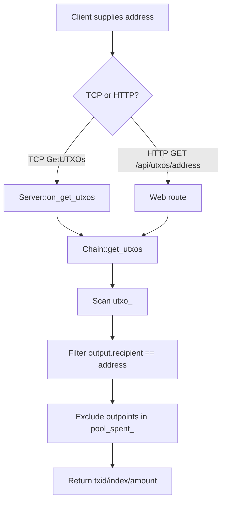
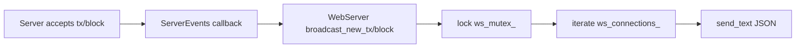

# Complete Data Flow

This document follows real execution paths through the current implementation.

## Startup Flow

## Wallet Creates Transaction via TCP

## Transaction Submission via HTTP

HTTP `POST /api/transaction` uses the same binary payload layout as TCP `CreateTransaction`, but wrapped as hex in JSON:

## Miner Creates Block via TCP

Important: `Chain::add_block()` assumes the block has already been checked by the caller. It mutates UTXO and mempool state before storing/pushing the block.

## UTXO Lookup

`get_utxos()` deliberately hides outputs already reserved by pending mempool transactions, so wallets do not select an output that another pending local transaction is already spending.

## Persistence and Recovery Flow

- Blocks are persisted immediately when genesis or accepted blocks are stored.
- Pending transactions are persisted immediately when accepted into the mempool.
- On startup, all persisted blocks are loaded and replayed through `apply_tx()` to reconstruct the UTXO set.
- On startup, all persisted pool transactions are loaded into `pool_`, and their inputs are inserted into `pool_spent_`.
- If no blocks are present, genesis is created and persisted.

## Broadcast Flow

TCP accepted transactions and blocks are bridged into WebSocket events via callbacks supplied by `main()`:

HTTP accepted transactions call `broadcast_new_tx()` directly from the HTTP route.
