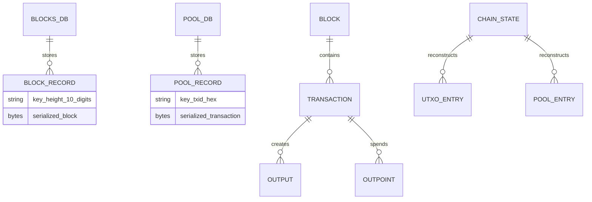

# Database

Axis has no database abstraction class. Database access is embedded in `Chain` and uses LevelDB directly.

## LevelDB Handles

| Field | Type | Opened in | Directory |
| --- | --- | --- | --- |
| `blocks_db_` | `std::unique_ptr<leveldb::DB>` | `Chain::Chain()` | `blocks` |
| `pool_db_` | `std::unique_ptr<leveldb::DB>` | `Chain::Chain()` | `pool` |

Both are private members of `Chain` and are destroyed automatically when `Chain` is destroyed.

## `blocks` Key/Value Schema

| Key | Value | Producer | Consumer |
| --- | --- | --- | --- |
| zero-padded decimal height, 10 bytes | `Block::serialize()` | `store_block()` | `load_blocks()` |

Example keys:

| Height | Key |
| ---: | --- |
| 0 | `0000000000` |
| 25 | `0000000025` |
| 123456 | `0000123456` |

The key format is deliberately sortable so sequential LevelDB iteration yields chain order.

## `pool` Key/Value Schema

| Key | Value | Producer | Consumer |
| --- | --- | --- | --- |
| lowercase txid hex, 64 chars | `Transaction::serialize()` | `add_tx()` | `load_pool()` |

When a transaction is mined, `add_block()` deletes its pool key.

## In-Memory Indexes Rebuilt from Database

| In-memory field | Rebuilt from | Purpose |
| --- | --- | --- |
| `blocks_` | `blocks` DB values | Ordered chain vector. |
| `height_` | `blocks_.size()` | Number of blocks, not tip index. |
| `utxo_` | Replay of all loaded block transactions | Current spendable outputs. |
| `pool_` | `pool` DB values | Pending transactions by txid. |
| `pool_spent_` | Inputs of pending transactions | Prevents local mempool double-spends and hides reserved UTXOs. |

## Database Operations by Function

| Function | DB operations | Notes |
| --- | --- | --- |
| `Chain::Chain()` | `DB::Open` twice | Opens/create `blocks` and `pool`. |
| `Chain::load_blocks()` | Iterator over `blocks_db_` | Deserializes and applies all blocks. |
| `Chain::load_pool()` | Iterator over `pool_db_` | Deserializes pending transactions. |
| `Chain::store_block()` | `blocks_db_->Put` | Throws on failure. |
| `Chain::add_tx()` | `pool_db_->Put` | Persists accepted pending tx. |
| `Chain::add_block()` | `pool_db_->Delete`, `store_block()` | Removes mined txs and stores block. |

## What Is Not Stored

- Difficulty metadata. `difficulty_` is hardcoded to `3` on every startup.
- Target metadata. `target_` is rebuilt from `difficulty_` on startup.
- Chain configuration or network ports.
- Address indexes beyond the derived `utxo_` map.
- Block hash indexes. Block lookup by hash scans `blocks_`.
- Mempool arrival time, fee, priority, or eviction metadata.
- Signatures/public keys for accepted pool transactions. Only `Transaction` is stored; `SignedTransaction` is not persisted.

The last point means pool transaction signatures are validated on first submission but are not retained in the pool database.

## Database Relationship Diagram

