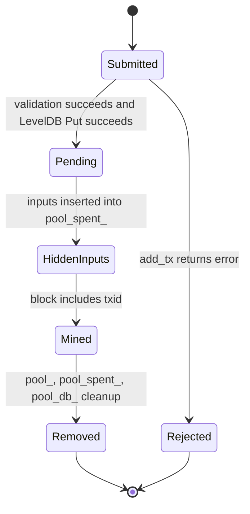

# Mempool

The mempool is the set of locally accepted, not-yet-mined transactions. Axis stores it in memory and persists it to LevelDB.

## In-Memory Structures

| Field | Type | Purpose |
| --- | --- | --- |
| `pool_` | `unordered_map<Hash, Transaction, HashHasher>` | Pending transactions by txid. |
| `pool_spent_` | `unordered_map<OutPoint, OutPoint>` | Inputs reserved by pending transactions. |

`pool_` is declared public in `chain.h`, but current code accesses it through methods except internal chain methods. New code should avoid direct mutation and use methods.

## Insertion

`Chain::add_tx()` inserts into the mempool after validation:

1. Reserve every input in `pool_spent_`.
2. Insert transaction into `pool_`.
3. Persist transaction to `pool_db_` under txid hex key.

Duplicate txid check happens before insertion. Pending double-spend check happens by testing every input against `pool_spent_`.

## Duplicate Detection

| Duplicate type | Mechanism |
| --- | --- |
| Same txid already pending | `pool_.contains(tx.txid())` -> `TxError::Duplicate`. |
| Different tx spending same pending input | `pool_spent_.contains(input)` -> `TxError::InputSpent`. |

Confirmed-chain duplicate checks are indirect: once a transaction is mined, its inputs disappear from `utxo_`, so another spend of the same inputs fails ownership/input lookup.

## Mining Selection

Axis does not choose transactions for miners. Instead:

- TCP `GetPool` returns pending txids.
- A miner/client builds a `CreateBlock` request containing selected txids.
- `parse_create_block_payload()` requires every txid to exist in `pool_`.
- The server reconstructs the block using current pool transaction bodies.

There is no fee sorting, max block size, priority, age, or eviction policy.

## Eviction/Removal

There is no time-based or size-based eviction. Transactions leave the mempool only when included in an accepted block.

`Chain::add_block()` removes mined non-coinbase transactions:

1. Erase each input from `pool_spent_`.
2. Erase txid from `pool_`.
3. Delete txid key from `pool_db_`.

## Persistence

Pending transactions are persisted as `Transaction::serialize()` values. Public key and signature are not stored. On startup, `load_pool()` reconstructs `pool_` and `pool_spent_`, but it does not re-validate signatures or ownership.

## Mempool Flow

## Failure Cases

- LevelDB write failure throws after in-memory mempool insertion.
- LevelDB delete failure during block insertion throws after some in-memory state may already be mutated.
- Persisted pool transactions are trusted on startup and may reserve inputs even if chain state changed externally.

## Future Improvements

- Make `pool_` private.
- Store `SignedTransaction` or validation metadata if signatures need revalidation after restart.
- Add fee calculation and transaction selection rules.
- Add maximum mempool size and eviction policy.
- Use LevelDB write batches for atomic pool/block updates.
