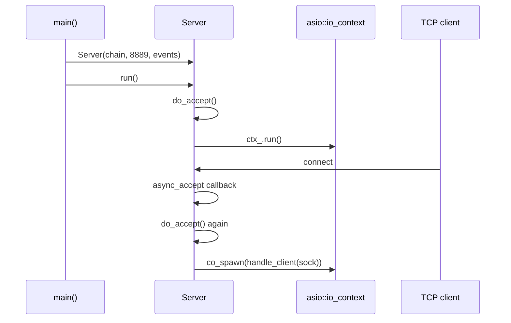
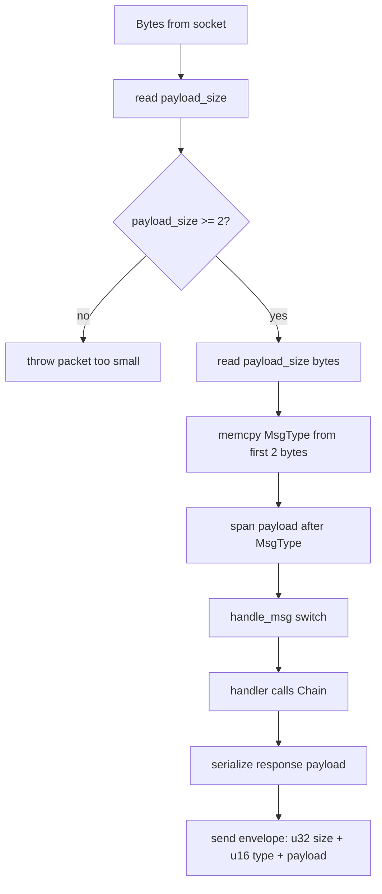

# Networking

Axis exposes two network surfaces:

1. Binary TCP protocol served by `Server` on port `8889` in the current `main.cpp`.
2. HTTP/JSON and WebSocket API served by `WebServer` on port `8080`.

The repository README still mentions older/no REST behavior and an older port in places; the current implementation in `src/main.cpp` is authoritative: TCP `8889`, HTTP/WebSocket `8080`.

## TCP Server Architecture

`Server` is implemented in `src/net.cpp` using standalone Asio.

### Lifecycle

`do_accept()` creates one socket per pending accept. On success it immediately schedules the next accept and starts a coroutine for the accepted socket.

### Session Loop

`handle_client()` loops forever:

1. Read a 4-byte `uint32_t payload_size`.
2. Reject if `payload_size < sizeof(MsgType)`.
3. Allocate a vector of `payload_size` bytes.
4. Read exactly that many bytes.
5. Copy the first 2 bytes as `MsgType`.
6. Treat remaining bytes as payload.
7. Dispatch through `handle_msg()`.

The loop exits on exceptions. A string equal to `"End of file"` is treated as normal disconnect; other exceptions are logged as session errors.

### Message Routing

Handled request types:

| Request | Handler | Response |
| --- | --- | --- |
| `GetUTXOs` | `on_get_utxos()` | `UTXOsResponse` |
| `GetTip` | `on_get_tip()` | `TipResponse` |
| `GetPool` | `on_get_pool()` | `PoolResponse` |
| `GetDifficulty` | `on_get_difficulty()` | `DifficultyResponse` |
| `CreateTransaction` | `on_create_tx()` | `TransactionResponse` |
| `CreateBlock` | `on_create_block()` | `CreateBlockResponse` |

Declared but not handled request values:

- `GetBlock`
- `GetTransaction`
- `GetUTXO`

Unknown message types are logged and do not receive an error response.

### Packet Lifecycle

## HTTP API

`WebServer::setup_routes()` registers routes with Crow:

| Route | Method | Purpose |
| --- | --- | --- |
| `/api/status` | GET | Node status, height, difficulty, tip hash. |
| `/api/tip` | GET | Current tip block with transactions. |
| `/api/block/<id>` | GET | Block by height or 32-byte hex hash. |
| `/api/blocks` | GET | Paginated block summaries. |
| `/api/mempool` | GET | Pending transaction list. |
| `/api/utxos/<address>` | GET | UTXOs and balance for a 20-byte address. |
| `/api/address/<address>` | GET | Alias for UTXO lookup. |
| `/api/transaction` | POST | Submit a signed transaction payload as hex. |
| `/api/<path>` | OPTIONS | CORS preflight. |
| `/ws/events` | WebSocket | Server-push event stream and ping/pong. |

HTTP responses are manually serialized JSON strings. `json_response()` sets:

- `Content-Type: application/json`
- `Access-Control-Allow-Origin: *`
- `Access-Control-Allow-Methods: GET, POST, OPTIONS`
- `Access-Control-Allow-Headers: Content-Type, X-API-Key`

There is no authentication, authorization, TLS, or rate limiting in the current Crow layer.

## WebSocket Events

`WebServer` stores raw `crow::websocket::connection*` pointers while connections are open.

Server-to-client messages:

| Event | When sent | Shape |
| --- | --- | --- |
| `connected` | Immediately after WebSocket open | `{ "type": "connected" }` |
| `new_tx` | Transaction accepted via TCP or HTTP | `{ "type": "new_tx", "txid": "...", "transaction": {...} }` |
| `new_block` | Block accepted via TCP | `{ "type": "new_block", "hash": "...", "timestamp": ..., "transactionCount": ... }` |
| `pong` | Client sends `ping` or `{ "type":"ping" }` | `{ "type": "pong" }` |

## Network Impact of Core Operations

| Operation | TCP impact | HTTP/WebSocket impact |
| --- | --- | --- |
| `GetUTXOs` | Reads from chain and returns binary UTXO list. | Equivalent data available as JSON through `/api/utxos/<address>`. |
| `CreateTransaction` | On accept, returns binary result and triggers WebSocket `new_tx`. | HTTP submit also triggers `new_tx`. |
| `CreateBlock` | On accept, returns binary result and triggers WebSocket `new_block`. | No HTTP block submission endpoint. |
| Chain read routes | Not applicable. | HTTP routes call `Chain` read methods and return JSON. |

## Failure Cases

- Malformed TCP packet length below 2 bytes terminates the client session.
- Malformed TCP transaction/block payloads are caught and returned as `InvalidPayload` responses for submission handlers.
- Unknown TCP message types are logged but not answered.
- HTTP invalid input returns JSON errors with status 400 or 413 depending on route.
- WebSocket binary messages are ignored.
