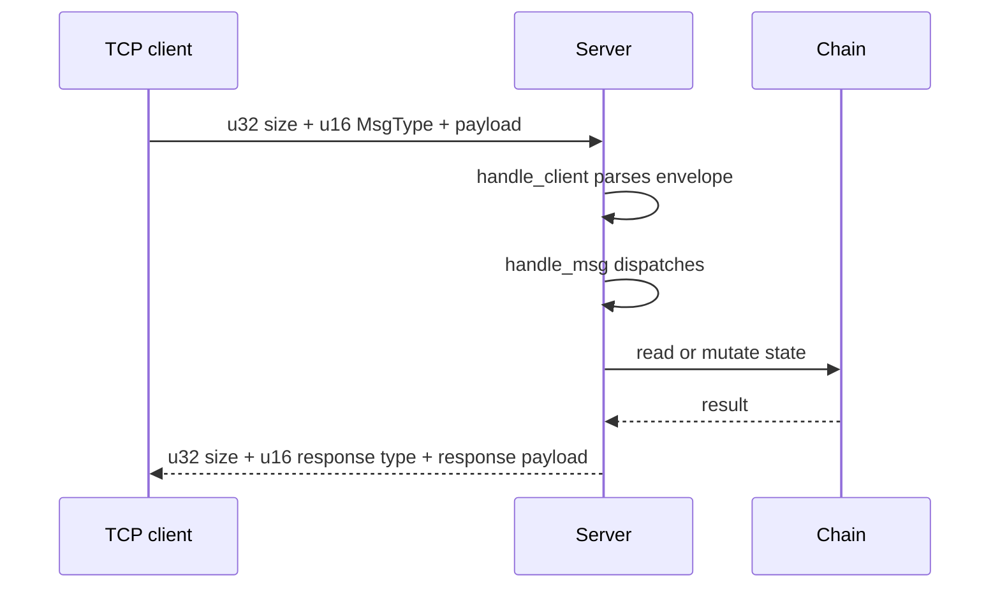

# Protocol Overview

Axis has two protocol families:

- A binary TCP protocol based on `MsgType` and `Writer`/`Reader` primitives.
- A Crow HTTP/JSON and WebSocket protocol.

For exact binary layouts, see [api/ProtocolPackets.md](api/ProtocolPackets.md). For route-level HTTP details, see [api/PublicAPI.md](api/PublicAPI.md).

## TCP Message IDs

`MsgType` is a `uint16_t` enum:

| Value | Name | Runtime support |
| ---: | --- | --- |
| 0 | `GetUTXOs` | handled |
| 1 | `GetBlock` | declared, not handled |
| 2 | `GetTip` | handled |
| 3 | `GetTransaction` | declared, not handled |
| 4 | `GetUTXO` | declared, not handled |
| 5 | `GetDifficulty` | handled |
| 6 | `GetPool` | handled |
| 7 | `CreateTransaction` | handled |
| 8 | `CreateBlock` | handled |
| 9 | `DifficultyResponse` | server response |
| 10 | `TransactionResponse` | server response |
| 11 | `CreateBlockResponse` | server response |
| 12 | `UTXOsResponse` | server response |
| 13 | `TipResponse` | server response |
| 14 | `PoolResponse` | server response |

## TCP Envelope

```text
u32 payload_size
u16 msg_type
payload bytes
```

`payload_size` includes the 2-byte message type plus payload bytes, but not the 4-byte length prefix.

## HTTP Surface

| Endpoint | Method | Purpose |
| --- | --- | --- |
| `/api/status` | GET | status, version, height, difficulty, tip hash |
| `/api/tip` | GET | full tip block |
| `/api/block/<id>` | GET | block by height or hash |
| `/api/blocks` | GET | paginated summaries |
| `/api/mempool` | GET | pending transactions |
| `/api/utxos/<address>` | GET | address UTXOs and balance |
| `/api/address/<address>` | GET | alias for UTXO lookup |
| `/api/transaction` | POST | submit hex-encoded signed transaction payload |
| `/api/<path>` | OPTIONS | CORS preflight |
| `/ws/events` | WebSocket | event stream |

## Protocol Data Types

| Concept | Binary | JSON |
| --- | --- | --- |
| Hash | 32 raw bytes | 64-character lowercase hex |
| Address | 20 raw bytes | 40-character lowercase hex |
| Amount | `uint64_t` base units | JSON number |
| Timestamp | `uint64_t` Unix seconds | JSON number |
| Public key | raw libsodium bytes | only in `rawTx` hex payload |
| Signature | raw libsodium bytes | only in `rawTx` hex payload |

## Packet Flow



## Protocol Compatibility Notes

- Native-endian integer encoding means clients should currently run on compatible architecture/ABI or explicitly match Axis's byte layout.
- There is no version negotiation.
- There is no request correlation ID.
- There is no authentication or encryption.
- HTTP `rawTx` intentionally reuses the TCP `CreateTransaction` payload rather than `Transaction::serialize()` because signature/public key fields are required.
