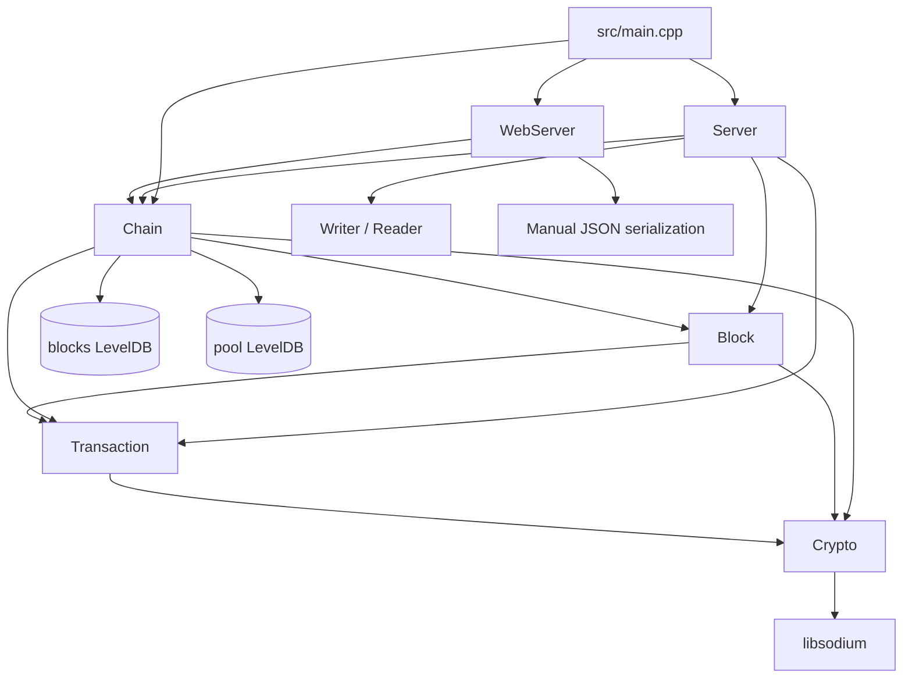

# Axis Technical Documentation

This directory is the canonical technical reference for the current Axis implementation. It was generated from the indexed source tree, including every header, implementation file, CMake target, test file, and the existing protocol/API notes.

Axis is an educational C++23 blockchain node. It currently implements:

- A single-process node daemon, `axisd`.
- A proof-of-work-style linear blockchain with in-memory chain state and LevelDB persistence.
- A UTXO transaction model with Ed25519 signatures.
- A binary TCP protocol for wallets/miners.
- A Crow HTTP/JSON API and WebSocket event stream for explorers and dashboards.
- A small regression test executable for serialization and Merkle behavior.

Important current limitations are documented explicitly throughout these files. In particular, Axis does not implement peer-to-peer consensus, fork choice, difficulty retargeting, authenticated APIs, TLS, wallet key management, or block validation as a reusable public `Chain` API. Blocks are accepted through the TCP `CreateBlock` handler after local checks in `src/net.cpp`.

## Reading Order

1. [Architecture](Architecture.md) — the whole system and module boundaries.
2. [Project Structure](ProjectStructure.md) — every source/header/test/build file.
3. [Build System](BuildSystem.md) — CMake targets and external dependencies.
4. [Data Flow](DataFlow.md) — transaction, block, UTXO, storage, and broadcast flows.
5. [Blockchain](Blockchain.md), [Transactions](Transactions.md), [UTXO](UTXO.md), [Mempool](Mempool.md), and [Validation](Validation.md) — core blockchain behavior.
6. [Networking](Networking.md), [Protocol](Protocol.md), and [api/ProtocolPackets](api/ProtocolPackets.md) — TCP, HTTP, WebSocket, and binary layouts.
7. [Storage](Storage.md) and [Database](Database.md) — LevelDB persistence.
8. [Threading](Threading.md), [Error Handling](ErrorHandling.md), and [Performance](Performance.md) — operational considerations.
9. [classes/](classes/) — class-by-class reference.
10. [developer/](developer/) — contribution, extension, and debugging guidance.
11. [diagrams/](diagrams/) — Mermaid diagrams for workflows and relationships.

## Canonical Documents

| Area | Document |
| --- | --- |
| System design | [Architecture.md](Architecture.md) |
| Source layout | [ProjectStructure.md](ProjectStructure.md) |
| CMake/dependencies | [BuildSystem.md](BuildSystem.md) |
| Data movement | [DataFlow.md](DataFlow.md) |
| Threading/lifetime | [Threading.md](Threading.md) |
| TCP/HTTP/WebSocket | [Networking.md](Networking.md) |
| Binary/object serialization | [Serialization.md](Serialization.md) |
| LevelDB persistence | [Storage.md](Storage.md), [Database.md](Database.md) |
| Chain and blocks | [Blockchain.md](Blockchain.md), [Consensus.md](Consensus.md) |
| Transactions/accounting | [Transactions.md](Transactions.md), [UTXO.md](UTXO.md), [Mempool.md](Mempool.md) |
| Rules and failures | [Validation.md](Validation.md), [ErrorHandling.md](ErrorHandling.md) |
| Crypto | [Cryptography.md](Cryptography.md) |
| Protocol/API | [Protocol.md](Protocol.md), [api/PublicAPI.md](api/PublicAPI.md), [api/InternalAPI.md](api/InternalAPI.md), [api/ProtocolPackets.md](api/ProtocolPackets.md) |
| Performance/future work | [Performance.md](Performance.md), [FutureRoadmap.md](FutureRoadmap.md) |

## Implementation Map

## Accuracy Notes

- File paths and function names refer to the current source tree.
- Existing lower-case docs such as `binary_packet_serialization.md` and `http_websocket_api.md` remain as historical/legacy references, but the TitleCase documents in this directory are the canonical documentation set.
- Behavior marked as a limitation or future improvement is not implemented today.
- Several declarations exist in headers but are not implemented or not wired into the runtime; those are called out rather than assumed to work.
