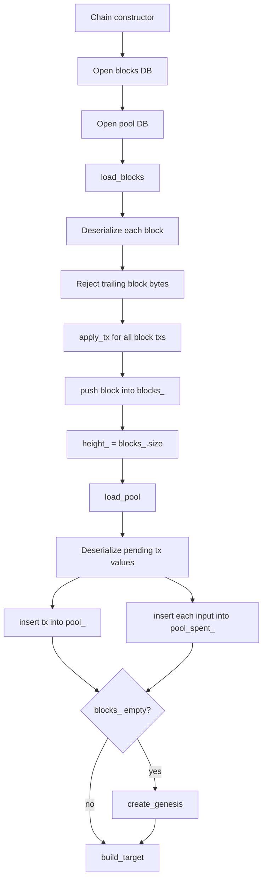

# Storage

Axis persists blockchain and mempool data with LevelDB. `Chain` owns both database handles through `std::unique_ptr<leveldb::DB>`.

## Storage Locations

`Chain::Chain()` opens two databases relative to the process working directory:

| Directory | Field | Contents |
| --- | --- | --- |
| `blocks` | `blocks_db_` | Serialized blocks keyed by height. |
| `pool` | `pool_db_` | Serialized pending transactions keyed by txid hex. |

Both databases use `leveldb::Options{ .create_if_missing = true }`.

## Block Persistence

### Key

`Chain::block_key(height)` formats block heights as zero-padded 10-character decimal strings:

```text
height 0 -> "0000000000"
height 1 -> "0000000001"
```

This makes LevelDB lexicographic iteration match numeric block order for heights up to 9,999,999,999.

### Value

The value is `Block::serialize()`:

```text
80-byte header
u32 transaction_count
for each transaction:
  u32 tx_size
  tx_size bytes Transaction::serialize()
```

### Write Path

- Genesis: `create_genesis()` calls `store_block(blk)` before pushing the block into `blocks_`.
- Accepted block: `add_block()` calls `store_block(blk)` after applying transactions and removing mined mempool transactions, then pushes the block and increments height.

If LevelDB `Put` fails, `store_block()` throws `std::runtime_error`.

## Pool Persistence

### Key

`hex_key(tx.txid())` converts the 32-byte txid to a 64-character lowercase hex string.

### Value

The value is `Transaction::serialize()`.

### Write Path

`Chain::add_tx()` writes the transaction after all validation checks pass and after updating in-memory `pool_spent_` and `pool_`. If LevelDB `Put` fails, it throws.

### Delete Path

`Chain::add_block()` deletes each mined non-coinbase transaction from `pool_db_` using its txid hex key. If LevelDB `Delete` fails, it throws.

## Recovery



`load_blocks()` validates only serialization readability and lack of trailing bytes. It does not validate proof-of-work, previous hashes, Merkle roots, or transaction signatures while loading persisted data.

`load_pool()` deserializes transactions and reconstructs the mempool spent index. It does not re-run `add_tx()` validation against the restored UTXO set.

## Persistence Consistency Notes

- During `add_tx()`, in-memory pool state is updated before the LevelDB write. If the write throws, in-memory state remains modified until process exit or error handling unwinds. The caller does not roll it back.
- During `add_block()`, UTXO and pool state are mutated before the block is persisted. If `store_block()` throws, in-memory state has already changed.
- The project does not use LevelDB write batches for atomic multi-key updates.
- There is no schema version key or metadata record.

## Recovery Limitations

- Corrupt stored block values cause startup failure with a descriptive runtime error.
- Corrupt stored pool values can throw during `load_pool()` and abort startup.
- Missing pool entries referenced by external miners are rejected during block payload parsing.
- There is no compaction/repair workflow in code.
