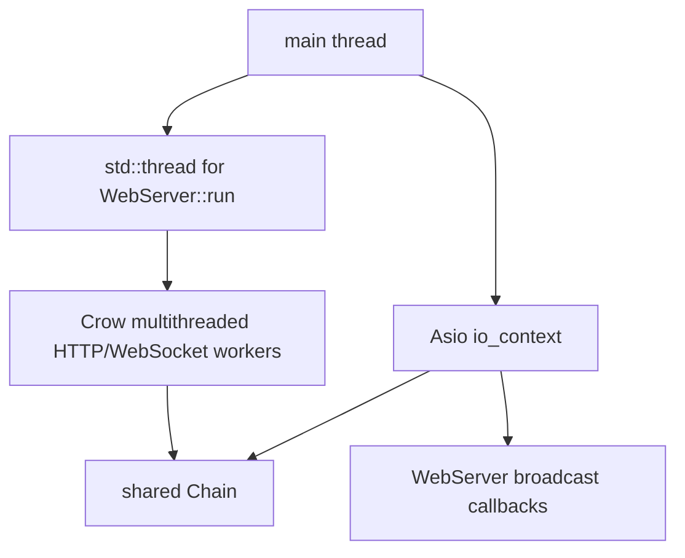

# Threading and Concurrency

Axis uses two server frameworks in one process:

- Asio TCP server runs on the main thread through `Server::run()` and `ctx_.run()`.
- Crow HTTP/WebSocket server runs on a separate `std::thread` and is configured with `.multithreaded()`.

Both servers share a single `Chain&`.

## Runtime Threads

## Chain Synchronization

`Chain` protects most state with `mutable std::shared_mutex mutex_`.

### Shared Lock Readers

The following methods acquire `std::shared_lock`:

- `tip()`
- `tip_hash()`
- `height()`
- `get_difficulty()`
- `target()`
- `get_block(uint32_t)`
- `get_block(const Hash&)`
- `get_blocks(uint32_t, uint32_t)`
- `get_utxos()`
- `pool_contains()`
- `get_pool_tx()`
- `get_pool_txs()`

These methods return copies of blocks/transactions/hashes, so callers do not hold references into mutable containers after the lock is released.

### Unique Lock Writers

The following methods acquire `std::unique_lock`:

- `add_tx()`
- `add_block()`

They mutate `pool_`, `pool_spent_`, `utxo_`, `blocks_`, `height_`, and LevelDB state.

### Unsynchronized Private Startup Helpers

`load_blocks()`, `load_pool()`, `create_genesis()`, `apply_tx()`, `build_target()`, `store_block()`, `dump_utxo()`, and `rebuild_utxo()` do not independently lock. They are used during construction or by already-locked methods. `apply_tx()` is called by both startup loading and `add_block()`; in the latter case the caller already holds the unique lock.

## WebSocket Synchronization

`WebServer` protects `ws_connections_` with `std::mutex ws_mutex_`.

- On open: lock, insert connection pointer, unlock, send `connected` message.
- On close: lock and erase connection pointer.
- Broadcast: lock, iterate all connection pointers, call `send_text()` for each.

Current implication: network send calls happen while `ws_mutex_` is held. This is simple but can make slow WebSocket clients block other connection set operations.

## Object Lifetime

`main()` constructs objects in this order:

1. `Chain chain;`
2. `WebServer web{chain, 8080};`
3. `Server server{chain, 8889, events};`

`Chain` outlives both servers. Callback lambdas capture `web` by reference and are stored inside `ServerEvents`. This is safe under the current lifetime because `web` remains alive while `server.run()` executes.

## Shutdown Behavior

There is no explicit signal handling in source. Normal flow after `server.run()` returns is:

1. `web.stop()`
2. `web_thread.join()` if joinable
3. Stack objects destruct

In practice, `Server::run()` runs the Asio context until no work remains or an exception escapes. The TCP accept loop continuously re-arms accepts, so ordinary shutdown requires external process termination unless a future stop mechanism is added.

## Thread Safety Summary

| Component | Thread-safe today? | Reason |
| --- | --- | --- |
| `Chain` public read/write methods | Mostly yes | Uses shared/unique mutex around public accessors and mutators. |
| `Chain::pool_` public field | No direct external safety | `pool_` is public in `chain.h`; external code could mutate it without locking. Current code does not do so. |
| `WebServer::ws_connections_` | Yes for set mutations | Protected by `ws_mutex_`. Send happens under lock. |
| `Writer` / `Reader` | No | Intended as local stack objects. |
| `Transaction` / `Block` | Immutable-by-convention after construction | Public vectors can be mutated; cached hashes/txids will not automatically update. |
| LevelDB handles | Used behind `Chain` locks | LevelDB itself supports concurrent access, but Axis serializes writes through `Chain`. |

## Concurrency Pitfalls

- Do not expose mutable references to `Chain` internals.
- Do not mutate `Transaction::inputs`, `Transaction::outputs`, or `Block::transactions` after construction unless hashes/Merkle roots are recomputed manually; current classes do not provide recomputation APIs.
- Avoid calling `Chain::tip_hash()` and `Chain::tip()` from inside a method that already holds `mutex_` unless the lock type permits it. `verify_block_header()` calls both while not holding its own lock, but it is not currently used.
- Be careful adding callbacks from `Chain` to `WebServer`; avoid calling out while holding chain locks unless the callback is known non-blocking.
