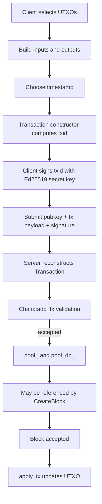

# Transactions

Transactions are UTXO-based. A normal transaction spends previous outputs and creates new outputs. A coinbase transaction has no inputs and creates new value.

## Core Types

| Type | File | Meaning |
| --- | --- | --- |
| `OutPoint` | `include/axis/tx.h` | Reference to a previous transaction output: `txid` + output `index`. |
| `TxOutput` | `include/axis/tx.h` | Spendable output: recipient `Address` + `amount`. |
| `Transaction` | `include/axis/tx.h`, `src/tx.cpp` | Inputs, outputs, timestamp, cached txid. |
| `SignedTransaction` | `include/axis/tx.h` | Transaction plus public key and signature for submission. |

## Transaction Lifecycle



## TxID Computation

`Transaction::compute_hash()` serializes inputs, outputs, and timestamp into a temporary `Writer`, then computes Blake2b.

Included in txid preimage:

- each input txid,
- each input index,
- each output recipient,
- each output amount,
- timestamp.

Excluded:

- existing `txid_`,
- input count,
- output count,
- public key,
- signature.

The public key and signature live in `SignedTransaction` and are used only at submission time.

## Signing and Verification

- Client signs the 32-byte txid hash.
- Server verifies using `verify_sig(pubkey, tx.txid(), sig)`.
- Sender address is derived as `blake2b(pubkey)` truncated to 20 bytes through libsodium `crypto_generichash` output length.
- Every input UTXO must belong to that derived address.

## Validation in `Chain::add_tx()`

A transaction is accepted into the mempool only if:

1. Every output amount is nonzero.
2. Output sum does not overflow `uint64_t`.
3. Output sum is nonzero.
4. There is at least one input; externally submitted coinbase transactions are rejected.
5. Every input exists in `utxo_`.
6. Every input UTXO recipient equals `derive_address(pubkey)`.
7. Input sum does not overflow `uint64_t`.
8. `sum_in >= sum_out`.
9. Signature verifies over the txid.
10. The txid is not already in `pool_`.
11. No input is already reserved in `pool_spent_`.
12. LevelDB accepts the pool write.

There is no fee field. If `sum_in > sum_out`, the difference is not explicitly recorded or assigned to the miner in the current implementation.

## Serialization

`Transaction::serialize()` stores txid, timestamp, inputs, and outputs. It does not include public key or signature. This means mempool persistence retains only the validated transaction body, not the proof used to validate it.

## Mutability and Invariants

`Transaction::inputs`, `outputs`, and `timestamp` are public. The constructor computes `txid_`, but later mutations do not recompute it. Developers must treat a transaction as immutable after construction or add a recomputation API before mutating.

Expected invariant after construction:

```text
txid_ == blake2b(inputs || outputs || timestamp)
```

Deserialization does not enforce this invariant; it trusts the serialized txid field.

## Failure Cases

| Error | Cause |
| --- | --- |
| `InvalidPayload` | Empty inputs, arithmetic overflow, malformed parser input, or storage-related exception in callers. |
| `ZeroAmount` | Any zero output or total output sum zero. |
| `BadOwnership` | Input missing, input recipient does not match derived sender address, or insufficient inputs. |
| `BadSignature` | Ed25519 detached signature verification fails. |
| `Duplicate` | Same txid already exists in mempool. |
| `InputSpent` | A pending transaction already spends one of the inputs. |

## Performance

- TxID computation is O(inputs + outputs).
- Serialization/deserialization is O(inputs + outputs).
- `add_tx()` input validation is O(inputs + outputs) average-case with hash-map lookups.
- Address UTXO discovery is not indexed; wallets call `get_utxos()`, which scans the whole UTXO map.
