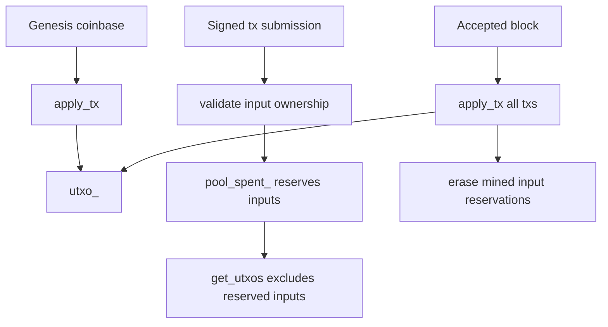

# UTXO Model

Axis uses the Unspent Transaction Output model. Coins are represented as discrete outputs. Spending consumes previous outputs and creates new outputs.

## In-Memory Representation

`Chain` stores current spendable outputs in:

```text
std::unordered_map<OutPoint, TxOutput> utxo_
```

- Key: `OutPoint{txid, index}` identifies one output of one transaction.
- Value: `TxOutput{recipient, amount}` describes who can spend it and how much it is worth.

`OutPoint` has equality and a custom hash. The hash currently copies the first `sizeof(size_t)` bytes of the txid into a `size_t` and XORs the output index.

## Creation

Outputs are created by `apply_tx()`:

```text
for each output at index i:
    utxo_[OutPoint{tx.txid(), i}] = output
```

Coinbase transactions create UTXOs without consuming inputs.

## Spending

Inputs are spent by `apply_tx()`:

```text
for each input:
    utxo_.erase(input)
```

This operation is unconditional. If `apply_tx()` is called with an invalid transaction, missing inputs are silently ignored. The current design relies on validation before mutation.

## Lookup

`Chain::get_utxos(address, outpoints)` scans all `utxo_` entries and appends entries where:

1. `output.recipient == address`, and
2. the outpoint is not in `pool_spent_`.

The result contains `(OutPoint, amount)` pairs, not full `TxOutput` values.

## Pending Spend Protection

`pool_spent_` prevents local mempool double-spends and hides reserved outputs from wallet selection.

When a transaction is accepted to the mempool:

```text
for each input:
    pool_spent_[input] = input
```

When that transaction is mined into a block:

```text
for each input:
    pool_spent_.erase(input)
```

Then `apply_tx()` permanently removes those inputs from `utxo_`.

## UTXO Data Flow



## Ownership Rule

A normal transaction can spend an outpoint only when the previous output recipient equals the address derived from the provided public key:

```text
derive_address(pubkey) == previous_output.recipient
```

The signature must also verify over the transaction txid.

## Limitations

- No address-to-outpoint index; lookups are O(total UTXOs).
- No coinbase maturity.
- No dust rules.
- No script language or multi-signature outputs.
- No explicit fee accounting.
- No rollback/reorg support for undoing UTXO changes.
