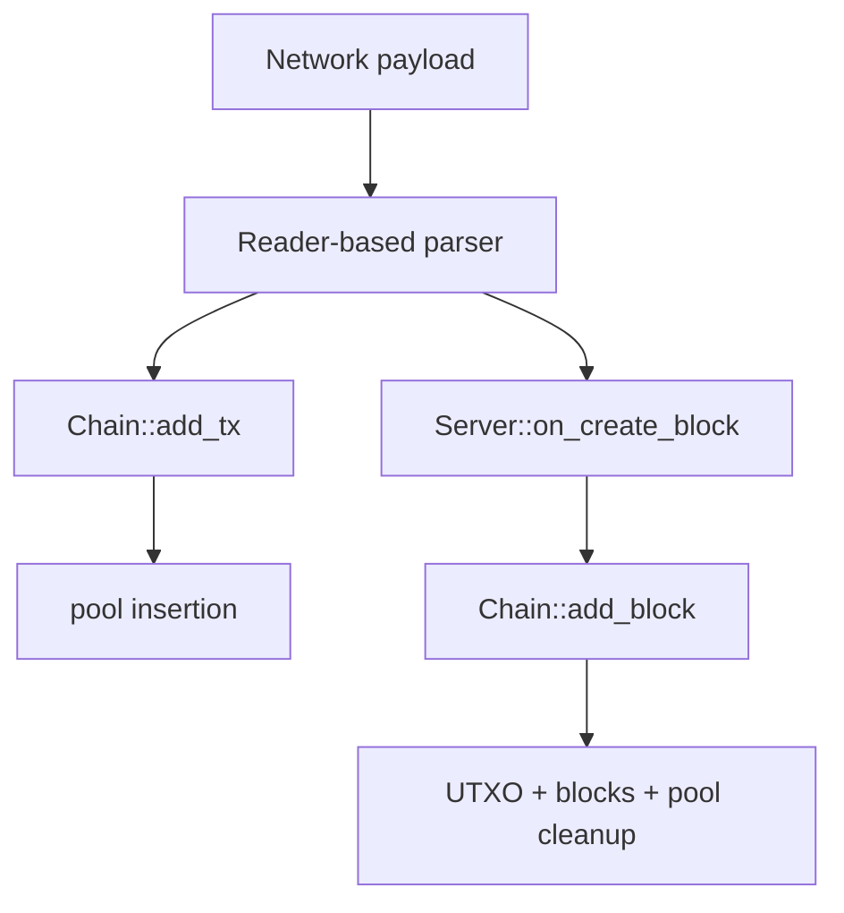

# Validation Rules

Validation in Axis is split between transaction acceptance in `Chain`, block acceptance in `Server`, and primitive parsing in `Reader`-based payload parsers.

## Transaction Validation (`Chain::add_tx`)

| Rule | Failure |
| --- | --- |
| Every output amount must be nonzero. | `TxError::ZeroAmount` |
| Output sum must not overflow `uint64_t`. | `TxError::InvalidPayload` |
| Output sum must be nonzero. | `TxError::ZeroAmount` |
| Submitted transaction must have at least one input. | `TxError::InvalidPayload` |
| Every input must exist in `utxo_`. | `TxError::BadOwnership` |
| Every input output recipient must equal `derive_address(pubkey)`. | `TxError::BadOwnership` |
| Input sum must not overflow `uint64_t`. | `TxError::InvalidPayload` |
| Input sum must be at least output sum. | `TxError::BadOwnership` |
| Signature must verify against txid. | `TxError::BadSignature` |
| Txid must not already be in `pool_`. | `TxError::Duplicate` |
| Inputs must not already be in `pool_spent_`. | `TxError::InputSpent` |
| Pool DB write must succeed. | throws `std::runtime_error` |

`TxError::BadPubkey` exists but is not currently returned by `Chain::add_tx()`. Public key bytes are fixed-size raw bytes; no separate libsodium public key validity check is performed.

## Block Validation (`Server::on_create_block`)

| Rule | Failure |
| --- | --- |
| Payload must parse with required fields. | `BlockError::InvalidPayload` |
| Every supplied non-coinbase txid must be in mempool. | `BlockError::InvalidPayload` with reason `tx not in pool` |
| Reconstructed Merkle root must equal wire Merkle root. | `BlockError::InvalidBlockHash` |
| Block hash must be <= current target. | `BlockError::HighHash` |
| Previous hash must equal chain tip hash. | `BlockError::BadPreviousHash` |
| Block storage/pool cleanup must not throw. | currently caught as `InvalidPayload` if exception occurs inside try block |

`BlockError` includes values that are not currently emitted by the runtime path: `InvalidHeight`, `TimeTooFar`, `TimeTooOld`, `BadSignature`, `MissingInputs`, `Duplicate`, `Internal`.

## Header Validation Helper

`Chain::verify_block_header()` checks:

- previous hash equals `tip_hash()`;
- block timestamp is strictly greater than tip timestamp;
- first `difficulty_` bytes of block hash are zero.

This helper is private and not used by current block submission. It also calls public locked accessors while not holding its own lock.

## Parsing Validation

### `Reader`

All primitive reads check buffer bounds and throw `std::runtime_error` if the buffer is too short.

### TCP Transaction Payload

`parse_create_tx_payload()` reads pubkey, timestamp, input count, inputs, output count, outputs, and signature. It does not reject trailing bytes.

### HTTP Transaction Payload

`parse_signed_transaction_payload()` reads the same fields and rejects trailing bytes.

### TCP Block Payload

`parse_create_block_payload()` reads header fields, coinbase fields, tx count, and txids. It requires each txid to already exist in the mempool. It does not reject trailing bytes.

## Storage Validation

`load_blocks()` rejects stored block values with trailing bytes after deserialization. It does not validate proof-of-work, Merkle roots, previous hash continuity, or transaction signatures.

`load_pool()` does not re-run mempool validation.

## Validation Responsibility Boundary

The most important boundary is that `Chain::add_block()` is a state mutation function, not a full validation function.

## Security Implications

- Binary payload count fields can request large vector reserves; add maximum counts before exposing to untrusted networks.
- Native-endian serialization can cause inconsistent validation across architectures.
- Persisted pool entries are trusted on restart without signatures.
- Manual JSON construction must escape all untrusted strings; current error strings go through `json_escape()`, and most hashes/addresses are hex-generated.
