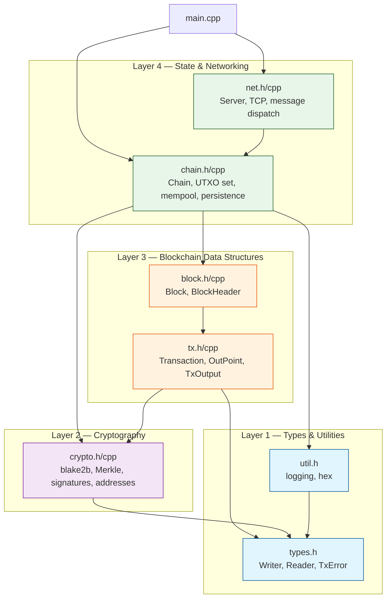
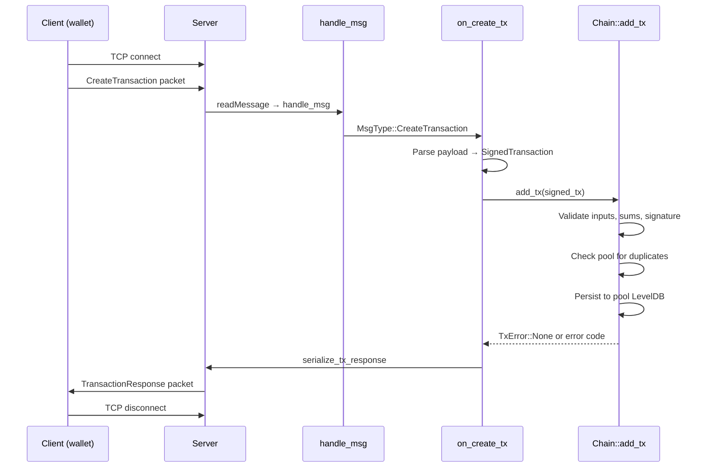
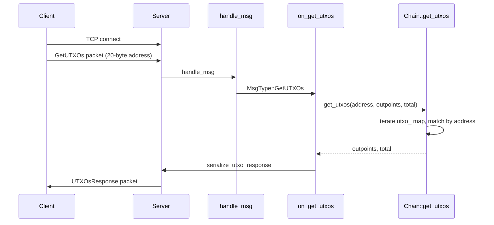

# Architecture

## High-level picture

Axis has four layers. Each layer has a single responsibility and a clear
interface.

**Layer 1** has no project-specific dependencies. Everything depends on it.

**Layer 2** depends only on Layer 1 (types) and libsodium.

**Layer 3** builds on Layers 1 and 2 to define the core data structures.

**Layer 4** implements stateful logic. `Chain` owns all state; `Server`
delegates to `Chain` and never holds blockchain state itself.

## Module responsibilities

### `types.h` — Foundation types

Defines the byte-array aliases (`Hash`, `Address`, `PublicKey`, `SecretKey`,
`Signature`) and the `Writer`/`Reader` serialization helpers. Every other
module includes this file.

Think of this file as the vocabulary of the project. Once you know what a
`Hash` is and how `Writer`/`Reader` work, you can understand every other
file.

### `util.h` — Utilities

A tiny logging namespace (`logging::info`, `logging::err`, `logging::reject`)
and hex conversion templates (`to_hex`, `from_hex`).

### `crypto.h/cpp` — Cryptography

Five pure functions:
- `blake2b` — hash arbitrary bytes into a 32-byte digest
- `compute_merkle_root` — build a Merkle tree from transaction hashes
- `derive_address` — compute a 20-byte address from a 32-byte public key
- `verify_sig` — check an Ed25519 signature
- `sign_msg` — create an Ed25519 signature (available but not used in the
  node — wallets call this)

### `tx.h/cpp` — Transaction types

Defines `OutPoint` (what a transaction input points to), `TxOutput` (where
coins go), and `Transaction` (the core unit of value transfer). Also defines
`SignedTransaction` (a transaction bundled with its public key and
signature).

`Transaction` is self-hashing: the constructor computes the `txid` from
inputs, outputs, and timestamp.

### `block.h/cpp` — Block types

`BlockHeader` holds the chain-linking fields (previous hash, Merkle root,
timestamp, nonce). `Block` bundles a header with a list of transactions.
Like `Transaction`, `Block` is self-hashing.

### `chain.h/cpp` — Blockchain state

The `Chain` class is the heart of the project. It owns:

| Member | Type | Purpose |
|--------|------|---------|
| `blocks_` | `vector<Block>` | All confirmed blocks in memory |
| `utxo_` | `unordered_map<OutPoint, TxOutput>` | The UTXO set |
| `pool_` | `unordered_map<Hash, Transaction>` | Pending (unconfirmed) transactions |
| `pool_spent_` | `unordered_map<OutPoint, OutPoint>` | UTXOs already claimed by pool txs |
| `blocks_db_` | `unique_ptr<leveldb::DB>` | Persistent block storage |
| `pool_db_` | `unique_ptr<leveldb::DB>` | Persistent pool storage |

It validates incoming transactions with `add_tx()` and answers UTXO queries
with `get_utxos()`.

### `net.h/cpp` — TCP server

The `Server` class provides a single-threaded asynchronous TCP server using
Asio coroutines. It accepts connections, reads one message per connection,
dispatches to the appropriate handler, and sends a response.

### `main.cpp` — Entry point

Initializes libsodium, creates the `Chain` (which loads state from LevelDB
and creates the genesis block if needed), creates a `Server` bound to the
chain, and starts the event loop.

## Data flow

### Transaction submission

### UTXO query

## Ownership and lifetimes

- The `Chain` object lives in `main()` and outlives the `Server` (declared
  first, destroyed last).
- `Chain` owns all blocks (in `blocks_`), the UTXO set, and the pool.
- `Chain` owns the LevelDB database handles (`blocks_db_`, `pool_db_`).
- `Server` holds a reference to `Chain` — it does not own any blockchain
  state.
- Each TCP connection creates a `shared_ptr<socket>` that lives until the
  coroutine completes.
- `Writer` and `Reader` are stack-allocated, short-lived objects used
  during serialization and deserialization.

## Why this architecture?

**Single Chain instance.** There is exactly one blockchain. A singleton-like
design (created in `main()`, passed by reference) avoids global state while
keeping the code simple.

**No database abstraction layer.** LevelDB is used directly via its C++ API.
A wrapper would add complexity without benefit at this scale.

**No virtual interfaces.** Every dependency is concrete. This is a deliberate
choice: virtual dispatch adds cost and complexity with no payoff when there
is exactly one implementation of each concept.

**Coroutines for networking.** Asio's C++20 coroutine support (`co_await`,
`co_spawn`) makes asynchronous code read like synchronous code. The
connection handler is a single linear function rather than a chain of
callbacks.

## Tradeoffs

| Decision | Benefit | Cost |
|----------|---------|------|
| All blocks in memory | Simple, fast access | Doesn't scale beyond ~100K blocks |
| Rebuild UTXO from blocks on startup | No checkpoint needed | Startup gets slower as chain grows |
| One message per connection | Simple protocol | No persistent connection |
| Host byte order in serialization | Fast on x86 | Not portable to big-endian |
| No miner | Keeps codebase minimal | Core blockchain feature missing |
