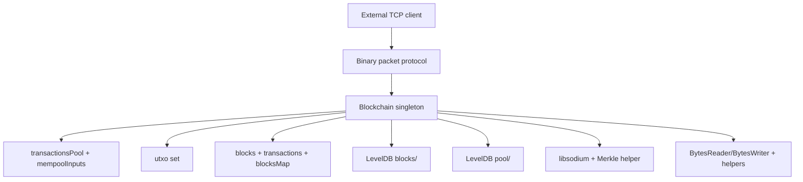
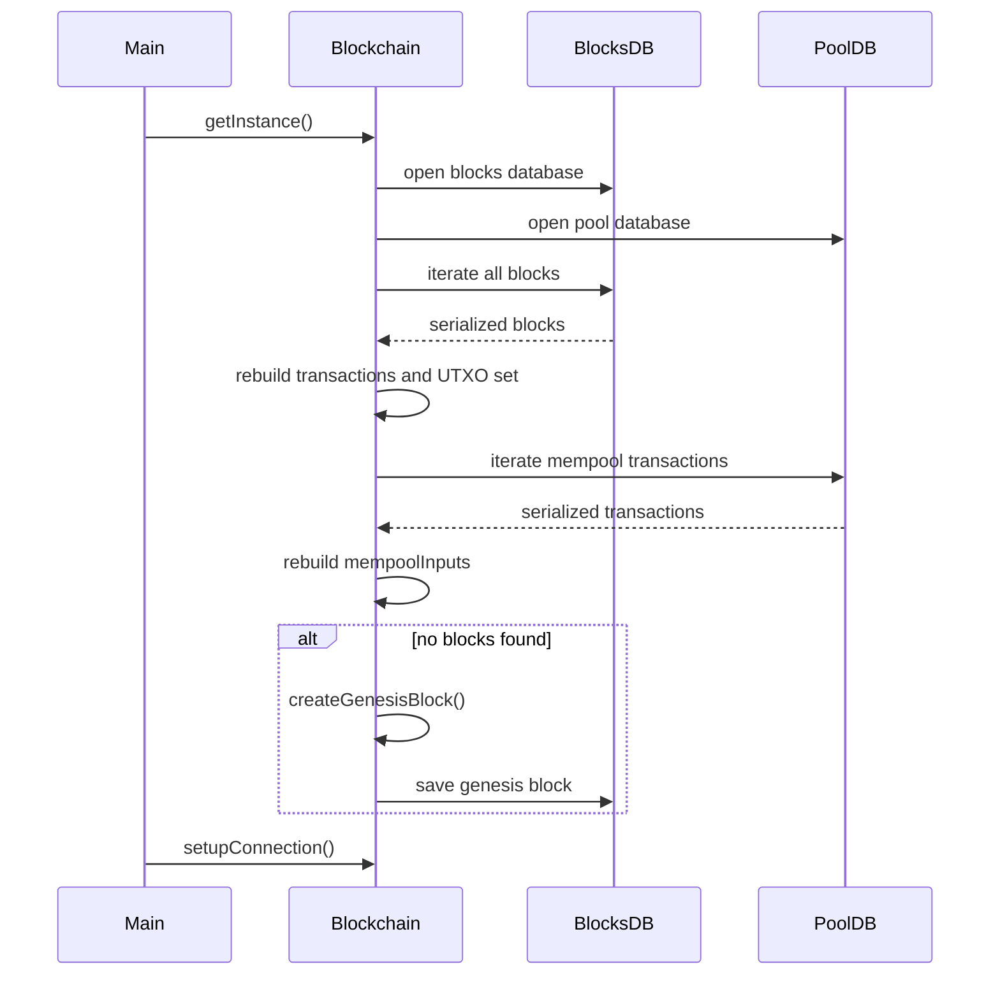
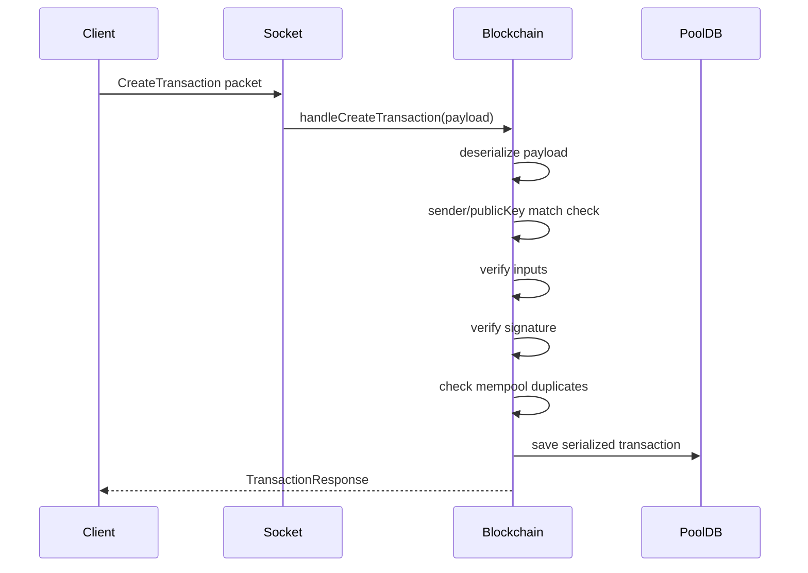
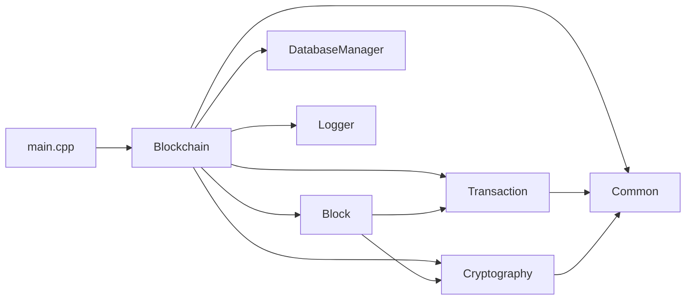

# Architecture

This document explains the high-level architecture of Axis, how major modules interact, why the code is shaped this way, and what tradeoffs come with the current design.

## 1. High-level view

Axis is a single-process blockchain node foundation. It combines:

- domain models for blocks and transactions,
- in-memory state for chain, mempool, and UTXO set,
- persistent key/value storage,
- a binary TCP message protocol,
- asynchronous socket handling using Asio coroutines.

At a high level, the system has four layers:

1. **Core utilities**: bytes, hashing helpers, address helpers, logging.
2. **Domain model**: `Transaction`, `Input`, `UTXO`, `Block`.
3. **State and orchestration**: `Blockchain`.
4. **Persistence and I/O**: LevelDB and TCP sockets.

## 2. Architecture diagram

## 3. Main modules and responsibilities

## `core`

### Responsibilities

- define shared byte-oriented types like `Hash`, `Addr`, `PublicKey`, and `Signature`,
- define packet types and packet framing,
- provide serialization helpers,
- provide hex conversion helpers,
- provide address derivation,
- parse UTXO keys,
- provide simple logging.

### Why it exists

These concerns are needed by nearly every other module. Centralizing them avoids duplicated low-level code.

## `blockchain`

### Responsibilities

- represent blocks and transactions,
- compute transaction hashes,
- validate transaction ownership and signatures,
- maintain the mempool,
- maintain the UTXO set,
- load and persist state,
- handle incoming network payloads.

### Why it exists

This is where the node’s business rules live.

## `crypto`

### Responsibilities

- compute Merkle roots for transaction hash lists.

### Why it exists

A block needs a compact commitment to all included transactions. That commitment is the Merkle root.

## `storage`

### Responsibilities

- open LevelDB databases,
- save, load, and delete raw key/value pairs.

### Why it exists

It isolates persistence details from the rest of the code.

## 4. Object ownership and lifetime

## The `Blockchain` singleton

The central architectural choice is the singleton `Blockchain` returned by `Blockchain::getInstance()`.

### Ownership

- It owns all in-memory chain state.
- It owns both `DatabaseManager` instances.
- It coordinates socket requests.

### Lifetime

- Constructed lazily on first call to `getInstance()`.
- Lives until process exit.

### Consequence

This makes the node easy to initialize, but it also centralizes many responsibilities into one object.

## Global Asio objects

In `axis/src/blockchain/blockchain.cpp`, the following are global:

- `asio::io_context context`
- `asio::ip::tcp::acceptor acceptor`

### Ownership and lifetime

They are static-duration globals in that translation unit and effectively live for the entire process.

### Tradeoff

This simplifies setup, but makes testing and dependency injection harder.

## Domain objects

### `Transaction`

- Usually created from request bytes or reconstructed from database bytes.
- Stored by value in vectors and maps.

### `Block`

- Stored by value in `blocks`.
- Rebuilt from serialized bytes during startup.

### `UTXO`

- Stored by value in the `utxo` map.

## 5. In-memory state model

The `Blockchain` object maintains several collections.

| Member | Purpose |
|---|---|
| `blocks` | Ordered chain of blocks in memory |
| `height` | Declared chain height field, not actively maintained in visible logic |
| `difficulty` | Number of leading zero bytes required in target construction |
| `target` | Proof-of-work threshold built from `difficulty` |
| `transactionsPool` | Pending mempool transactions |
| `transactions` | Transactions already loaded from blocks |
| `mempoolInputs` | Tracks which UTXOs are reserved by pending mempool transactions |
| `utxo` | Current spendable outputs |
| `blocksMap` | Maps block hash hex string to block index |
| `blocksDB` | Persistent block storage |
| `poolsDB` | Persistent mempool storage |

## 6. Data flow

### Startup flow

### Transaction submission flow

## 7. Control flow

Axis uses two main control styles:

- **synchronous control** for local data processing and database access,
- **asynchronous control** for network I/O.

### Synchronous areas

- transaction verification,
- serialization/deserialization,
- UTXO updates,
- LevelDB reads/writes.

### Asynchronous areas

- accepting TCP clients,
- reading packet bytes,
- writing response packets.

The coroutine entry points are the `asio::awaitable<void>` methods in `Blockchain`.

## 8. Module dependencies

## 9. Why this architecture was likely chosen

This codebase favors **clarity and directness** over abstraction depth.

### Benefits

- easy to trace end-to-end behavior,
- small number of files,
- low conceptual overhead,
- straightforward serialization logic,
- minimal class hierarchy.

### Tradeoffs

- `Blockchain` is a large “god object” with many responsibilities,
- global networking state reduces modularity,
- several protocol message types exist but are not fully implemented,
- manual binary formats require careful compatibility discipline,
- no explicit concurrency control protects shared state if future threading is added.

## 10. Architectural strengths

### Good fit for educational code

The system makes important blockchain ideas visible:

- UTXO accounting,
- transaction hashing,
- Merkle commitments,
- signature verification,
- mempool double-spend prevention,
- persistent state reconstruction.

### Simple persistence story

Storing blocks and mempool transactions as serialized blobs is easy to understand.

## 11. Architectural weaknesses and risks

### Networking is embedded in `Blockchain`

This makes the central class harder to test and expand.

### Serialization is architecture-dependent in places

Using raw `memcpy` and native numeric layouts can create cross-platform compatibility issues. See [Serialization](serialization.md).

### Block acceptance path is incomplete

There is block verification logic, but no fully implemented network path that accepts and commits mined blocks.

### State recovery relies on replaying blocks
n
The node reconstructs UTXO state by replaying stored transactions from blocks, which is simple but may become slow at scale.

## 12. Recommended future architectural refactors

If the project grows, strong next steps would be:

1. split network handlers into a separate protocol module,
2. create dedicated mempool and UTXO manager classes,
3. standardize serialization on fixed-width integer encoding,
4. introduce explicit chain-state persistence rather than replay-only recovery,
5. separate validation rules from transport logic,
6. add a miner component if block production is desired.
