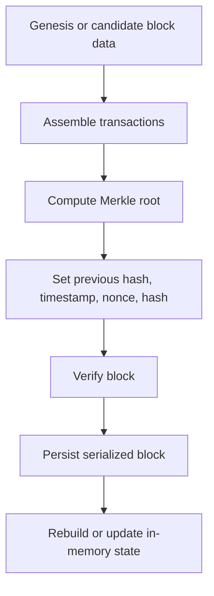

# Block Lifecycle

This document explains how blocks are created, loaded, verified, and stored in Axis.

## 1. Important context

Axis contains a meaningful `Block` model and block verification helper logic, but it does **not** currently implement a complete mined-block ingestion workflow over the network.

So this document distinguishes between:

- **implemented lifecycle pieces**,
- **conceptual future lifecycle pieces**.

## 2. What a block is in Axis

A block contains:

- a header,
- a list of transactions.

The header is `BlockHeader`:

- `previous_hash`
- `hash`
- `timestamp`
- `nonce`
- `merkleRoot`

## 3. Block lifecycle overview



## 4. Genesis block creation

The only fully explicit block creation path in current code is the genesis block.

### Where it happens

- `Blockchain::createGenesisBlock()`

### What it does

1. Creates a zero `previousHash`.
2. Loads a hardcoded block hash.
3. Loads a hardcoded Merkle root.
4. Loads a hardcoded recipient address.
5. Creates a genesis reward `UTXO`.
6. Builds a genesis transaction with fixed timestamp.
7. Stores that transaction in `transactions`.
8. Builds a `Block` containing the transaction.
9. Overwrites the block header’s computed Merkle root with the hardcoded value.
10. Pushes the block into memory.
11. Saves it to `blocksDB`.
12. Updates the UTXO set.

### Why hardcoded values are used

All nodes need the same genesis origin. Hardcoding ensures deterministic startup.

## 5. Normal block construction

The `Block` constructor:

```cpp
Block(const Hash& ph, const Hash& bh, uint64_t t, uint64_t n, const std::vector<Transaction>& txs)
```

stores the provided header values and computes the Merkle root from the transaction hashes.

### What it does not do

It does not mine the block hash.
It does not validate the block.
It assumes the caller already chose appropriate values.

## 6. Block serialization

Blocks are serialized by `Block::serialize()`.

Stored fields include:

- previous hash,
- block hash,
- Merkle root,
- nonce,
- timestamp,
- transaction count,
- each transaction’s byte size and serialized bytes.

## 7. Block deserialization

Blocks are reconstructed by:

- `Block::Block(std::string_view rawBytes)`

This reads the serialized header fields and rebuilds each transaction from embedded byte blobs.

## 8. Startup block loading

At startup, `Blockchain::loadBlocks()` replays the block database.

### Why replay matters

Axis does not persist the UTXO set directly. Instead, it recovers chain state by replaying transactions from stored blocks.

### Effects of loading a block

For each block loaded:

- transactions are inserted into the confirmed `transactions` map,
- `updateUTXO()` applies all spends and outputs,
- block is appended to `blocks`,
- block hash is indexed in `blocksMap`.

## 9. Block verification logic

The main helper is:

- `Blockchain::verifyBlock(const Block& block)`

### What it checks

1. block has at least one transaction,
2. first transaction is a valid coinbase transaction,
3. all later transactions already exist in the mempool,
4. computed Merkle root matches header Merkle root,
5. `previous_hash` matches the current chain tip,
6. block hash satisfies difficulty target.

### Why these checks exist

- coinbase rules prevent arbitrary reward structure,
- mempool membership assumes already-validated transactions,
- Merkle root check ensures transaction list integrity,
- previous-hash check enforces chain continuity,
- difficulty check enforces proof-of-work policy.

## 10. Coinbase transaction rules

`verifyCoinbaseTransaction()` accepts a transaction only if:

- it has no inputs,
- it has exactly one output,
- output coins are less than or equal to `MINER_REWARD`.

### Interpretation

This models block reward creation.

### Limitation

There is no complete block acceptance pipeline that consumes such a verified block in the visible code.

## 11. What is missing for a full block lifecycle

A complete blockchain node would usually also include:

- mining candidate assembly from mempool,
- nonce search loop,
- block broadcast to peers,
- block reception from peers,
- final block commit logic,
- mempool cleanup after confirmation,
- chain reorganization handling.

Those are not fully implemented here.

## 12. Example conceptual flow

Imagine future code creates a new block:

1. choose a coinbase reward transaction,
2. choose valid mempool transactions,
3. build the block object,
4. compute its Merkle root,
5. search nonce until hash satisfies target,
6. call `verifyBlock()`,
7. append to `blocks`,
8. store in `blocksDB`,
9. remove included transactions from mempool,
10. update UTXO state.

Axis currently implements pieces of this story, but not the entire end-to-end pipeline.

## 13. Why this partial implementation is still useful

Even without full mining support, Axis already demonstrates:

- how blocks group transactions,
- how Merkle roots commit to them,
- how proof-of-work targets can be represented,
- how persistent chain state can be replayed.

## 14. Summary

In current Axis reality:

- genesis block creation is fully implemented,
- block serialization/deserialization is implemented,
- block verification helper logic exists,
- full mined-block network workflow is not yet finished.

That is the correct mental model for maintainers.
