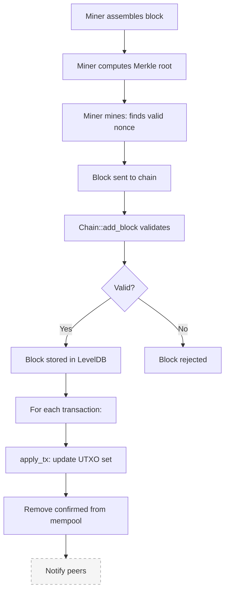
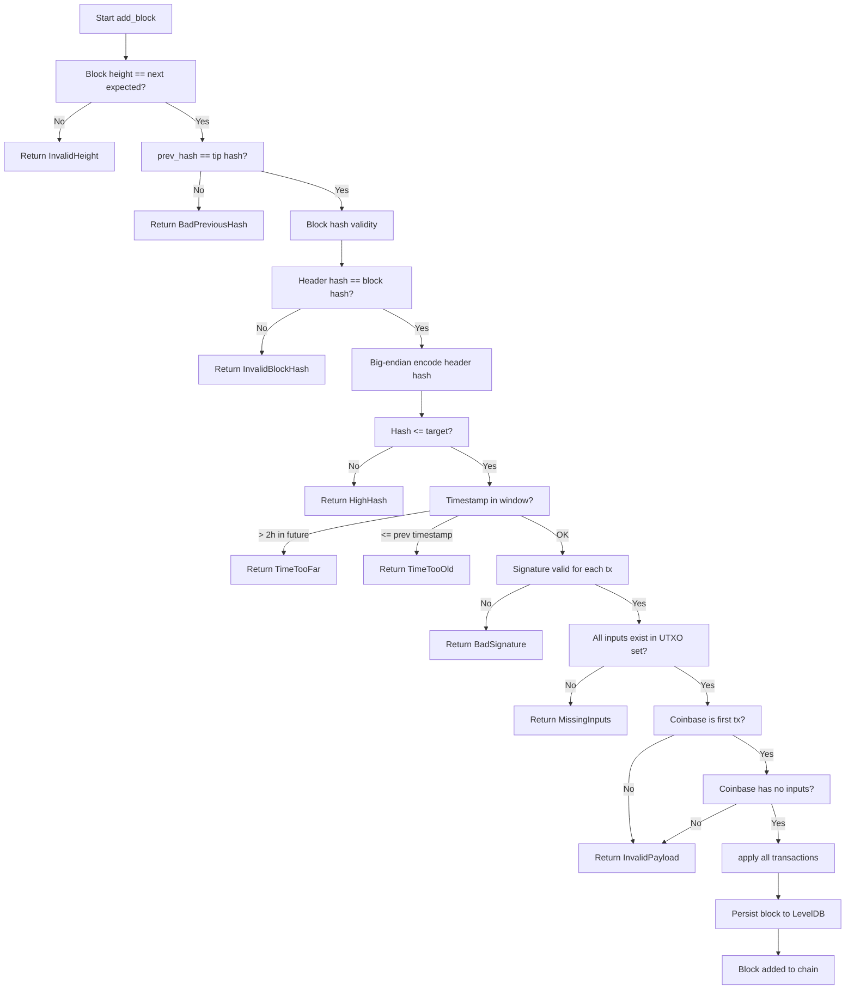

# Block lifecycle

This document traces a block from creation through validation to chain
inclusion. Note that Axis currently only creates the genesis block
automatically — the full mining pipeline is not wired to a network message.

## Lifecycle overview



## Step 1: Block assembly (miner, future feature)

A miner would:

1. Create a coinbase transaction paying the block reward to their address
2. Take some transactions from the mempool
3. Assemble a `Block`:

```cpp
std::vector<Transaction> txs;
txs.push_back(coinbase);
txs.insert(txs.end(), pool_txs.begin(), pool_txs.end());

Block blk{chain.get_tip_hash(), std::move(txs), current_time, 0};
```

## Step 2: Merkle root computation

The `Block` constructor automatically computes the Merkle root:

```cpp
Block::Block(Hash prev, std::vector<Transaction> txs, ...) {
    transactions_ = std::move(txs);
    header_.merkle_root = compute_block_merkle_root(transactions_);
    // ...
}
```

The Merkle root algorithm:

```cpp
Hash compute_block_merkle_root(const std::vector<Transaction>& txs) {
    // 1. Get all txids
    std::vector<Hash> hashes;
    for (const auto& tx : txs)
        hashes.push_back(tx.txid());

    // 2. Build the tree: pair and hash until one remains
    while (hashes.size() > 1) {
        if (hashes.size() % 2 == 1)
            hashes.push_back(hashes.back()); // duplicate odd element

        std::vector<Hash> next;
        for (size_t i = 0; i < hashes.size(); i += 2) {
            Writer w;
            w.put_hash(hashes[i]);
            w.put_hash(hashes[i + 1]);
            next.push_back(blake2b(w.buf));
        }
        hashes = std::move(next);
    }
    return hashes.empty() ? Hash{} : hashes[0];
}
```

The Merkle root fingerprints every transaction in the block. If any
transaction changes, the root changes, which changes the block hash, which
breaks the chain link.

## Step 3: Mining (finding a valid nonce)

Mining is the process of finding a `nonce` such that the block hash is below
the difficulty target:

```cpp
bool Block::verifyDifficulty() const {
    Hash h = hash();   // hash of the 80-byte block header
    // Check: h[0:3] must be 0x00 (difficulty = 3)
    return h[0] == 0x00 && h[1] == 0x00 && h[2] == 0x00;
}
```

The miner would iterate:

```cpp
Block blk = /* assembled block */;
while (!blk.verifyDifficulty()) {
    blk.nonce()++;   // try a different nonce
}
```

On average, this requires 2^24 (16 million) attempts for difficulty 3.
Bitcoin uses a much higher difficulty, requiring ~10^23 attempts per block.

## Step 4: Block validation (Chain::add_block)

This function is called when a client submits a mined block:



### Validation checks in detail

**1. Chain continuity**
```cpp
if (height_ != 0 && prev_hash_ != get_tip_hash())
    return BlockError::BadPreviousHash;
```

**2. Block hash integrity**
```cpp
Hash computed = blk.hash();   // hash of the 80-byte header
if (memcmp(computed.data(), blk_hash.data(), 32) != 0)
    return BlockError::InvalidBlockHash;
```

**3. Proof of Work**
```cpp
// Encode hash as big-endian uint256 for comparison
auto target = buildTarget(difficulty_);
uint256_t hash_int = hash_to_uint256(block_hash);
uint256_t target_int = hash_to_uint256(target);
if (hash_int > target_int)
    return BlockError::HighHash;
```

**4. Timestamp sanity**
```cpp
auto now = time_since_epoch();
if (blk.timestamp() > now + 7200)  // 2 hours in the future
    return BlockError::TimeTooFar;
if (height_ > 0 && blk.timestamp() <= get_tip().timestamp())
    return BlockError::TimeTooOld;
```

**5. Transaction validation**

Each non-coinbase transaction goes through the same validation as
`Chain::add_tx` (ownership, signature, sufficient funds).

**6. Coinbase rules**

The first transaction must be coinbase (no inputs). There is exactly one
coinbase per block.

**7. Applying to the UTXO set**

```cpp
for (const auto& tx : blk.transactions()) {
    for (const auto& in : tx.inputs)
        utxo_.erase(in);        // spend inputs
    uint32_t idx = 0;
    for (const auto& out : tx.outputs) {
        utxo_[OutPoint{tx.txid(), idx}] = out;  // create outputs
        idx++;
    }
}
```

**8. Mempool cleanup**
```cpp
for (const auto& tx : blk.transactions()) {
    pool_.erase(tx.txid());
    for (const auto& in : tx.inputs)
        pool_spent_.erase(in);
}
```

## Step 5: Block storage

After validation, the block is persisted to LevelDB:

```cpp
std::vector<uint8_t> raw = blk.serialize();
std::string key = height_key(height);
blocks_db_->Put(leveldb::WriteOptions{}, key, to_string(raw));
```

Block height is stored as big-endian bytes for natural ordering (when
iterating, blocks come out sorted by height).

## Step 6: Chain tip

The chain maintains a `tip_hash_` that always points to the most recent
block. New blocks must reference this hash in their `prev_hash`.
