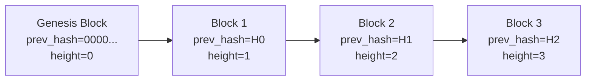
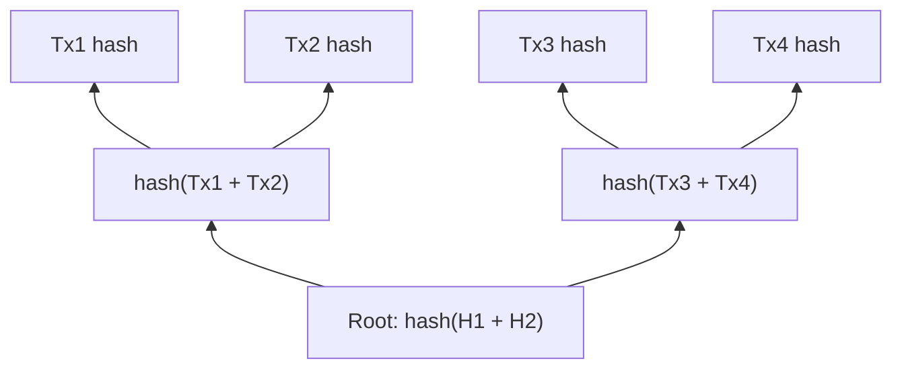

# Blockchain concepts

This document explains every blockchain concept used in Axis from first
principles. You do not need any prior blockchain knowledge.

---

## 1. What is a blockchain?

A **blockchain** is a growing list of records (called **blocks**) that are
linked together using cryptography.

Think of it as a notebook where:
- Each page is a **block**
- Every page contains a list of **transactions** (who sent what to whom)
- Every page has a timestamp and a "fingerprint" of the previous page
- Once written, a page cannot be changed without breaking the fingerprint
  chain

Because each block's fingerprint depends on the previous block, you cannot
go back and change an old block without also changing every block after it.
This makes the ledger tamper-evident.

### Real-world analogy

A blockchain is like a **wax-sealed letter chain**: you seal each letter with
the seal from the previous letter. If someone breaks a seal, every seal
after it is also broken, making tampering obvious.

---

## 2. What is a block?

A **block** is a batch of transactions grouped together. Each block has:

| Field | Purpose |
|-------|---------|
| `prev_hash` | Fingerprint (hash) of the previous block — creates the chain |
| `merkle_root` | Fingerprint of all transactions in this block |
| `timestamp` | When this block was created |
| `nonce` | A number miners change to find a valid block hash |
| `version` | Format version for future upgrades |
| `transactions` | The actual list of transactions |

### Block header vs block body

The first five fields (prev_hash through version) form the **block header**.
The header uniquely identifies the block. The **block body** is the list of
transactions.

### The chain



Each block's `prev_hash` equals the hash of the block before it. This is
what makes the blocks a **chain**.

---

## 3. What is a hash?

A **hash** is a fixed-length fingerprint of arbitrary data. Given any input
(like a sentence, a file, or a block of transactions), a hash function
produces a short, unique-looking output.

Axis uses **Blake2b**, a fast and secure hash function. It always produces
**32 bytes** (256 bits) of output, regardless of input size.

### Properties of a good hash function

1. **Deterministic:** Same input always gives the same output
2. **Fast to compute:** Given input, getting the hash is quick
3. **One-way:** Given a hash, finding the input is practically impossible
4. **Avalanche effect:** Changing one byte of input changes ~50% of output
   bits
5. **Collision-resistant:** Finding two inputs with the same hash is
   practically impossible

### Why hashes are essential for blockchain

- **Block linking:** Each block stores the hash of the previous block. Any
  change to a previous block changes its hash, breaking the chain.
- **Transaction IDs:** Each transaction is identified by its hash (txid).
- **Merkle trees:** Hashes are combined into a Merkle root to fingerprint
  all transactions in a block efficiently.
- **Mining:** The Proof of Work requires finding a block whose hash is below
  a target value.

### Example

In Axis:
```cpp
// Hash a 32-byte hash (for Merkle tree internal nodes)
Hash blake2b(std::span<const uint8_t> data);
```

The function calls libsodium's `crypto_generichash`, which implements
Blake2b with a 32-byte output.

---

## 4. What is a Merkle tree?

A **Merkle tree** (or hash tree) is a way to combine many hashes into a
single "root" hash. It allows you to prove that a specific transaction is
included in a block without having to show all transactions.

### How it works



1. Take the hash of every transaction
2. Pair them up and hash each pair together
3. Repeat until a single hash remains — that's the Merkle root

If the number of hashes at any level is odd, the last hash is duplicated
(paired with itself) to make it even.

### Why Merkle roots exist

The Merkle root goes into the block header. This means the header alone
fingerprints all transactions in the block. Without a Merkle root, the block
header would need to list every transaction hash, making the header large.

### In Axis

```cpp
// Called during Block construction
header_.merkle_root = compute_block_merkle_root(transactions);

// The function collects all txids and builds the tree
static Hash compute_block_merkle_root(const std::vector<Transaction>& txs)
```

---

## 5. What is a transaction?

A **transaction** is a transfer of value. In Axis, a transaction:

1. **Spends** one or more existing unspent outputs (inputs)
2. **Creates** one or more new outputs
3. Is identified by its **txid** (hash of the transaction data)

### Transaction structure

```
Transaction {
    inputs:  [OutPoint, OutPoint, ...]   // what you're spending
    outputs: [TxOutput, TxOutput, ...]   // where coins go
    timestamp: uint64_t                  // when it was created
}
```

Each input is an **OutPoint**: the txid of a previous transaction and the
index of a specific output in that transaction.

Each output is a **TxOutput**: the recipient's address and the amount of
coins to send.

### Coinbase transaction

A **coinbase** transaction is a special transaction with no inputs. It
creates coins out of thin air (the block reward). Every block starts with a
coinbase transaction that pays the miner.

```cpp
bool is_coinbase() const { return inputs.empty(); }
```

---

## 6. What is a UTXO?

**UTXO** stands for **Unspent Transaction Output**. This is the fundamental
accounting unit in a UTXO-based blockchain.

### How it works

- The blockchain does not store account balances. It stores a set of UTXOs.
- Each UTXO is an output from a transaction that has not yet been spent.
- An address's balance is the sum of all UTXOs that list that address as
  their recipient.
- When you send coins, you destroy some UTXOs (your inputs) and create new
  UTXOs (the outputs).

### Analogy

UTXOs are like physical cash. You don't have a "balance" — you have a
collection of bills and coins. To buy something, you hand over some bills
(inputs) and receive change (new outputs).

### In Axis

```cpp
// The UTXO set is a map from OutPoint → TxOutput
std::unordered_map<OutPoint, TxOutput> utxo_;

// To spend: erase the OutPoint from the map
utxo_.erase(in);  // spends an input

// To create: insert a new OutPoint → TxOutput pair
utxo_[OutPoint{tx.txid(), idx}] = out;  // creates a new UTXO
```

---

## 7. What is mining?

**Mining** (or **Proof of Work**) is the process of finding a valid block
hash. A valid block hash must be **below a target value**. The target
determines how difficult mining is.

### How Proof of Work works

1. The miner assembles a block with transactions
2. The miner computes the block hash
3. If the hash is below the target, the block is valid
4. If not, the miner changes the `nonce` field and tries again

Bitcoin-style mining is not yet implemented in Axis (the genesis block was
pre-mined). The `verifyDifficulty()` and `buildTarget()` code exists but
mining is not wired to any network message.

### Difficulty

**Difficulty** measures how hard it is to find a valid block. In Axis,
difficulty is static (value 3), meaning the block hash must start with 3
zero bytes:

```cpp
// Target: first 3 bytes are 0x00, rest are 0xFF
target_[0] = 0x00;
target_[1] = 0x00;
target_[2] = 0x00;
// target = 0x000000FFFF...FF

// A valid block hash must be <= this target
```

### What is a nonce?

A **nonce** is a number that miners change to get different block hashes.
Since the hash function is deterministic, changing the nonce produces a
completely different hash. The miner keeps trying different nonces until one
produces a hash below the target.

---

## 8. What are digital signatures?

A **digital signature** proves that a transaction was authorized by the
owner of the coins being spent.

### How it works

Each user has a pair of keys:
- **Private key** (secret): known only to the user, used to sign
- **Public key** (public): shared with everyone, used to verify

To send coins:
1. Create the transaction (inputs, outputs, timestamp)
2. Hash it to get the txid
3. Sign the txid with your private key
4. Send the transaction + public key + signature to the network

To verify:
1. Hash the transaction to get the txid
2. Check that `verify(public_key, txid, signature) == true`
3. Check that `derive_address(public_key) == input_utxo_owner`

### Ed25519

Axis uses **Ed25519** signatures via libsodium. Ed25519 is a modern, fast,
secure elliptic-curve signature scheme. A signature is 64 bytes.

### In Axis

```cpp
// Verify a signature
bool ok = crypto_sign_verify_detached(sig, msg, msg_len, pubkey) == 0;
```

---

## 9. How are addresses derived?

An **address** in Axis is a 20-byte hash of the public key. It identifies
who can spend a UTXO.

```cpp
// Address = Blake2b-160 of the public key
Address derive_address(const PublicKey& pk) {
    Address addr{};
    crypto_generichash(addr.data(), addr.size(),
                       pk.data(), pk.size(), nullptr, 0);
    return addr;
}
```

This is a **hashing step**: you cannot reverse the address to find the
public key. When someone sends you coins, they only need your address (20
bytes), not your public key (32 bytes).

When you want to spend coins, you reveal your public key, and the network
verifies that `derive_address(pubkey)` matches the UTXO's recipient address.

---

## 10. What is the genesis block?

The **genesis block** is the very first block in the blockchain. It has no
previous block (`prev_hash` is all zeros). It contains the first coinbase
transaction, which creates the initial coins in the system.

In Axis, the genesis block is created automatically when the chain starts
for the first time (when the LevelDB databases are empty):

```cpp
void Chain::create_genesis() {
    Hash prev{};
    prev.fill(0);  // no previous block

    // Coinbase: 15,000,000 units to the genesis address
    Transaction coinbase{{}, {{GENESIS_ADDR, 15 * UNITS}}, 1781545365};

    Block blk{prev, {std::move(coinbase)}, 1781545365, 31496};
    // ...
}
```

The genesis address is `f45a20e043b01f65638a46831ce79b8fec3f6737`. Since no
one has the private key for this address, the genesis coins are permanently
unspendable — they exist to demonstrate the UTXO model.

---

## 11. What is the mempool?

The **mempool** (memory pool) is a collection of pending (unconfirmed)
transactions. When a wallet sends a transaction, it goes to the mempool
first. Later, a miner would include mempool transactions in a new block.

In Axis, the mempool is stored both in memory and in a LevelDB database
(`pool/`). If the node restarts, pending transactions are reloaded.

```cpp
std::unordered_map<Hash, Transaction, HashHasher> pool_;
```

The mempool also tracks which UTXOs have been spent by pending transactions
to prevent double-spending within the pool:

```cpp
std::unordered_map<OutPoint, OutPoint> pool_spent_;
```
