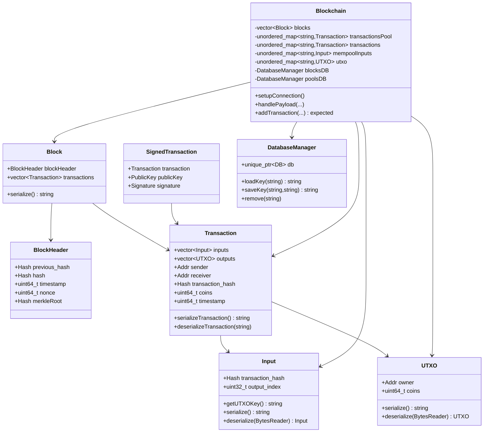
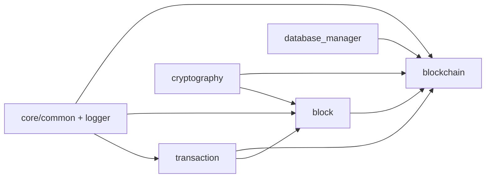

# Class and Module Diagrams

This document collects diagrams that summarize the main types and relationships in Axis.

## Core domain relationships

```mermaid
classDiagram
    class BlockHeader {
        +Hash previous_hash
        +Hash hash
        +uint64_t timestamp
        +uint64_t nonce
        +Hash merkleRoot
    }

    class UTXO {
        +Addr owner
        +uint64_t coins
        +serialize() string
        +deserialize(BytesReader) UTXO
    }

    class Input {
        +Hash transaction_hash
        +uint32_t output_index
        +getUTXOKey() string
        +serialize() string
        +deserialize(BytesReader) Input
    }

    class Transaction {
        +vector~Input~ inputs
        +vector~UTXO~ outputs
        +Addr sender
        +Addr receiver
        +Hash transaction_hash
        +uint64_t coins
        +uint64_t timestamp
        +serializeTransaction() string
        +deserializeTransaction(string)
    }

    class SignedTransaction {
        +Transaction transaction
        +PublicKey publicKey
        +Signature signature
    }

    class Block {
        +BlockHeader blockHeader
        +vector~Transaction~ transactions
        +serialize() string
    }

    class DatabaseManager {
        +unique_ptr~DB~ db
        +loadKey(string) string
        +saveKey(string,string) string
        +remove(string)
    }

    class Blockchain {
        -vector~Block~ blocks
        -unordered_map~string,Transaction~ transactionsPool
        -unordered_map~string,Transaction~ transactions
        -unordered_map~string,Input~ mempoolInputs
        -unordered_map~string,UTXO~ utxo
        -DatabaseManager blocksDB
        -DatabaseManager poolsDB
        +setupConnection()
        +handlePayload(...)
        +addTransaction(...) expected
    }

    Block --> BlockHeader
    Block --> Transaction
    Transaction --> Input
    Transaction --> UTXO
    SignedTransaction --> Transaction
    Blockchain --> Block
    Blockchain --> Transaction
    Blockchain --> Input
    Blockchain --> UTXO
    Blockchain --> DatabaseManager
```

## Module dependency view

```mermaid
flowchart LR
    Core[core/common + logger] --> Tx[transaction]
    Core --> Block[block]
    Core --> Chain[blockchain]
    Crypto[cryptography] --> Block
    Crypto --> Chain
    Storage[database_manager] --> Chain
    Tx --> Block
    Tx --> Chain
    Block --> Chain
```
