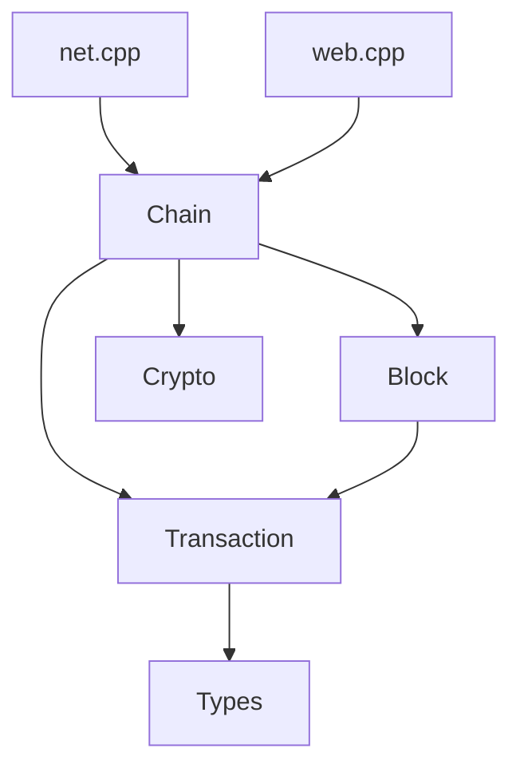

# Extending the Project

This guide explains where new code belongs and which boundaries to preserve.

## Where Features Belong

| Feature type | Preferred location |
| --- | --- |
| New binary TCP message | `include/axis/net.h`, `src/net.cpp`, docs in `api/ProtocolPackets.md` |
| New HTTP endpoint | `src/web.cpp`, docs in `api/PublicAPI.md` |
| Chain validation rule | `src/chain.cpp` or a new validation module called by `Chain` |
| New persisted object/index | `Chain` storage helpers or a future database abstraction |
| Crypto primitive wrapper | `crypto.h` / `crypto.cpp` |
| Transaction/block serialization change | `tx.cpp` / `block.cpp`, plus serialization/protocol docs |
| Tests for serialization/validation | `tests/` and CMake target updates |
| Build dependency | `CMakeLists.txt` |

## Boundaries to Preserve



Rules:

- `Transaction` should not query the UTXO set.
- `Block` should not write to LevelDB.
- `Chain` should not know about sockets, Crow routes, or WebSocket connections.
- `WebServer` should not directly mutate `utxo_`, `pool_`, or `blocks_`.
- `Server` should parse protocol bytes but delegate durable state changes to `Chain`.

## Adding a TCP Message

1. Add a `MsgType` value in `include/axis/net.h`.
2. Add a handler method declaration if needed.
3. Add a `case` in `Server::handle_msg()`.
4. Implement request parsing with `Reader`.
5. Implement response serialization with `Writer`.
6. Add payload limits before allocating vectors.
7. Document the layout in `docs/api/ProtocolPackets.md`.
8. Add tests or integration tooling.

## Adding an HTTP Route

1. Add route registration in `WebServer::setup_routes()` or refactor routes into helper functions first.
2. Parse inputs strictly.
3. Use `error_response()` for failures.
4. Use `json_response()` for JSON success responses.
5. Document the endpoint in `docs/api/PublicAPI.md`.
6. Consider CORS/security impact.

## Adding Chain Validation

Prefer validating before mutating state.

For block validation, a good future direction is:

```text
validate_block(block) -> BlockError
connect_block(block)  -> mutates state only after validation
```

Today, `Chain::add_block()` mutates directly and assumes the caller has validated the block.

## Adding Persistence

If adding new LevelDB records:

- Define a key prefix or fixed key format.
- Document key/value layout in `Database.md` and `Storage.md`.
- Consider write batches when a change spans multiple records.
- Add a schema version if incompatible changes are possible.

## Common Pitfalls

- Mutating `Transaction::outputs` after construction leaves `txid_` stale.
- Mutating `Block::transactions` after construction leaves Merkle root and cached block hash stale.
- Adding validation after `apply_tx()` may leave partial state if it fails.
- Returning references to internal chain containers can outlive locks.
- Using `Writer::put_str()` without a separate length field creates ambiguous layouts.
- Assuming HTTP `rawTx` is `Transaction::serialize()` is wrong; it is the create-transaction submission payload including pubkey/signature.
