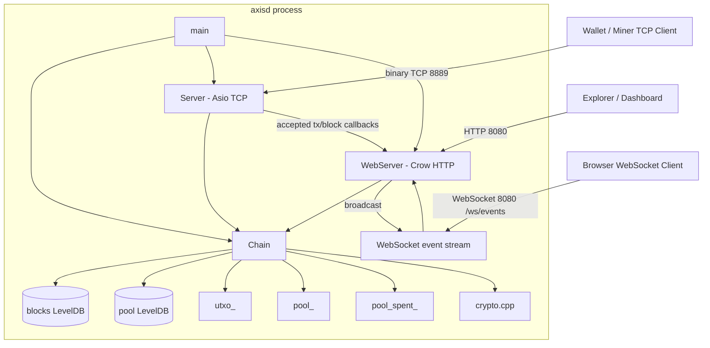
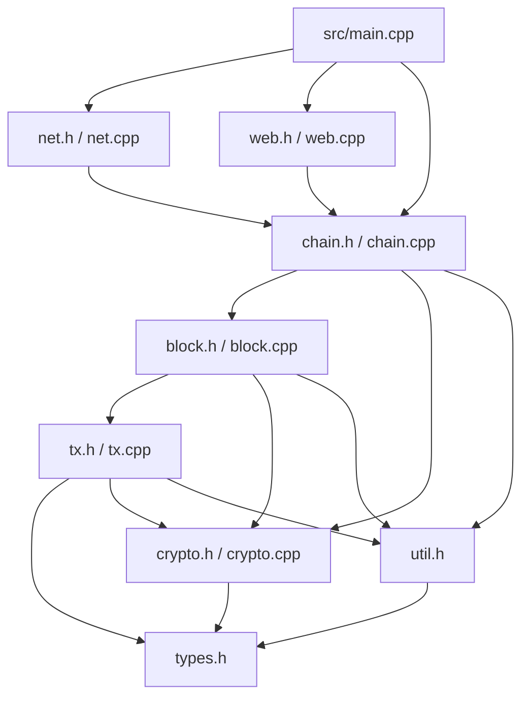
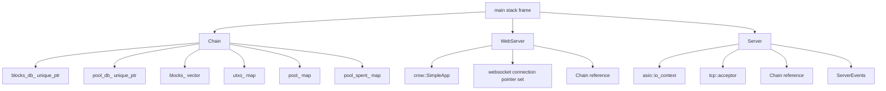
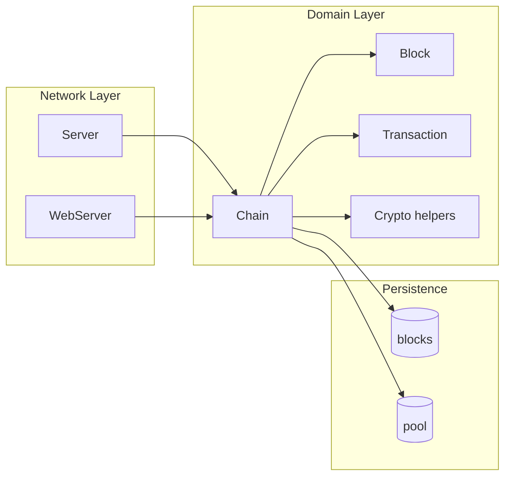

# Architecture Diagrams

## System Components

```mermaid
graph TD
    Wallet[Wallet / Miner TCP Client]
    Explorer[Explorer / Dashboard]
    Browser[Browser WebSocket Client]

    subgraph Axis[axisd process]
        Main[main]
        Chain[Chain]
        TCP[Server - Asio TCP]
        HTTP[WebServer - Crow HTTP]
        WS[WebSocket event stream]
        Blocks[(blocks LevelDB)]
        Pool[(pool LevelDB)]
        UTXO[utxo_]
        Mempool[pool_]
        PoolSpent[pool_spent_]
        Crypto[crypto.cpp]
    end

    Wallet -->|binary TCP 8889| TCP
    Explorer -->|HTTP 8080| HTTP
    Browser -->|WebSocket 8080 /ws/events| WS
    Main --> Chain
    Main --> TCP
    Main --> HTTP
    TCP --> Chain
    HTTP --> Chain
    WS --> HTTP
    Chain --> Blocks
    Chain --> Pool
    Chain --> UTXO
    Chain --> Mempool
    Chain --> PoolSpent
    Chain --> Crypto
    TCP -->|accepted tx/block callbacks| HTTP
    HTTP -->|broadcast| WS
```

## Module Dependency Direction

```mermaid
graph TD
    main[src/main.cpp] --> net[net.h / net.cpp]
    main --> web[web.h / web.cpp]
    main --> chain[chain.h / chain.cpp]
    net --> chain
    web --> chain
    chain --> block[block.h / block.cpp]
    chain --> crypto[crypto.h / crypto.cpp]
    chain --> util[util.h]
    block --> tx[tx.h / tx.cpp]
    block --> crypto
    block --> util
    tx --> types[types.h]
    tx --> crypto
    tx --> util
    crypto --> types
    util --> types
```

## Runtime Ownership

```mermaid
graph TD
    main[main stack frame] --> chain[Chain]
    main --> web[WebServer]
    main --> server[Server]

    chain --> blocksDb[blocks_db_ unique_ptr]
    chain --> poolDb[pool_db_ unique_ptr]
    chain --> blocksVec[blocks_ vector]
    chain --> utxoMap[utxo_ map]
    chain --> poolMap[pool_ map]
    chain --> poolSpentMap[pool_spent_ map]

    server --> ioContext[asio::io_context]
    server --> acceptor[tcp::acceptor]
    server --> chainRef[Chain reference]
    server --> callbacks[ServerEvents]

    web --> crowApp[crow::SimpleApp]
    web --> wsConnections[websocket connection pointer set]
    web --> chainRef2[Chain reference]
```

## Data Ownership Boundaries

```mermaid
graph LR
    subgraph NetworkLayer[Network Layer]
        TCP[Server]
        WEB[WebServer]
    end

    subgraph DomainLayer[Domain Layer]
        Chain[Chain]
        Block[Block]
        Tx[Transaction]
        Crypto[Crypto helpers]
    end

    subgraph PersistenceLayer[Persistence]
        BlocksDB[(blocks)]
        PoolDB[(pool)]
    end

    TCP --> Chain
    WEB --> Chain
    Chain --> Block
    Chain --> Tx
    Chain --> Crypto
    Chain --> BlocksDB
    Chain --> PoolDB
```
