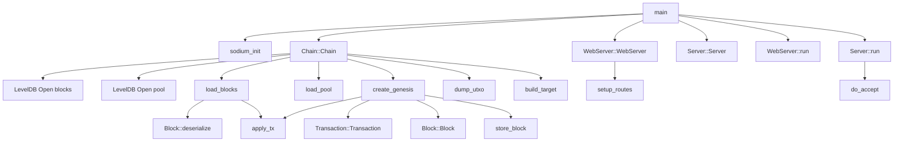
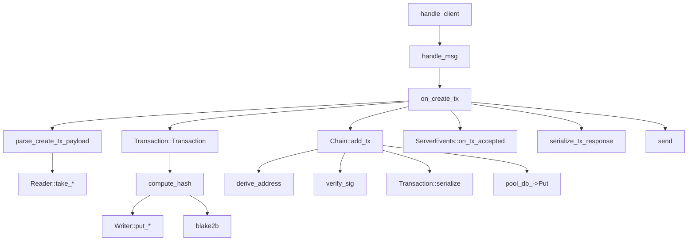
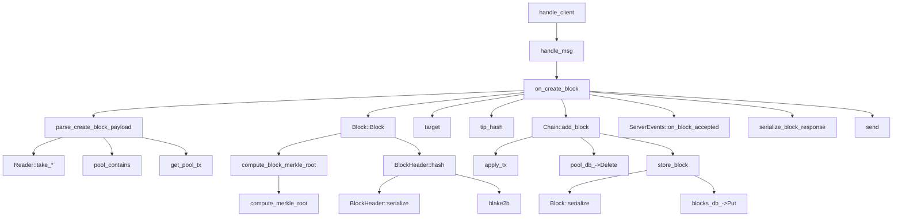
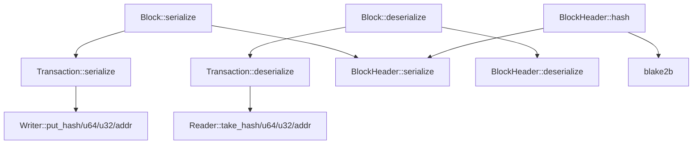

# Call Graphs

These diagrams show important runtime call paths. They are simplified from the indexed code graph and source inspection.

## Startup Call Graph



## TCP Transaction Submission Call Graph



## TCP Block Submission Call Graph



## HTTP Route Call Graph

```mermaid
graph TD
    setup_routes --> StatusRoute[/api/status]
    setup_routes --> TipRoute[/api/tip]
    setup_routes --> BlockRoute[/api/block/id]
    setup_routes --> BlocksRoute[/api/blocks]
    setup_routes --> MempoolRoute[/api/mempool]
    setup_routes --> UTXORoute[/api/utxos/address]
    setup_routes --> TxRoute[/api/transaction]
    setup_routes --> WebSocketRoute[/ws/events]

    StatusRoute --> height
    StatusRoute --> get_difficulty
    StatusRoute --> tip_hash
    TipRoute --> tip
    TipRoute --> block_json
    BlockRoute --> parse_u32
    BlockRoute --> get_block
    BlockRoute --> from_hex
    BlocksRoute --> get_blocks
    BlocksRoute --> block_summary_json
    MempoolRoute --> get_pool_txs
    MempoolRoute --> transaction_json
    UTXORoute --> from_hex
    UTXORoute --> get_utxos
    TxRoute --> hex_to_bytes
    TxRoute --> parse_signed_transaction_payload
    TxRoute --> add_tx
    TxRoute --> broadcast_new_tx
```

## Serialization Call Graph


