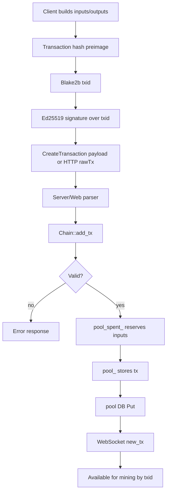
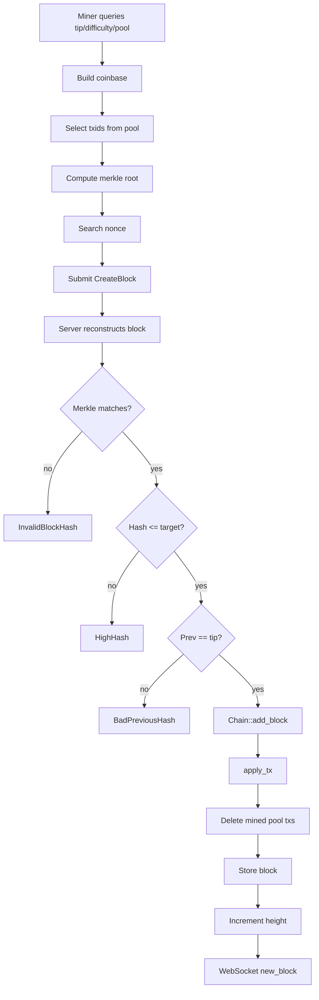
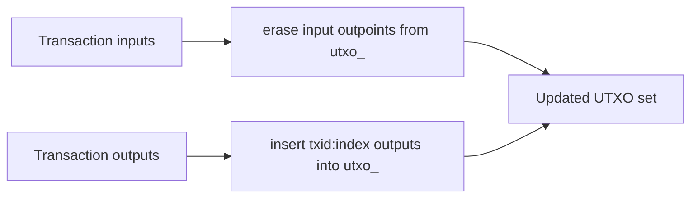
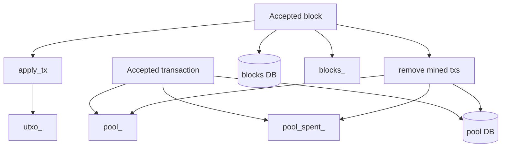
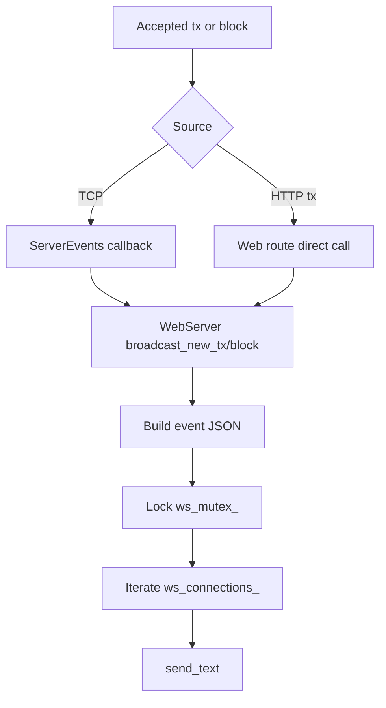

# Data Flow Diagrams

## Transaction Lifecycle

```mermaid
flowchart TD
    A[Client builds inputs/outputs] --> B[Transaction hash preimage]
    B --> C[Blake2b txid]
    C --> D[Ed25519 signature over txid]
    D --> E[CreateTransaction payload or HTTP rawTx]
    E --> F[Server/Web parser]
    F --> G[Chain::add_tx]
    G --> H{Valid?}
    H -->|no| R[Error response]
    H -->|yes| I[pool_spent_ reserves inputs]
    I --> J[pool_ stores tx]
    J --> K[pool DB Put]
    K --> L[WebSocket new_tx]
    L --> M[Available for mining by txid]
```

## Block Lifecycle

```mermaid
flowchart TD
    A[Miner queries tip/difficulty/pool] --> B[Build coinbase]
    B --> C[Select txids from pool]
    C --> D[Compute merkle root]
    D --> E[Search nonce]
    E --> F[Submit CreateBlock]
    F --> G[Server reconstructs block]
    G --> H{Merkle matches?}
    H -->|no| X[InvalidBlockHash]
    H -->|yes| I{Hash <= target?}
    I -->|no| Y[HighHash]
    I -->|yes| J{Prev == tip?}
    J -->|no| Z[BadPreviousHash]
    J -->|yes| K[Chain::add_block]
    K --> L[apply_tx]
    L --> M[Delete mined pool txs]
    M --> N[Store block]
    N --> O[Increment height]
    O --> P[WebSocket new_block]
```

## UTXO State Transition

```mermaid
flowchart LR
    Inputs[Transaction inputs] --> Remove[erase input outpoints from utxo_]
    Outputs[Transaction outputs] --> Create[insert txid:index outputs into utxo_]
    Remove --> NewState[Updated UTXO set]
    Create --> NewState
```

## Storage Flow

```mermaid
flowchart TD
    AcceptedTx[Accepted transaction] --> PoolMemory[pool_]
    AcceptedTx --> PoolSpent[pool_spent_]
    AcceptedTx --> PoolDB[(pool DB)]

    AcceptedBlock[Accepted block] --> Apply[apply_tx]
    Apply --> UTXO[utxo_]
    AcceptedBlock --> BlocksDB[(blocks DB)]
    AcceptedBlock --> BlocksMemory[blocks_]
    AcceptedBlock --> RemovePool[remove mined txs]
    RemovePool --> PoolMemory
    RemovePool --> PoolSpent
    RemovePool --> PoolDB
```

## WebSocket Broadcast Flow

```mermaid
flowchart TD
    Accepted[Accepted tx or block] --> EventSource{Source}
    EventSource -->|TCP| Callback[ServerEvents callback]
    EventSource -->|HTTP tx| Direct[Web route direct call]
    Callback --> Broadcast[WebServer broadcast_new_tx/block]
    Direct --> Broadcast
    Broadcast --> Serialize[Build event JSON]
    Serialize --> Lock[Lock ws_mutex_]
    Lock --> Iterate[Iterate ws_connections_]
    Iterate --> Send[send_text]
```
