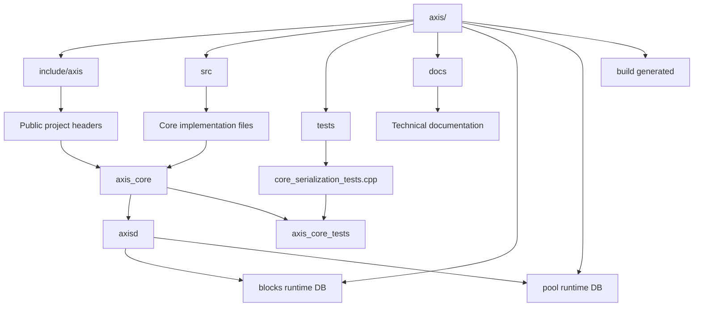

# Folder Relationship Diagram

```mermaid
graph TD
    Root[axis/]
    Root --> Include[include/axis]
    Root --> Src[src]
    Root --> Tests[tests]
    Root --> Docs[docs]
    Root --> Blocks[blocks runtime DB]
    Root --> Pool[pool runtime DB]
    Root --> Build[build generated]

    Include --> Headers[Public project headers]
    Src --> Impl[Core implementation files]
    Tests --> CoreTests[core_serialization_tests.cpp]
    Docs --> TechDocs[Technical documentation]

    Headers --> CoreLib[axis_core]
    Impl --> CoreLib
    CoreTests --> TestTarget[axis_core_tests]
    CoreLib --> Daemon[axisd]
    CoreLib --> TestTarget
    Daemon --> Blocks
    Daemon --> Pool
```
