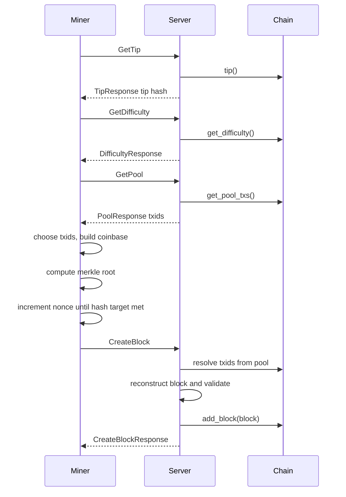

# Mining Flow Diagram

```mermaid
sequenceDiagram
    participant Miner
    participant Server
    participant Chain

    Miner->>Server: GetTip
    Server->>Chain: tip()
    Server-->>Miner: TipResponse tip hash

    Miner->>Server: GetDifficulty
    Server->>Chain: get_difficulty()
    Server-->>Miner: DifficultyResponse

    Miner->>Server: GetPool
    Server->>Chain: get_pool_txs()
    Server-->>Miner: PoolResponse txids

    Miner->>Miner: choose txids, build coinbase
    Miner->>Miner: compute merkle root
    Miner->>Miner: increment nonce until hash target met

    Miner->>Server: CreateBlock
    Server->>Chain: resolve txids from pool
    Server->>Server: reconstruct block and validate
    Server->>Chain: add_block(block)
    Server-->>Miner: CreateBlockResponse
```

Current implementation note: the mining loop lives in the companion mining repository. Axis verifies a submitted candidate but does not run a mining loop itself.
