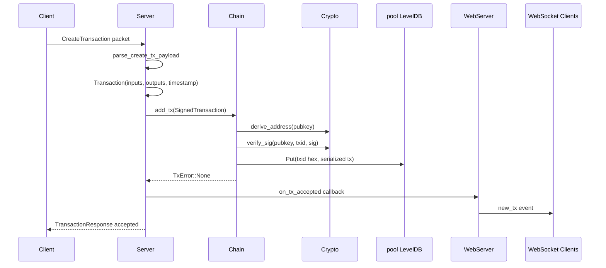
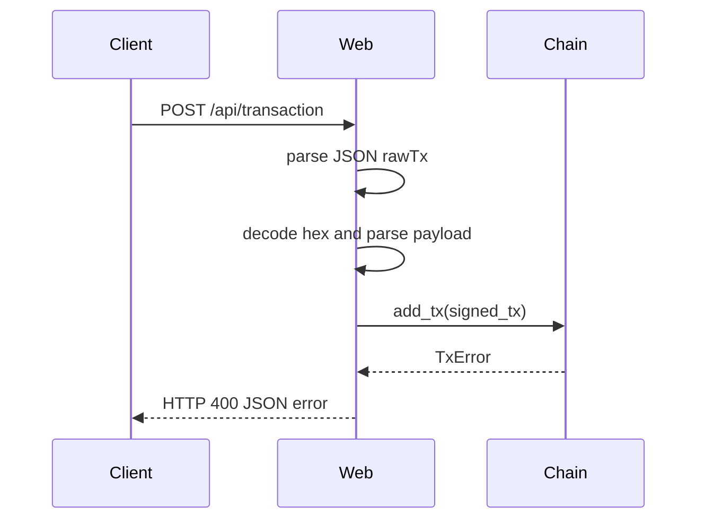
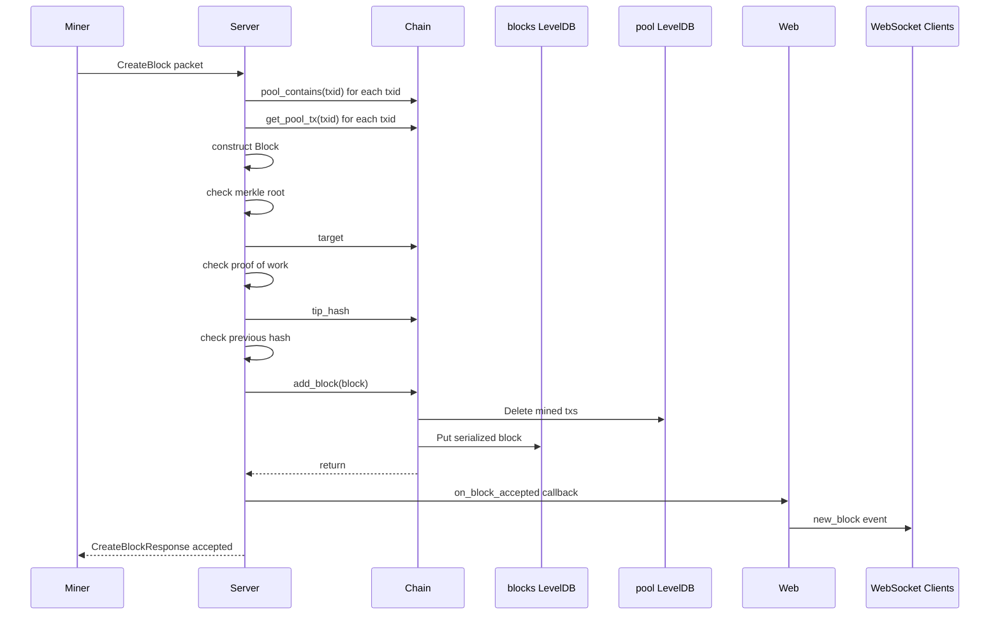
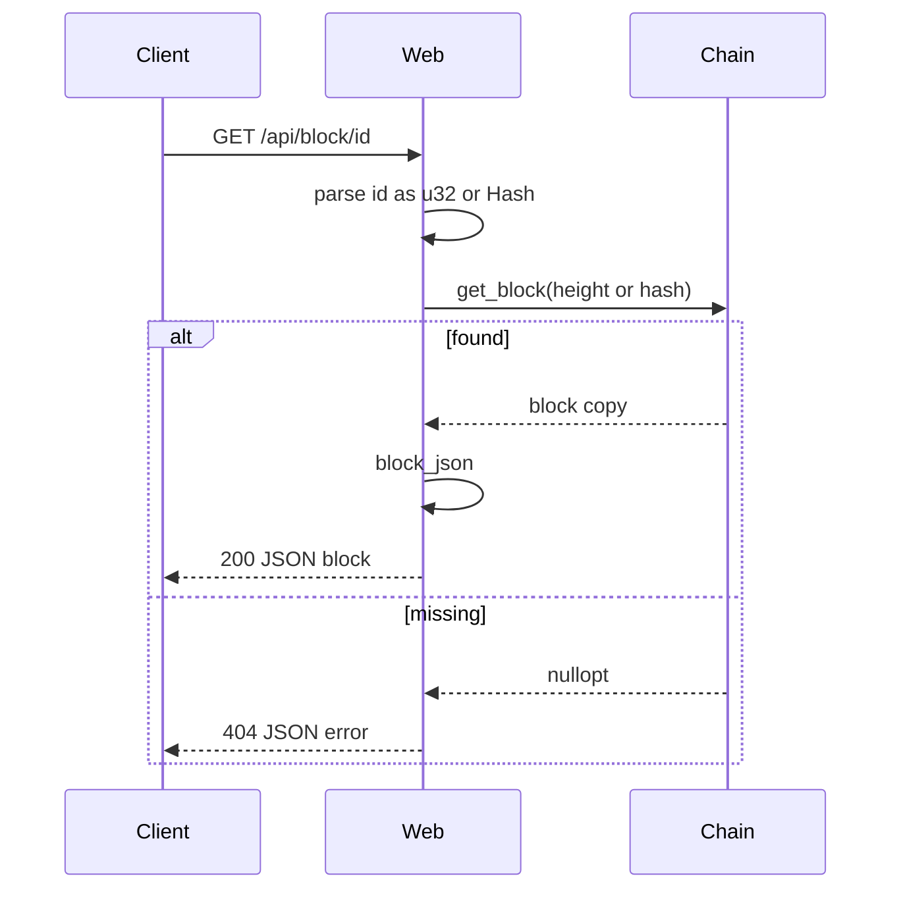
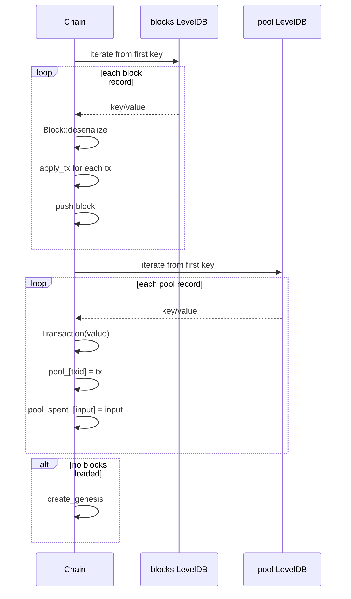

# Sequence Diagrams

## Transaction Accepted via TCP

```mermaid
sequenceDiagram
    participant Client
    participant Server
    participant Chain
    participant Crypto
    participant PoolDB as pool LevelDB
    participant Web as WebServer
    participant WS as WebSocket Clients

    Client->>Server: CreateTransaction packet
    Server->>Server: parse_create_tx_payload
    Server->>Server: Transaction(inputs, outputs, timestamp)
    Server->>Chain: add_tx(SignedTransaction)
    Chain->>Crypto: derive_address(pubkey)
    Chain->>Crypto: verify_sig(pubkey, txid, sig)
    Chain->>PoolDB: Put(txid hex, serialized tx)
    Chain-->>Server: TxError::None
    Server->>Web: on_tx_accepted callback
    Web->>WS: new_tx event
    Server-->>Client: TransactionResponse accepted
```

## Transaction Rejected via HTTP

```mermaid
sequenceDiagram
    participant Client
    participant Web
    participant Chain

    Client->>Web: POST /api/transaction
    Web->>Web: parse JSON rawTx
    Web->>Web: decode hex and parse payload
    Web->>Chain: add_tx(signed_tx)
    Chain-->>Web: TxError
    Web-->>Client: HTTP 400 JSON error
```

## Block Accepted via TCP

```mermaid
sequenceDiagram
    participant Miner
    participant Server
    participant Chain
    participant BlocksDB as blocks LevelDB
    participant PoolDB as pool LevelDB
    participant Web
    participant WS as WebSocket Clients

    Miner->>Server: CreateBlock packet
    Server->>Chain: pool_contains(txid) for each txid
    Server->>Chain: get_pool_tx(txid) for each txid
    Server->>Server: construct Block
    Server->>Server: check merkle root
    Server->>Chain: target
    Server->>Server: check proof of work
    Server->>Chain: tip_hash
    Server->>Server: check previous hash
    Server->>Chain: add_block(block)
    Chain->>PoolDB: Delete mined txs
    Chain->>BlocksDB: Put serialized block
    Chain-->>Server: return
    Server->>Web: on_block_accepted callback
    Web->>WS: new_block event
    Server-->>Miner: CreateBlockResponse accepted
```

## HTTP Block Lookup

```mermaid
sequenceDiagram
    participant Client
    participant Web
    participant Chain

    Client->>Web: GET /api/block/id
    Web->>Web: parse id as u32 or Hash
    Web->>Chain: get_block(height or hash)
    alt found
        Chain-->>Web: block copy
        Web->>Web: block_json
        Web-->>Client: 200 JSON block
    else missing
        Chain-->>Web: nullopt
        Web-->>Client: 404 JSON error
    end
```

## Startup Recovery

```mermaid
sequenceDiagram
    participant Chain
    participant BlocksDB as blocks LevelDB
    participant PoolDB as pool LevelDB

    Chain->>BlocksDB: iterate from first key
    loop each block record
        BlocksDB-->>Chain: key/value
        Chain->>Chain: Block::deserialize
        Chain->>Chain: apply_tx for each tx
        Chain->>Chain: push block
    end
    Chain->>PoolDB: iterate from first key
    loop each pool record
        PoolDB-->>Chain: key/value
        Chain->>Chain: Transaction(value)
        Chain->>Chain: pool_[txid] = tx
        Chain->>Chain: pool_spent_[input] = input
    end
    alt no blocks loaded
        Chain->>Chain: create_genesis
    end
```
