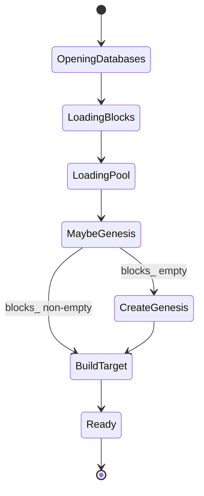
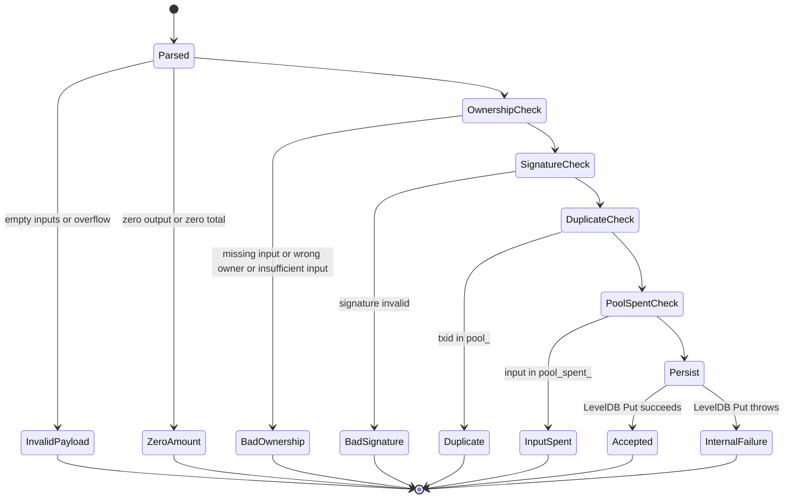
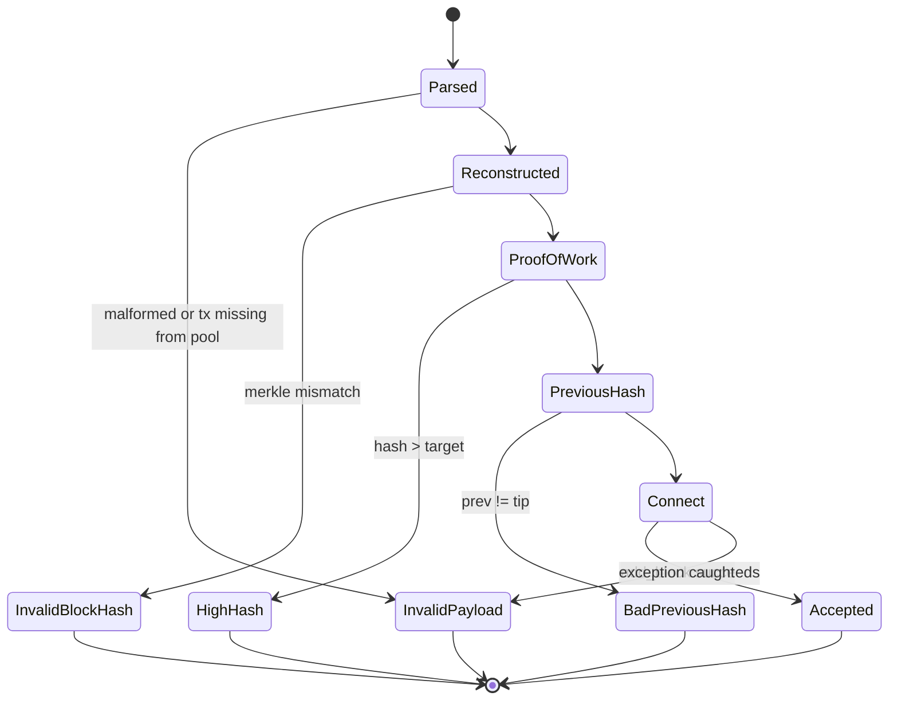
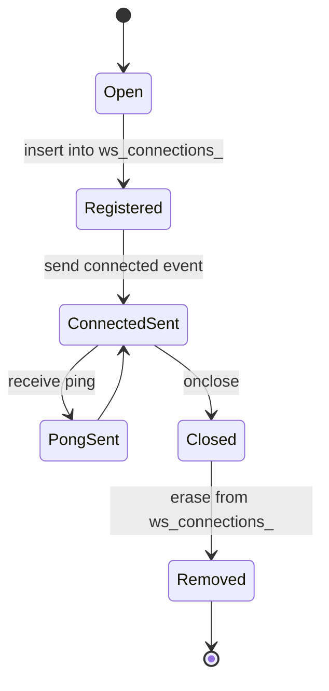

# State Machines

## Chain Startup State

```mermaid
stateDiagram-v2
    [*] --> OpeningDatabases
    OpeningDatabases --> LoadingBlocks
    LoadingBlocks --> LoadingPool
    LoadingPool --> MaybeGenesis
    MaybeGenesis --> CreateGenesis: blocks_ empty
    MaybeGenesis --> BuildTarget: blocks_ non-empty
    CreateGenesis --> BuildTarget
    BuildTarget --> Ready
    Ready --> [*]
```

## Transaction Acceptance State

```mermaid
stateDiagram-v2
    [*] --> Parsed
    Parsed --> InvalidPayload: empty inputs or overflow
    Parsed --> ZeroAmount: zero output or zero total
    Parsed --> OwnershipCheck
    OwnershipCheck --> BadOwnership: missing input or wrong owner or insufficient input
    OwnershipCheck --> SignatureCheck
    SignatureCheck --> BadSignature: signature invalid
    SignatureCheck --> DuplicateCheck
    DuplicateCheck --> Duplicate: txid in pool_
    DuplicateCheck --> PoolSpentCheck
    PoolSpentCheck --> InputSpent: input in pool_spent_
    PoolSpentCheck --> Persist
    Persist --> Accepted: LevelDB Put succeeds
    Persist --> InternalFailure: LevelDB Put throws
    Accepted --> [*]
    InvalidPayload --> [*]
    ZeroAmount --> [*]
    BadOwnership --> [*]
    BadSignature --> [*]
    Duplicate --> [*]
    InputSpent --> [*]
    InternalFailure --> [*]
```

## Block Acceptance State

```mermaid
stateDiagram-v2
    [*] --> Parsed
    Parsed --> InvalidPayload: malformed or tx missing from pool
    Parsed --> Reconstructed
    Reconstructed --> InvalidBlockHash: merkle mismatch
    Reconstructed --> ProofOfWork
    ProofOfWork --> HighHash: hash > target
    ProofOfWork --> PreviousHash
    PreviousHash --> BadPreviousHash: prev != tip
    PreviousHash --> Connect
    Connect --> Accepted: add_block succeeds
    Connect --> InvalidPayload: exception caught
    Accepted --> [*]
    InvalidPayload --> [*]
    InvalidBlockHash --> [*]
    HighHash --> [*]
    BadPreviousHash --> [*]
```

## WebSocket Connection State

```mermaid
stateDiagram-v2
    [*] --> Open
    Open --> Registered: insert into ws_connections_
    Registered --> ConnectedSent: send connected event
    ConnectedSent --> PongSent: receive ping
    PongSent --> ConnectedSent
    ConnectedSent --> Closed: onclose
    Closed --> Removed: erase from ws_connections_
    Removed --> [*]
```
