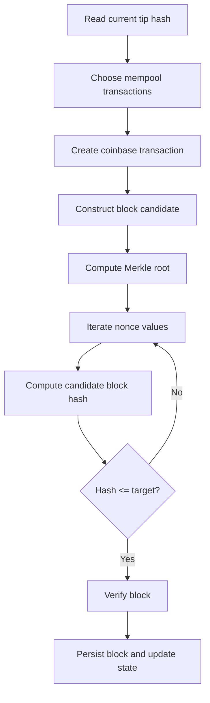

# Miner

## 1. Important truth about the current codebase

Axis does **not** currently implement a full miner component.

However, the codebase includes several concepts that a miner would use:

- `difficulty`
- `target`
- `buildTarget()`
- `verifyDifficulty()`
- coinbase-style transaction verification
- block construction support
- Merkle root computation

This document explains both the current state and how a future miner would fit into the design.

## 2. What a miner is

A miner is the component that tries to create a valid new block by:

1. selecting transactions,
2. creating a coinbase reward transaction,
3. building a block candidate,
4. repeatedly changing the nonce,
5. checking whether the resulting block hash satisfies the target.

## 3. What Axis already has for mining-related logic

### Difficulty model

`Blockchain::buildTarget()` constructs the target hash.

Current rule:

- start with all bytes `0xff`,
- set the first `difficulty` bytes to `0x00`.

### Difficulty verification

`Blockchain::verifyDifficulty(const Hash&)` returns whether a candidate hash is numerically less than or equal to the target.

### Coinbase verification

`Blockchain::verifyCoinbaseTransaction()` ensures a reward transaction:

- has no inputs,
- has exactly one output,
- pays no more than `MINER_REWARD`.

### Block verification

`Blockchain::verifyBlock()` includes proof-of-work and coinbase checks.

## 4. What Axis does not yet have

The codebase does not currently show:

- a block-candidate builder that consumes the mempool,
- a nonce-search loop,
- a block-hash computation routine for mining,
- a block submission endpoint,
- mempool cleanup after successful block creation,
- reward payout workflow beyond validation helpers.

## 5. How a miner would conceptually work here

## 6. Likely mining workflow with current types

A future implementation would likely:

1. call `getCurrentBlockHash()` for `previous_hash`,
2. create a coinbase `Transaction`,
3. select transactions from `transactionsPool`,
4. build a `Block` with those transactions,
5. compute block hash from header material,
6. test nonce values until `verifyDifficulty()` passes,
7. append and persist the block,
8. update UTXO state,
9. remove included transactions from mempool and `pool/` DB.

## 7. Why `verifyBlock()` alone is not mining

A common beginner mistake is to think block verification equals mining.

It does not.

- **Mining** searches for a valid nonce and block hash.
- **Verification** checks whether a proposed block already satisfies the rules.

Axis currently provides more verification scaffolding than mining implementation.

## 8. Reward model in this project

Constants in `Blockchain`:

- `MINER_REWARD = 3 * UNITS`
- `GENESIS_REWARD = 15 * UNITS`
- `UNITS = 1000000`

### Interpretation

The project uses integer smallest-unit accounting rather than floating-point coin amounts.

## 9. Design considerations for a future miner

If you implement mining, decide:

- how to choose transactions from the mempool,
- whether to sort by fee or arrival order,
- how to compute the block hash exactly,
- how to update difficulty over time,
- how to handle stale candidates when new blocks appear.

## 10. Beginner summary

Axis is miner-ready only in a partial sense:

- it has blocks,
- it has transactions,
- it has a target rule,
- it can verify basic block validity,
- but it does not yet contain the active search-and-commit loop that a real miner needs.
