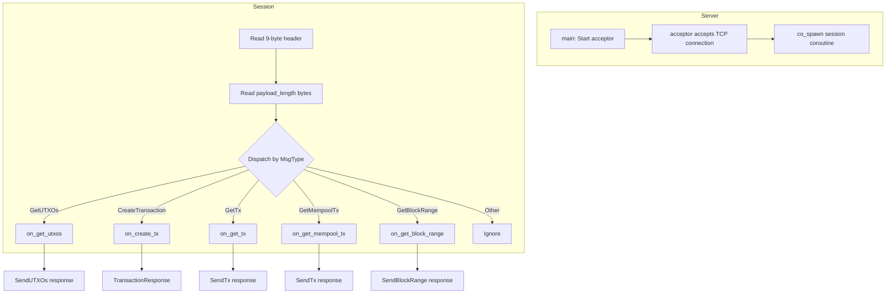

# Network layer

This document describes Axis's network layer: how TCP connections are
handled, how coroutines work, and how messages are dispatched.

## Architecture



## TCP server

The server runs on **port 8080** by default (configurable via `set_port`).

```cpp
class Server {
    asio::io_context ctx_;
    asio::ip::tcp::acceptor acceptor_;
    Chain& chain_;

    void start(uint16_t port);
    asio::awaitable<void> session(asio::ip::tcp::socket sock);
};
```

### Startup

```cpp
void Server::start(uint16_t port) {
    auto endpoint = asio::ip::tcp::endpoint{
        asio::ip::tcp::v4(), port};
    acceptor_.open(endpoint.protocol());
    acceptor_.set_option(asio::ip::tcp::acceptor::reuse_address(true));
    acceptor_.bind(endpoint);
    acceptor_.listen();

    // Spawn one coroutine per accepted connection
    co_spawn(ctx_, do_accept(), asio::detached);
    ctx_.run();
}
```

### Accept loop

```cpp
asio::awaitable<void> Server::do_accept() {
    while (true) {
        auto sock = co_await acceptor_.async_accept(
            asio::use_awaitable);
        co_spawn(ctx_, session(std::move(sock)), asio::detached);
    }
}
```

Each accepted socket gets its own **session** coroutine. This is a
stackful coroutine model: `co_await` suspends the coroutine without
blocking the thread.

## Coroutines (C++20 `co_await`)

Axis uses Asio's C++20 coroutine support. A coroutine is a function that
uses `co_await` or `co_return`. It can suspend mid-execution without
blocking the OS thread.

### Thread model

There is a single I/O thread running `ctx_.run()`. All coroutines execute
on this thread. When a coroutine `co_await`s an asynchronous operation, the
thread is not blocked — it runs other coroutines while waiting.

This means there is no concurrency: only one coroutine runs at a time on the
single thread. The coroutine model simplifies code because:

1. No mutexes or locks needed
2. Sequential-looking code for I/O operations
3. No callback spaghetti

### Reading from a socket

```cpp
asio::awaitable<std::vector<uint8_t>> async_read(
    asio::ip::tcp::socket& sock, size_t n) {
    std::vector<uint8_t> buf(n);
    co_await asio::async_read(sock,
        asio::buffer(buf), asio::use_awaitable);
    co_return buf;
}
```

The `co_await` suspends the session coroutine until exactly N bytes have
been read. Meanwhile, other sessions' coroutines can proceed.

### Writing to a socket

```cpp
asio::awaitable<void> async_write(
    asio::ip::tcp::socket& sock,
    std::span<const uint8_t> data) {
    co_await asio::async_write(sock,
        asio::buffer(data.data(), data.size()),
        asio::use_awaitable);
}
```

## Session coroutine

The `session` function handles one TCP connection:

```cpp
asio::awaitable<void> Server::session(
    asio::ip::tcp::socket sock) {
    try {
        while (true) {
            // 1. Read 9-byte header
            auto header = co_await async_read(sock, 9);
            Reader r{header};

            auto magic = r.take_u32();
            if (magic != 0xDEADBEEF) break;

            auto type = r.take_u8();
            auto payload_len = r.take_u32_be();

            // 2. Read payload
            auto payload = co_await async_read(sock, payload_len);

            // 3. Dispatch
            switch (MsgType(type)) { ... }
        }
    } catch (const std::exception&) {
        // Connection closed or error
    }
}
```

If the client disconnects, `async_read` throws, the catch block exits the
session, and the socket is destroyed (RAII closes it).

## Message handlers

### on_get_utxos

Reads the 20-byte address from the payload, calls `chain_.get_utxos(addr)`,
serializes the response, and sends it back with a `SendUTXOs` header.

```cpp
// Response format:
// [magic (4)] [SendUTXOs type (1)] [payload_len (4 BE)]
// [varint count] [OutPoint + TxOutput]...

// Each OutPoint: [txid (32)] [index (4)]
// Each TxOutput: [recipient (20)] [amount (8)]
```

### on_create_tx

Deserializes a `SignedTransaction`, validates it via `chain_.add_tx(...)`,
and returns a `TransactionResponse`.

### on_get_tx / on_get_mempool_tx

Reads a 32-byte txid, looks it up in the chain's UTXO or mempool, and
returns a `SendTx` with the serialized transaction (or an empty response
if not found).

### on_get_block_range

Reads `start_range` (uint32) and `end_range` (uint32), fetches blocks
from `chain_.get_block_range(start, end)`, serializes them, and returns a
`SendBlockRange`.

## Message sending helpers

### send_payload

Serializes any payload into the packet format:

```cpp
asio::awaitable<void> send_payload(
    asio::ip::tcp::socket& sock,
    MsgType type,
    const std::vector<uint8_t>& payload) {
    Writer w;
    w.put_u32(MAGIC);          // 0xDEADBEEF
    w.put_u8(static_cast<uint8_t>(type));
    w.put_u32_be(payload.size());  // big-endian length
    co_await async_write(sock, w.buf);   // header
    co_await async_write(sock, payload); // body
}
```

### send_txresponse

Specialized for `TransactionResponse` messages:

```cpp
asio::awaitable<void> send_txresponse(
    asio::ip::tcp::socket& sock,
    bool accepted, TxError err,
    const std::string& reason) {
    Writer w;
    w.put_u32(MAGIC);
    w.put_u8(static_cast<uint8_t>(MsgType::TransactionResponse));
    w.put_u32_be(4 + reason.size());  // payload: 1+1+2+reason

    Writer payload;
    payload.put_u8(accepted ? 1 : 0);
    payload.put_u8(static_cast<uint8_t>(err));
    payload.put_u16(reason.size());
    payload.put_bytes({(const uint8_t*)reason.data(), reason.size()});

    co_await async_write(sock, w.buf);
    co_await async_write(sock, payload.buf);
}
```

## Future: peer-to-peer networking

Currently, Axis runs as a standalone node. There is no peer discovery, no
handshake, no block relay, and no transaction relay. A future peer-to-peer
layer would add:

1. **Handshake**: exchange version, genesis hash, and listening port
2. **Block relay**: when a new block is validated, broadcast it to peers
3. **Transaction relay**: forward mempool transactions to peers
4. **Peer discovery**: maintain a list of known peers, periodically connect
5. **Compact blocks**: send block headers first, fill in missing transactions
   on demand (BIP152-style)
