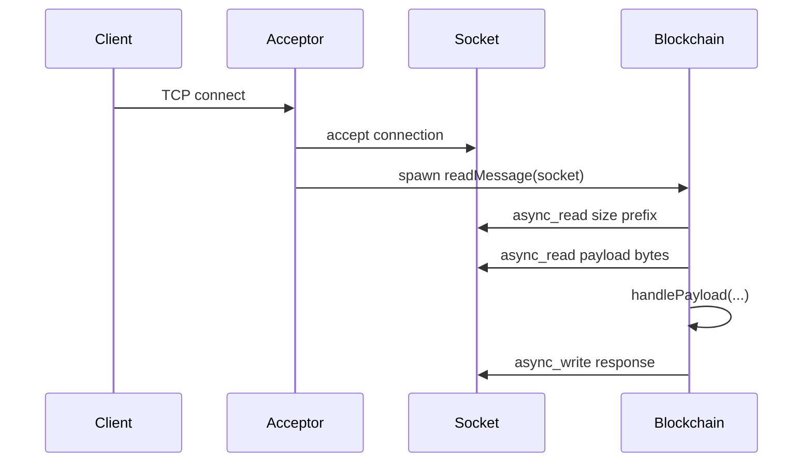

# Network

This document explains the networking model used by Axis.

## 1. Overview

Axis runs a TCP server using standalone Asio.

The networking model is deliberately small:

- one TCP listener,
- one binary packet format,
- one message read per accepted client in the current implementation,
- coroutine-based async reads and writes.

The server listens on port `9618`.

## 2. Where networking lives in the code

Even though the repository has `include/axis/network/` and `src/network/` directories, the actual network logic currently lives inside:

- `axis/include/axis/blockchain/blockchain.h`
- `axis/src/blockchain/blockchain.cpp`

This means `Blockchain` is both:

- domain/state manager,
- TCP protocol handler.

## 3. Startup and listening

Two global objects are defined in `axis/src/blockchain/blockchain.cpp`:

```cpp
asio::io_context context;
asio::ip::tcp::acceptor acceptor(context, asio::ip::tcp::endpoint(asio::ip::tcp::v4(), 9618));
```

### What they do

- `context` drives asynchronous I/O.
- `acceptor` listens for incoming TCP connections.

`Blockchain::setupConnection()` starts the accept loop and runs the event loop.

## 4. Connection lifecycle



## 5. Accept flow

`Blockchain::acceptClient()` does the following:

1. creates a new `shared_ptr<tcp::socket>`,
2. calls `acceptor.async_accept(...)`,
3. on success, logs a connection message,
4. immediately schedules acceptance of the next client,
5. spawns `readMessage(socket)` as a coroutine.

### Why the socket is in `shared_ptr`

The socket must stay alive across asynchronous operations. Shared ownership avoids premature destruction while the coroutine still needs it.

## 6. Read flow

`Blockchain::readMessage()` currently handles one message from a client.

### Exact behavior

1. Read 4 bytes into `payloadSize`.
2. Reject if `payloadSize < sizeof(PayloadType)`.
3. Allocate a buffer of `payloadSize` bytes.
4. Read exactly that many bytes.
5. Extract `PayloadType` from the first bytes.
6. Pass the remaining bytes to `handlePayload()`.
7. If an exception occurs, log rejection.

### Important implication

The current implementation does not contain a loop to read many packets from the same connection. In practice, it behaves like a **single-request connection handler**.

## 7. Supported message types in practice

The `PayloadType` enum contains more values than the server fully handles.

### Enum values declared

- `GetBalance`
- `GetBlock`
- `GetTransaction`
- `GetUTXO`
- `GetUTXOs`
- `BalanceResponse`
- `BlockResponse`
- `TransactionResponse`
- `UTXOResponse`
- `UTXOsResponse`
- `CreateTransaction`

### Actually handled in `handlePayload()` right now

- `GetUTXOs`
- `CreateTransaction`

### Mentioned but not implemented

- `GetUTXO` case exists but the call is commented out
- `GetBlock`, `GetTransaction`, `GetBalance` response paths are not implemented in the visible code

This distinction is important for anyone writing a client.

## 8. Coroutine behavior

The async methods use `asio::awaitable<void>` and `co_await`.

### Methods using coroutines

- `sendPacket()`
- `sendTransactionResponse()`
- `readMessage()`
- `handlePayload()`
- `handleGetUTXOs()`
- `handleCreateTransaction()`

### Why coroutines are useful here

They make async code look more like straight-line code. Instead of deeply nested callbacks, the code reads top to bottom.

## 9. Error handling strategy

### Packet parse / payload errors

If the payload is malformed, the server:

- logs rejection,
- often sends `TransactionResponse` with `InvalidPayload` for `CreateTransaction`.

### Socket/read errors

Exceptions from async reads are caught in `readMessage()` and logged.

### Unsupported payload types

`handlePayload()` logs an error.

## 10. Threading model

The visible code uses one global `asio::io_context` and does not start worker threads.

### Practical consequence

The node behaves like a single-threaded async server unless the process is expanded later.

### Shared-state implication

There are no mutexes around blockchain state. That is acceptable in a single-threaded event loop, but would need redesign if multiple threads start touching shared maps and vectors.

## 11. Request and response flow examples

## `GetUTXOs`

Client sends address bytes.
Server:

1. decodes the address,
2. scans UTXO set,
3. serializes matching references and total balance,
4. sends `UTXOsResponse`.

## `CreateTransaction`

Client sends:

- public key,
- sender address,
- receiver address,
- amount,
- timestamp,
- inputs,
- outputs,
- signature.

Server:

1. deserializes payload,
2. verifies public-key-to-sender match,
3. verifies inputs,
4. verifies signature,
5. checks mempool conflicts,
6. persists to mempool DB,
7. sends `TransactionResponse`.

## 12. Networking limitations

- no TLS,
- no authentication beyond transaction signatures,
- no peer protocol for block syncing,
- no handshake/version negotiation,
- no repeated packet loop per connection,
- no backpressure or rate-limiting logic,
- no explicit maximum packet size limit beyond available memory.

## 13. Advice for client implementers

If you write a client for Axis:

- open a TCP connection to port `9618`,
- send exactly one framed packet per connection unless you verify broader behavior yourself,
- encode integers exactly as the server expects on your platform assumptions,
- read a framed response back,
- do not assume all enum message types are supported.

See [Packet protocol](packet_protocol.md) for exact layouts.
