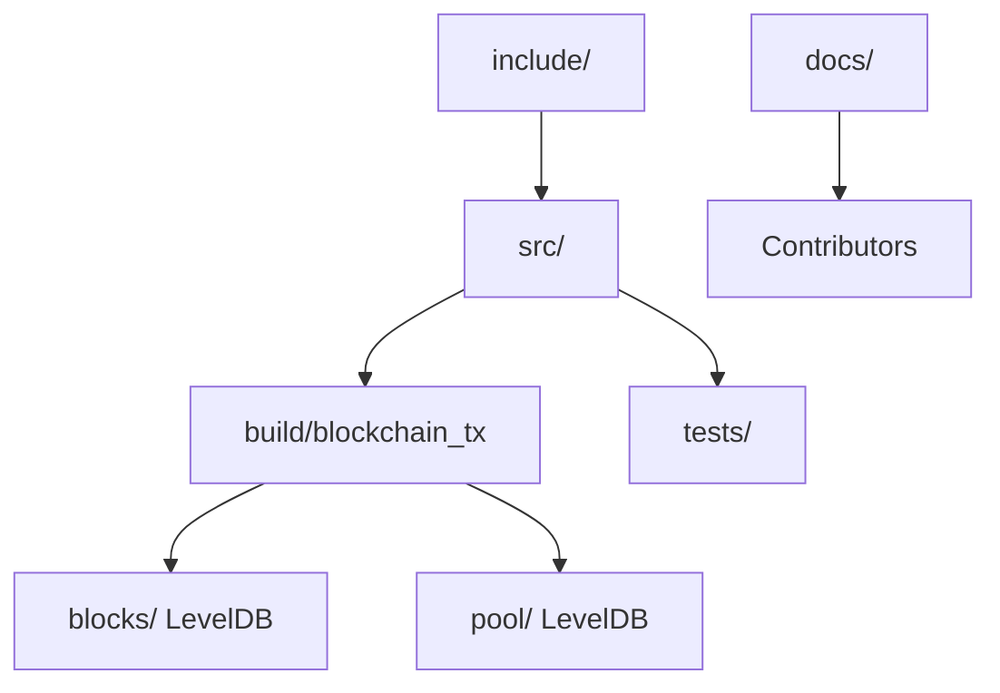

# Project Structure

This document explains every important directory in the repository, why it exists, and how its contents relate to the rest of the system.

## Top-level layout

```text
axis/
├── blocks/
├── build/
├── docs/
├── include/
├── pool/
├── screenshots/
├── src/
├── tests/
├── CMakeLists.txt
├── CMakeSettings.json
└── README.md
```

## `include/`

This directory contains public headers used by the project.

### Why it exists

The project separates interface from implementation:

- headers in `include/` describe types, function signatures, and reusable declarations,
- source files in `src/` define behavior.

This is a conventional C++ layout that makes it easier to understand module boundaries.

## `include/axis/`

This is the project namespace area for public headers.

### Subdirectories

#### `include/axis/blockchain/`

Contains the main blockchain domain types:

- `block.h`
- `blockchain.h`
- `transaction.h`

These files define the most important business objects in the system.

#### `include/axis/core/`

Contains shared helpers used by multiple modules:

- `common.h`
- `logger.h`

This is the project’s utility layer.

#### `include/axis/crypto/`

Contains cryptographic helpers:

- `cryptography.h`

Right now this layer is very small and mostly provides Merkle root calculation.

#### `include/axis/storage/`

Contains persistence abstractions:

- `database_manager.h`

This wraps LevelDB usage behind a small C++ class.

#### `include/axis/network/`

This directory exists but does not currently contain public headers in the checked repository snapshot.

### Why that matters

It suggests the architecture anticipated a more explicit networking module, but most network logic currently lives inside `Blockchain` instead.

## `src/`

Contains implementation files.

### `src/main.cpp`

Program entry point. It initializes libsodium and starts the blockchain service.

### `src/blockchain/`

Implements the core domain logic:

- `block.cpp`: block construction and serialization,
- `blockchain.cpp`: node state, validation, persistence orchestration, and TCP handlers,
- `transaction.cpp`: transaction hashing and serialization.

This is the heart of the application.

### `src/core/`

Implements shared utilities:

- `common.cpp`: address derivation, hashing helpers, UTXO key parsing,
- `logger.cpp`: simple console logging.

### `src/crypto/`

Implements `computeMerkleRoot()` in `cryptography.cpp`.

### `src/storage/`

Implements `DatabaseManager` in `database_manager.cpp`.

### `src/network/`

This directory exists but is empty in the current source tree.

Again, this indicates a planned but not yet separated networking layer.

### `src/pch.cpp`

Supports the project’s precompiled-header build setup.

## `tests/`

Contains automated tests.

### Current contents

- `core_serialization_tests.cpp`

### What it covers

- transaction serialization/deserialization round-trip,
- block serialization/deserialization round-trip,
- rejection of malformed empty transaction input during deserialization.

### What it does not cover

- networking,
- signature validation,
- database recovery,
- mempool behavior,
- block validation,
- concurrency.

## `docs/`

Contains project documentation for contributors and maintainers.

This folder is the human-facing knowledge base of the repository.

## `blocks/`

Runtime LevelDB database directory for persisted blocks.

### Why it exists

Blocks must survive process restarts. This directory is the node’s long-term chain storage.

### Important note

This is runtime state, not source code. Do not treat it like hand-edited project content.

## `pool/`

Runtime LevelDB database directory for persisted mempool transactions.

### Why it exists

Pending transactions are saved so they can survive process restart.

### Design implication

Axis treats the mempool as persistent state, not purely in-memory cache.

## `build/`

Generated build artifacts.

### Why it exists

CMake writes build system output here. This directory should not be considered part of the source architecture.

## `screenshots/`

Appears to exist for visual assets or examples, but it is not part of the runtime code path.

## Build configuration files

### `CMakeLists.txt`

Defines:

- language standard,
- dependencies,
- library target `axis_core`,
- executable target `blockchain_tx`,
- test target `axis_core_tests`.

### `CMakeSettings.json`

IDE/build configuration support.

## Relationship between folders



## Where to look for common tasks

| Task | Primary location |
|---|---|
| Understand startup | `axis/src/main.cpp` |
| Understand chain state | `axis/include/axis/blockchain/blockchain.h` and `axis/src/blockchain/blockchain.cpp` |
| Understand transactions | `axis/include/axis/blockchain/transaction.h` and `axis/src/blockchain/transaction.cpp` |
| Understand serialization | `axis/include/axis/core/common.h`, `axis/src/blockchain/*.cpp` |
| Understand persistence | `axis/include/axis/storage/database_manager.h`, `axis/src/storage/database_manager.cpp` |
| Understand protocol | `axis/include/axis/core/common.h`, `axis/src/blockchain/blockchain.cpp` |
| Understand tests | `axis/tests/core_serialization_tests.cpp` |
