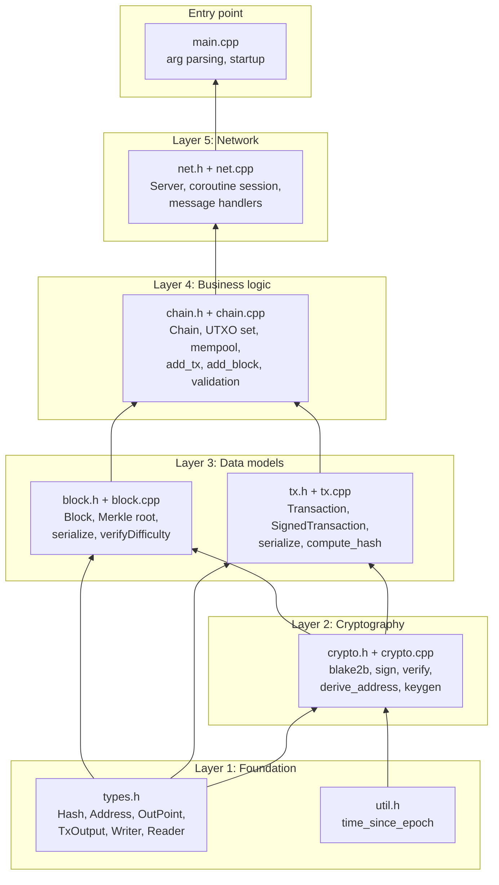

# Project structure

## Directory layout

```
axis/
├── CMakeLists.txt              # Top-level build system
├── README.md                   # Quick-start guide
├── docs/                       # Full documentation suite
│   ├── README.md               # Documentation index
│   ├── architecture.md         # High-level architecture
│   ├── blockchain.md           # Blockchain concepts explained
│   ├── project_structure.md    # This file
│   ├── getting_started.md      # Build + run guide
│   ├── transaction_lifecycle.md
│   ├── block_lifecycle.md
│   ├── utxo_model.md
│   ├── serialization.md
│   ├── packet_protocol.md
│   ├── database.md
│   ├── cryptography.md
│   ├── network.md
│   ├── class_reference.md
│   ├── function_reference.md
│   ├── developer_guide.md
│   ├── design_decisions.md
│   ├── faq.md
│   └── glossary.md
├── include/
│   └── axis/
│       ├── types.h     # Fundamental types: Hash, Address, OutPoint, etc.
│       ├── util.h      # Utility: time_since_epoch, hex formatting
│       ├── crypto.h    # Crypto API: blake2b, sign, verify, derive_address
│       ├── tx.h        # Transaction, SignedTransaction
│       ├── block.h     # Block
│       ├── chain.h     # Chain: blocks, UTXO set, mempool, validation
│       └── net.h       # Server: TCP, coroutines, message dispatch
├── src/
│   ├── crypto.cpp      # Crypto implementations (libsodium wrappers)
│   ├── tx.cpp          # Transaction serialization + hash computation
│   ├── block.cpp       # Block serialization + hash + Merkle tree
│   ├── chain.cpp       # Chain: genesis, validation, storage, UTXO
│   ├── net.cpp         # Server: accept, session, message handlers
│   └── main.cpp        # Entry point: parse args, start chain + server
├── tests/
│   └── core_serialization_tests.cpp  # 5 unit tests (serialization roundtrip)
└── build/               # Build artifacts (generated)
```

## Layer diagram



## File responsibilities

### `include/axis/types.h`

The lowest layer. No project includes, only standard library (`<array>`,
`<cstdint>`, `<vector>`, `<functional>`, `<cstring>`, `<span>`).

Defines:
- `Hash` (`std::array<uint8_t, 32>`)
- `Address` (`std::array<uint8_t, 20>`)
- `OutPoint` (txid + index)
- `TxOutput` (recipient + amount)
- `Writer` / `Reader` (serialization helpers)
- `HashHasher` (for using `Hash` in `unordered_map`)

### `include/axis/util.h`

Utility functions:
- `time_since_epoch()` — current Unix timestamp as `uint64_t`
- `hash_to_hex()` — debug hex formatting for hashes

### `include/axis/crypto.h` + `src/crypto.cpp`

Thin wrappers around libsodium:
- `blake2b` — hash arbitrary bytes
- `generate_keypair` — Ed25519 key generation
- `sign_msg` — Ed25519 signing
- `verify_sig` — Ed25519 verification
- `derive_address` — 20-byte hash of public key

### `include/axis/tx.h` + `src/tx.cpp`

Transaction data structures and serialization:
- `Transaction` — inputs, outputs, timestamp, txid
- `SignedTransaction` — transaction + public key + signature
- `TxError` — error codes for transaction validation
- Serialization methods and hash computation

### `include/axis/block.h` + `src/block.cpp`

Block data structure and helpers:
- `Block` — header (prev_hash, merkle_root, timestamp, nonce, version) + transactions
- `BlockError` — error codes for block validation
- `compute_block_merkle_root` — build Merkle tree from transactions
- `verifyDifficulty` — check Proof of Work
- Serialization and hash computation

### `include/axis/chain.h` + `src/chain.cpp`

The core of the node:
- `Chain` — owns blocks, UTXO set, mempool, two LevelDB databases
- `add_tx` — validate and store a pending transaction
- `add_block` — validate and apply a mined block
- `get_utxos` — query UTXO set by address
- `get_tx` — lookup transaction by txid
- Genesis block creation
- Database persistence and startup reload

### `include/axis/net.h` + `src/net.cpp`

TCP server with C++20 coroutines:
- `Server` — Asio-based TCP server
- `session` — per-connection coroutine, reads packets and dispatches
- Message handlers: `on_get_utxos`, `on_create_tx`, `on_get_tx`, etc.
- `send_payload`, `send_txresponse` — response helpers

### `src/main.cpp`

Entry point:
- Parses `--help` flag
- Creates `Chain` (loads from disk or creates genesis)
- Creates and starts `Server` on port 8080
- Runs the Asio event loop

### `tests/core_serialization_tests.cpp`

Five unit tests using the `axis_core` library:
1. Transaction serialization roundtrip
2. Block serialization roundtrip
3. UTXO query returns expected count and value
4. Transaction signature validation passes
5. Transaction with bad signature is rejected

## Include graph (no cycles)

```
types.h (no project includes)
util.h (no project includes)
crypto.h → types.h
tx.h → types.h, crypto.h
block.h → types.h, tx.h
chain.h → types.h, crypto.h, tx.h, block.h, util.h
net.h → types.h, chain.h
main.cpp → chain.h, net.h
```

This is a strict DAG. `chain.h` depends on `tx.h` and `block.h` (which
depend on `types.h` and `crypto.h`). `net.h` depends on `chain.h`. No
circular dependencies.
