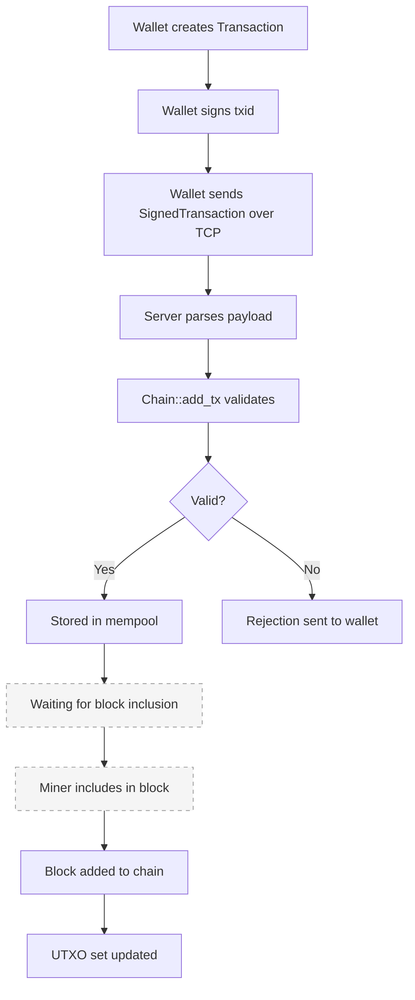
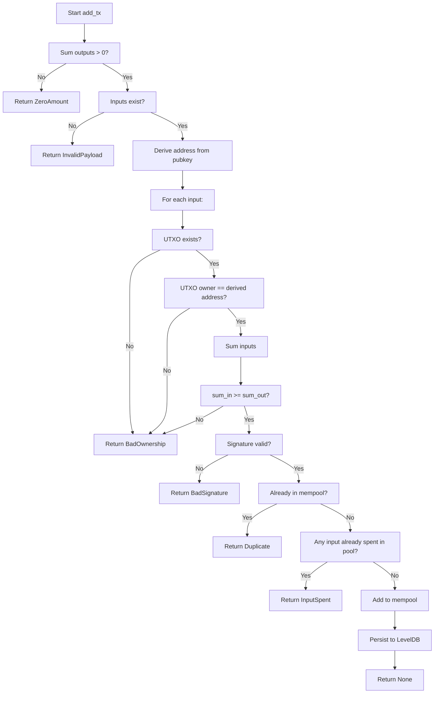

# Transaction lifecycle

This document traces a transaction from creation through validation to
(mined) confirmation.

## Lifecycle overview



> Note: The dashed steps (mempool → block) are not yet wired to a network
> message in the current codebase. `verifyBlock()` exists as a helper, but
> no client message can submit a mined block.

## Step 1: Transaction creation (in the wallet)

The wallet creates a `Transaction`:

```cpp
std::vector<OutPoint> inputs = {
    {previous_txid_1, 0},   // reference the first output of a previous tx
    {previous_txid_2, 3},   // reference the fourth output of another tx
};

std::vector<TxOutput> outputs = {
    {bob_address, 30},       // send 30 to Bob
    {alice_address, 69},     // send 69 back to Alice (change)
};

Transaction tx{std::move(inputs), std::move(outputs), current_timestamp};
```

The constructor automatically computes the txid:

```cpp
void Transaction::compute_hash() {
    Writer w;
    for (const auto& in : inputs) {
        w.put_hash(in.txid);
        w.put_u32(in.index);
    }
    for (const auto& out : outputs) {
        w.put_addr(out.recipient);
        w.put_u64(out.amount);
    }
    w.put_u64(timestamp);
    txid_ = blake2b(w.buf);  // 32-byte hash
}
```

**What goes into the txid:** all inputs, all outputs, and the timestamp.
Changing any one of these produces a completely different txid.

## Step 2: Signing (in the wallet)

The wallet creates a `SignedTransaction` by signing the txid with the
sender's private key:

```cpp
Signature sig = sign_msg(private_key, tx.txid());

SignedTransaction st{
    std::move(tx),
    public_key,   // revealed so the network can verify
    sig
};
```

The signature proves: "I, the holder of this private key, authorize this
exact transaction."

## Step 3: Serialization and sending

The wallet serializes the `SignedTransaction` into the wire format and sends
it over TCP:

```
[pubkey (32)] [timestamp (8)] [input_count (4)] [inputs...] [output_count (4)] [outputs...] [signature (64)]
```

Each input:   `[txid (32)] [index (4)]`
Each output:  `[address (20)] [amount (8)]`

## Step 4: Server receives and parses

The `Server::on_create_tx` coroutine:

1. Reads the 4-byte payload size
2. Reads the payload bytes
3. Extracts the `MsgType` (must be `CreateTransaction = 12`)
4. Parses the payload with `Reader`:
   ```cpp
   auto pubkey = r.take_pk();        // 32 bytes
   auto timestamp = r.take_u64();     // 8 bytes
   // input_count (4) + count * (32+4)
   // output_count (4) + count * (20+8)
   auto sig = r.take_sig();          // 64 bytes
   ```

## Step 5: Validation (Chain::add_tx)

This is the core validation function. It performs checks in order — each
check is fast and eliminates invalid transactions early.



### Validation checks in detail

**1. Output amount validation**
```cpp
uint64_t sum_out = 0;
for (const auto& out : tx.outputs) {
    if (out.amount == 0)         // outputs must have positive value
        return TxError::ZeroAmount;
    if (sum_out > max - out.amount)   // prevent overflow
        return TxError::InvalidPayload;
    sum_out += out.amount;
}
if (sum_out == 0)                // at least one output
    return TxError::ZeroAmount;
```

**2. Input existence**
```cpp
if (tx.inputs.empty())           // non-coinbase must have inputs
    return TxError::InvalidPayload;
```

**3. Ownership verification**
```cpp
Address sender = derive_address(pk);
for (const auto& in : tx.inputs) {
    auto it = utxo_.find(in);
    if (it == utxo_.end())                 // does the UTXO exist?
        return TxError::BadOwnership;
    if (it->second.recipient != sender)     // do I own it?
        return TxError::BadOwnership;
    sum_in += it->second.amount;
}
if (sum_in < sum_out)                       // can I afford it?
    return TxError::BadOwnership;
```

**4. Signature verification**
```cpp
if (!verify_sig(pk, tx.txid(), sig))
    return TxError::BadSignature;
```

The signature covers the txid, which covers all inputs, outputs, and the
timestamp. This prevents any part of the transaction from being modified
after signing.

**5. Mempool checks**
```cpp
if (pool_.contains(tx.txid()))          // already in pool?
    return TxError::Duplicate;
for (const auto& in : tx.inputs)
    if (pool_spent_.contains(in))         // input already claimed?
        return TxError::InputSpent;
```

**6. Persistence**
```cpp
// Mark inputs as spent in the pool
for (const auto& in : tx.inputs)
    pool_spent_[in] = in;
pool_[tx.txid()] = tx;

// Persist to LevelDB
pool_db_->Put(key, tx.serialize());
```

## Step 6: Response

The server sends a `TransactionResponse`:

```
[accepted (1)] [error_code (1)] [reason_length (2)] [reason (N)]
```

- If accepted: `{1, 0, 9, "accepted"}`
- If rejected: `{0, <code>, <len>, "<reason>"}`

## Step 7: Block inclusion (future)

When a miner exists, it would:
1. Take transactions from `pool_`
2. Create a coinbase transaction (miner reward)
3. Build a block
4. Mine it (find a valid nonce)
5. Call `Chain::add_block()` which would:
   - Validate the block
   - Apply each transaction to the UTXO set
   - Remove confirmed transactions from the pool
   - Persist the block to LevelDB
