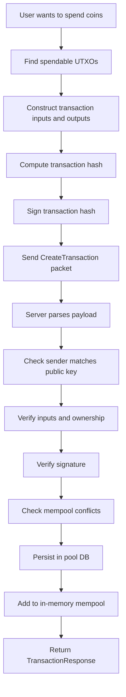

# Transaction Lifecycle

This document follows a transaction from idea to mempool acceptance in Axis.

## 1. Big picture

A transaction lifecycle answers this question:

> How does a payment move from a user’s intent into node-validated pending state?

In the current Axis implementation, the lifecycle ends at **mempool acceptance** because mined-block integration is not fully implemented as an external workflow.

## 2. Lifecycle overview



## 3. Step 1: Find spendable outputs

Before a client can create a transaction, it needs UTXOs belonging to the sender.

The current node supports this through:

- `GetUTXOs`

The server scans the in-memory `utxo` map and returns references to all outputs owned by the given address.

## 4. Step 2: Build inputs and outputs

The client chooses which UTXOs to spend.

### Inputs

Each chosen UTXO becomes an `Input`:

- previous transaction hash,
- output index.

### Outputs

The client creates one or more new `UTXO` outputs.

Typical example:

- receiver gets payment,
- sender gets change.

## 5. Step 3: Set transaction fields

The client must populate:

- `sender`
- `receiver`
- `coins`
- `inputs`
- `outputs`
- `timestamp`

The timestamp matters because it participates in the hash.

## 6. Step 4: Compute the transaction hash

Axis computes the hash from:

- sender,
- receiver,
- inputs,
- outputs,
- coin amount,
- timestamp.

The hash is computed by:

- `Transaction::computeTransactionHash()`
- or `Transaction::computeTransactionHash(uint64_t)` when a timestamp is supplied.

### Why this matters

The signature will later authenticate this exact hash.

## 7. Step 5: Sign the transaction hash

A client signs the transaction hash with the sender’s private key.

The server later verifies that signature using the submitted public key.

## 8. Step 6: Send `CreateTransaction`

The client sends a packet containing:

- public key,
- sender address,
- receiver address,
- amount,
- timestamp,
- inputs,
- outputs,
- signature.

See [Packet protocol](packet_protocol.md) for exact layout.

## 9. Step 7: Server deserializes payload

The server path is:

- `readMessage()`
- `handlePayload()`
- `handleCreateTransaction()`
- `deserializeCreateTransactionRequest()`

The payload parser performs structural validation before business-rule validation.

### Examples of rejected malformed payloads

- impossible input count,
- impossible output count,
- missing trailing signature bytes,
- trailing extra bytes.

## 10. Step 8: Sender/public key consistency check

After parsing, the server checks:

```cpp
computeAddress(publicKey) == transaction.sender
```

### Why this exists

This prevents identity spoofing.

A valid signature alone is not enough if the claimed sender address does not match the provided public key.

## 11. Step 9: Transaction acceptance checks

The heavy validation work happens in `acceptTransaction()`.

### 9.1 Amount must be non-zero

If `tx.coins == 0`, reject with `InvalidAmount`.

### 9.2 Input ownership and totals must be valid

`verifyInputs()` checks:

- inputs not empty,
- outputs not empty,
- no duplicate inputs inside the transaction,
- each referenced UTXO exists,
- each UTXO belongs to derived sender address,
- summed inputs do not overflow,
- summed outputs do not overflow,
- total inputs >= total outputs.

If these fail, reject with `OwnershipVerificationFailed`.

### 9.3 Signature must verify

`verifySignature()` uses libsodium Ed25519 verification.

If it fails, reject with `SignatureVerificationFailed`.

### 9.4 Transaction must not already be in mempool

Duplicate transaction hash rejects with `AlreadyInMempool`.

### 9.5 Inputs must not already be reserved by mempool

If another pending transaction already uses one of the same inputs, reject with `InputReservedByMempool`.

## 12. Step 10: Persist and reserve

If the transaction passes validation:

1. insert into `transactionsPool`,
2. insert each input into `mempoolInputs`,
3. save serialized transaction to `poolsDB`.

This makes the transaction durable and prevents a pending double spend.

## 13. Step 11: Response to client

The server returns `TransactionResponse`.

### Success example

- `accepted = 1`
- `errorCode = None`
- `reason = "Transaction accepted"`

### Rejection example

- `accepted = 0`
- `errorCode = SignatureVerificationFailed`
- `reason = "Signature verification failed"`

## 14. Example walk-through

Suppose Alice owns one UTXO worth 10 coins.
She wants to send Bob 7 and keep 3 as change.

### Client side

- input: Alice’s 10-coin UTXO
- outputs:
  - Bob: 7
  - Alice: 3
- amount field: 7
- timestamp: chosen by client
- hash transaction fields
- sign hash with Alice’s private key
- send packet

### Server side

- parse all fields,
- derive Alice’s address from public key,
- confirm derived address matches `sender`,
- confirm input exists and belongs to Alice,
- confirm 10 >= 7 + 3,
- verify signature,
- reserve input in mempool,
- persist transaction,
- return accepted response.

## 15. What does not happen yet in current code

In a full blockchain system, the next steps would usually be:

- broadcast transaction to peers,
- select transaction for mining,
- include it in a new block,
- remove it from mempool once confirmed.

Axis currently stops short of a full end-to-end mining and confirmation workflow in the visible codebase.

## 16. Common pitfalls for contributors

### Mistake: assuming `coins` alone defines payment correctness

It does not. Outputs define the actual post-transaction distribution of value.

### Mistake: forgetting transaction hash depends on timestamp

If client and server disagree on timestamp, signature verification fails because the hash changes.

### Mistake: ignoring mempool reservations

Even if an input still exists in the UTXO set, Axis can reject it if another pending transaction already reserved it.

## 17. Summary

The transaction lifecycle in Axis is:

- discover spendable outputs,
- build a UTXO-style transaction,
- hash it,
- sign it,
- submit it,
- validate identity, ownership, and signature,
- persist it in the mempool.

That lifecycle is the most complete end-to-end workflow in the current node implementation.
