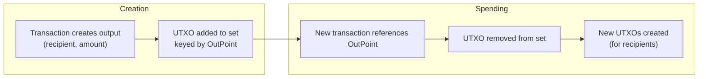

# UTXO model

## What is the UTXO model?

The **UTXO (Unspent Transaction Output) model** is the accounting system
used by Bitcoin and Axis. Instead of storing account balances, the system
stores a set of **unspent outputs**. Every output can be spent exactly once,
after which it is removed from the set.

## Comparison: Account model vs UTXO model

| Aspect | Account model (like Ethereum) | UTXO model (like Axis) |
|--------|-------------------------------|------------------------|
| State | Map of address → balance | Set of (txid, index) → output |
| A transfer | `alice.balance -= 10; bob.balance += 10` | Create tx that destroys old UTXOs and creates new ones |
| Privacy | Single balance reveals all activity | Outputs can be spent independently |
| Parallelism | Must sequence per-account updates | Outputs can be spent in parallel |
| State size | One entry per address | One entry per unspent output |

## The lifecycle of a UTXO



### Step 1: Creation

When a transaction has an output, that output becomes a UTXO. The key is
the **OutPoint**: the transaction's txid plus the output's index within that
transaction.

```
OutPoint {
    txid:   <hash of the transaction>
    index:  0  (first output)
}
```

### Step 2: Spending

When a new transaction references an OutPoint as an input, the corresponding
UTXO is removed from the set ("spent").

### Step 3: New creation

The spending transaction creates new outputs, which become new UTXOs.

## Example

Alice (address `A1`) has 100 coins in a single UTXO:
- OutPoint: `{txid: abc123, index: 0} → TxOutput{recipient: A1, amount: 100}`

Alice wants to send Bob 30 coins. She creates a transaction:

```text
Inputs:  {txid: abc123, index: 0}     // spends 100
Outputs: {recipient: Bob, amount: 30}  // Bob gets 30
         {recipient: Alice, amount: 69} // Alice gets 69 back (change)
                                      // 1 coin = transaction fee (lost)
```

After this transaction:
- UTXO `{abc123, 0}` is gone (spent)
- New UTXO `{def456, 0}` → Bob has 30
- New UTXO `{def456, 1}` → Alice has 69
- 1 coin (the difference between 100 and 99) is a transaction fee

## How Axis implements the UTXO set

```cpp
// The UTXO set is a hash map from OutPoint → TxOutput
std::unordered_map<OutPoint, TxOutput> utxo_;

// OutPoint: what you're spending (txid + index within that tx)
struct OutPoint {
    Hash txid;        // 32 bytes
    uint32_t index;   // 4 bytes
};

// TxOutput: where the coins go
struct TxOutput {
    Address recipient; // 20 bytes
    uint64_t amount;   // 8 bytes
};
```

### Key operations

**Spending** (in `apply_tx`):
```cpp
// Remove all inputs from the UTXO set
for (const auto& in : tx.inputs)
    utxo_.erase(in);

// Add all outputs as new UTXOs
uint32_t idx = 0;
for (const auto& out : tx.outputs) {
    utxo_[OutPoint{tx.txid(), idx}] = out;
    idx++;
}
```

**Querying** (in `get_utxos`):
```cpp
// Find all UTXOs belonging to an address
for (const auto& [op, output] : utxo_) {
    if (output.recipient == addr) {
        outpoints.push_back(op);
        total += output.amount;
    }
}
```

### Why use OutPoint as the map key?

The OutPoint uniquely identifies one specific output in one specific
transaction. This is the natural key: when you create a transaction input,
you specify which previous output you want to spend by its OutPoint. Using
the same type as both the `unordered_map` key and the input reference avoids
any conversion.

### Why no hex string keys?

The original version used string keys like `"abc123...def:0"` (hex txid +
":" + index). This required hex conversion on every UTXO lookup. The
redesigned version uses the binary `OutPoint` struct directly as the map
key, eliminating all string allocations from UTXO operations.

## The mempool and UTXOs

When a transaction enters the mempool (pending), its inputs are tracked
separately in `pool_spent_`:

```cpp
std::unordered_map<OutPoint, OutPoint> pool_spent_;
```

This prevents another pending transaction from spending the same UTXO. The
actual UTXO set is not modified until the transaction is confirmed in a block.

## UTXO set reconstruction

On startup, the UTXO set is rebuilt from scratch by replaying every block:

```cpp
Chain::Chain() {
    load_blocks();  // reads all blocks from LevelDB
    // ... each block calls apply_tx() which rebuilds the UTXO set
}
```

This is simple and correct: the blocks are the authoritative source of
truth. The cost is that startup time increases with chain length.
